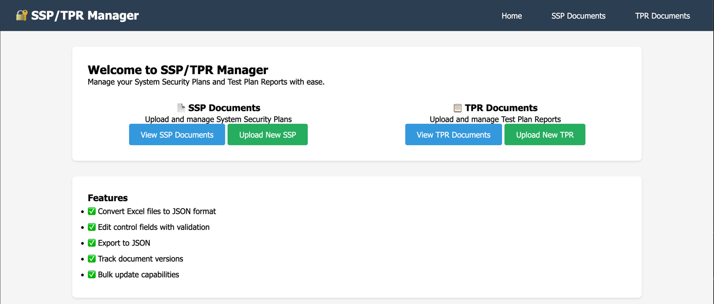

# SPARC — Systemized Policy and Regulatory Controls



**SPARC** is an open-source compliance documentation platform that transforms how organizations manage NIST 800-53 security controls. It replaces fragmented spreadsheets and siloed documents with a **coordinated, web-based, real-time source of truth** — empowering security teams, assessors, system owners, and program managers to document, assess, and prove compliance across the full RMF lifecycle.

---

## Overview

Managing **System Security Plans (SSPs)**, **Test Plans & Results (TPRs)**, and security baselines is painful when everything lives in large, versioned Excel files. SPARC solves that by providing:

- A **structured database** backing every control, replacing `SSP_v12_final_REALLYFINAL.xlsx` with a single source of truth
- **Real-time collaboration** so security teams, assessors, and system owners work from the same live data
- **Visual compliance dashboards** with interactive heat maps showing implementation and test status by NIST control family
- **Structured data export** in JSON and OSCAL formats for audit packages, reporting, and downstream tooling
- **Background processing** for large Excel workbooks so uploads never block the UI

### Who Benefits Most

| Role | How SPARC Helps |
|------|----------------|
| **Security / Compliance Teams** | Maintain and update SSPs without spreadsheet coordination overhead |
| **Assessors / 3PAOs** | Quickly find open findings, overdue tests, and controls needing attention |
| **System Owners / ISSOs** | Clear visibility into control implementation status and gaps by family |
| **Program Managers** | Better reporting and coordination across large control sets |

---

## What It Can Do

SPARC supports the full lifecycle of compliance documentation across four integrated modules:

**Control Catalog Management** — Browse, create, and manage NIST and custom control catalogs with family-level and control-level CRUD. NIST SP 800-53 Rev 4 (256 controls) and Rev 5 (323 controls) are pre-loaded via seeds.

**SSP Document Management** — Upload Excel-based System Security Plans, automatically parse controls and fields via background processing, edit implementation details inline, and export to JSON.

**TPR Document Management** — Upload and manage Test Plan Reports with multi-sheet support, color-coded test status indicators, pagination, filtering by section/asset/environment, and round-trip Excel export.

**Security Profile Management** — Import DISA STIGs (XCCDF XML), InSpec profiles (JSON), STIG Viewer exports, and CIS benchmarks. Export as OSCAL Component Definitions for interoperability with the NIST OSCAL ecosystem.

---

## Key Features

- **Interactive Heat Maps** — Collapsible status heat maps on SSP, TPR, and Profile pages display control status by NIST family. Click any cell to filter the control list below it.
- **Inline Field Editing** — Edit designated fields (implementation status, test results, remediation plans) directly in the browser; read-only fields are enforced.
- **Excel Round-Trip** — Upload Excel workbooks and export them back to Excel with original formatting preserved (TPR).
- **OSCAL Export** — Export Security Profiles as OSCAL Component Definitions (v1.1.2 schema) for integration with the broader OSCAL ecosystem.
- **Background Processing** — Async job processing for large files via Sidekiq, with real-time status updates in the UI.
- **RESTful API** — Programmatic access to convert, update, and export documents via `/api/v1/` endpoints.
- **NIST Catalog Guidance** — Catalog controls are cross-referenced with uploaded documents to provide guidance context during review.
- **JSON Export** — Download any document as structured JSON for reporting and downstream tooling.

---

## Quick Start

### Docker (Recommended)

```bash
git clone https://github.com/Rebel-Raiders/sparc.git
cd sparc
docker compose up --build
```

- `--build` is only needed the first time or after changing `Dockerfile` / `Gemfile`
- First run may take 3-10 minutes (downloads images, installs gems, runs migrations)
- Subsequent starts are typically under 20 seconds

Once the app is running, open **http://localhost:3000** in your browser.

After the app is up, load the NIST catalog seed data:

```bash
docker compose exec web bin/rails db:seed
```

This seeds NIST SP 800-53 Rev 4 (18 families, 256 controls) and Rev 5 (20 families, 323 controls).

### Local Development

See the [Development Setup](#development-setup) section below for detailed instructions.

---

## Technology Stack

### Core Framework

| Component | Version | Purpose |
|-----------|---------|---------|
| Ruby | 3.4.4 | Language runtime |
| Rails | 8.1.2 | Web framework |
| PostgreSQL | 15 | Primary database |
| Sidekiq | 8.1.1 | Background job processing |
| Redis | 7+ | Job queue backend |
| Puma | 7.2.0 | Application server |

### Frontend

| Component | Purpose |
|-----------|---------|
| Hotwire (Turbo + Stimulus) | Interactive UI without a JavaScript SPA |
| Propshaft | Asset pipeline |
| Importmap | JavaScript module loading (no Node.js build step) |

### Testing & Quality

| Tool | Purpose |
|------|---------|
| RSpec | Test framework |
| FactoryBot + Faker | Test data generation |
| RuboCop (rails-omakase) | Code style linting |
| Brakeman | Static security analysis |
| Capybara + Selenium | System/integration tests |

### DevOps & Deployment

| Tool | Purpose |
|------|---------|
| Docker + Docker Compose | Containerized development and deployment |
| Kamal | Docker-based production deployment |
| GitHub Actions | CI/CD pipeline (lint, security scan, tests) |
| Dependabot | Automated dependency updates |
| Active Storage | File uploads (local dev / S3 production) |

---

## Development Setup

### Prerequisites

- **Ruby** 3.4.4 (use [rbenv](https://github.com/rbenv/rbenv) or [asdf](https://asdf-vm.com/))
- **PostgreSQL** 15+
- **Redis** 7+
- **Bundler** (`gem install bundler`)

### Local Installation

#### 1. Clone and install dependencies

```bash
git clone https://github.com/Rebel-Raiders/sparc.git
cd sparc
bundle install
```

#### 2. (Optional) Create a `.env` file

```bash
# .env
WEB_PORT=3000
POSTGRES_PASSWORD=your-secure-password
```

#### 3. Set up the database

```bash
bin/rails db:create db:migrate db:seed
```

#### 4. Start background services

```bash
# Terminal 1 — Redis
redis-server

# Terminal 2 — Sidekiq (needed for Excel parsing)
bundle exec sidekiq
```

#### 5. Start the server

```bash
bin/rails server
```

Open **http://localhost:3000** in your browser.

### Running Tests

```bash
# Full test suite
bundle exec rspec

# Single spec file
bundle exec rspec spec/models/ssp_document_spec.rb

# Single test by line number
bundle exec rspec spec/models/ssp_document_spec.rb:18

# Linting
bundle exec rubocop

# Security scan
bundle exec brakeman

# Rails console
bin/rails console
```

---

## Docker Deployment

### Development

```bash
docker compose up --build
```

Services started:
- **web** — Rails app on port 3000
- **db** — PostgreSQL 15 on port 5433 (avoids conflicts with local Postgres)
- **redis** — Redis 7 on port 6380
- **sidekiq** — Background job processor

### Production

A production Docker Compose configuration is available at `docker-compose-prod.yaml`. Deployment is configured for [Kamal](https://kamal-deploy.org/) via `config/deploy.yml`.

```bash
# Production build
docker compose -f docker-compose-prod.yaml up --build -d
```

### Common Docker Commands

```bash
# View logs
docker compose logs -f web

# Run migrations
docker compose exec web bin/rails db:migrate

# Seed NIST catalogs
docker compose exec web bin/rails db:seed

# Rails console
docker compose exec web bin/rails console

# Stop all services
docker compose down
```

---

## API

REST API under the `Api::V1::` namespace at `/api/v1/`:

| Endpoint | Method | Description |
|----------|--------|-------------|
| `/api/v1/ssp_documents/convert` | POST | Upload and convert an SSP Excel file |
| `/api/v1/ssp_documents/update_fields` | PUT | Update SSP control fields |
| `/api/v1/ssp_documents/export` | GET | Export SSP as JSON |
| `/api/v1/tpr_documents/convert` | POST | Upload and convert a TPR Excel file |
| `/api/v1/tpr_documents/update_fields` | PUT | Update TPR control fields |
| `/api/v1/tpr_documents/export` | GET | Export TPR as JSON |

---

## Data Schemas

Detailed schema documentation for each document type is available in the [`/docs`](docs/) directory:

| Document | Schema Reference |
|----------|----------------|
| System Security Plan (SSP) | [docs/ssp-schema.md](docs/ssp-schema.md) |
| Test Plan Report (TPR) | [docs/tpr-schema.md](docs/tpr-schema.md) |
| Control Catalog | [docs/catalog-schema.md](docs/catalog-schema.md) |

---

## Contributing

Contributions are welcome! Here's how to get started:

1. Fork the repository
2. Create a feature branch (`git checkout -b feature/my-feature`)
3. Make your changes and ensure all checks pass:
   ```bash
   bundle exec rubocop      # Linting
   bundle exec brakeman     # Security
   bundle exec rspec        # Tests
   ```
4. Commit your changes and push to your fork
5. Open a Pull Request against `main`

### Branch Naming Convention

| Prefix | Purpose | Version Impact |
|--------|---------|---------------|
| `feature/` | New functionality | Minor bump |
| `fix/` | Bug fixes | Patch bump |
| `refactor/` | Code restructuring | Major bump |
| `release/` | Release preparation | Major bump |

---

## Roadmap

### Upcoming Features

Tracked via [GitHub Issues](https://github.com/Rebel-Raiders/sparc/issues):

**OSCAL Integration**
- SAP Creation (Security Assessment Plan)
- SAR Creation (Security Assessment Report)
- POA&M Import & Management
- SSP Creation & Authoring
- Baselines to OSCAL Profiles Import & Tailoring

**Compliance Scanning**
- Vulcan/InSpec to OSCAL Component Definitions (CDEF)
- SAF Evidence and Attestation Collection

**Authentication & Access Control**
- Okta MFA Integration & Enforcement
- GitLab MFA Enforcement & SSO Delegation
- Generic OIDC/SAML MFA Delegation

---

## Acknowledgments

SPARC builds on the work of several organizations and open-source projects:

- **[NIST](https://www.nist.gov/)** — For the SP 800-53 control catalog framework and the [OSCAL](https://pages.nist.gov/OSCAL/) standard that makes machine-readable compliance possible
- **[MITRE](https://www.mitre.org/)** — For advancing security automation frameworks including [SAF](https://saf.mitre.org/) (Security Automation Framework) and the [Heimdall](https://github.com/mitre/heimdall2) visualization platform
- **[Chef/Progress InSpec](https://www.inspec.io/)** — For the compliance-as-code framework that enables automated security testing and profile sharing
- **[DISA](https://www.disa.mil/)** — For maintaining STIGs (Security Technical Implementation Guides) in XCCDF format
- **[CIS](https://www.cisecurity.org/)** — For publishing security benchmarks used across industry

### Individual Contributors

- **[@clem-field](https://github.com/clem-field)** — Creator, lead developer, and maintainer

---

## License

SPARC is released under the [MIT License](LICENSE).

---

## Troubleshooting

**Port 3000 already in use** — Change the port in `docker-compose.yaml` under the `web` service (`ports: - "3001:3000"`) or stop the conflicting process.

**Database connection refused** — Wait a bit longer on first startup. Check `docker compose logs db` to confirm Postgres is running.

**Migrations fail** — The entrypoint automatically runs `db:prepare` on web startup. If needed, run manually: `docker compose exec web bin/rails db:migrate`

**Sidekiq not processing jobs** — Check logs: `docker compose logs sidekiq`. Ensure Redis is running.

**Still stuck?** — Run `docker compose logs` and look for errors. Feel free to [open an issue](https://github.com/Rebel-Raiders/sparc/issues) with the output.
