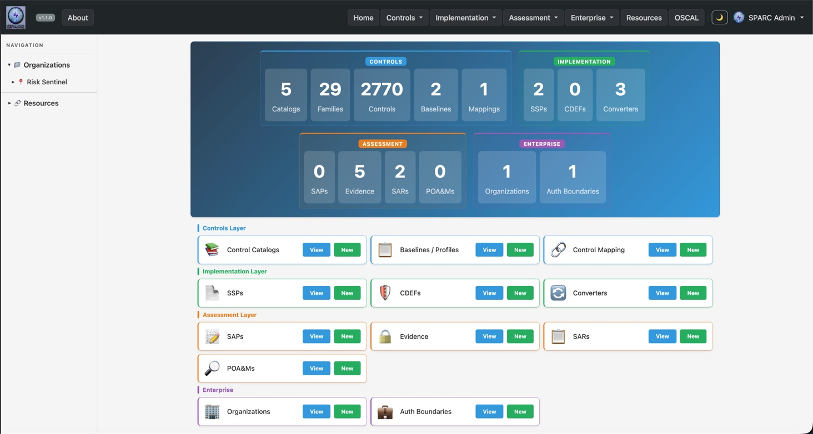

# SPARC — Systematic Policy and Regulatory Compliance




**SPARC** is an open-source compliance documentation platform that transforms how
organizations manage NIST 800-53 security controls. It replaces fragmented
spreadsheets and siloed documents with a **coordinated, web-based, real-time**
**source of truth** — empowering security teams, assessors, system owners, and
program managers to document, assess, and prove compliance across the full RMF lifecycle.

> **Documentation:** See the **[SPARC Wiki](https://github.com/risk-sentinel/sparc/wiki)**
>for comprehensive documentation covering RBAC, screens, core functions, integrations,
>architecture, and configuration.

---

## Key Features

- **Full RMF Artifact Lifecycle** — Manage Catalogs, Profiles, Component Definitions
(CDEFs), SSPs, SAPs, SARs, and POA&Ms in one platform
- **SSP Creation Wizard** — Build System Security Plans from scratch by selecting
baselines and assembling components
- **Multi-Format Import** — Import from OSCAL JSON, OSCAL XML,
DISA STIGs (XCCDF), and InSpec profiles
- **OSCAL Export** — Export validated OSCAL v1.1.2 JSON for SSPs, CDEFs, Profiles,
SARs, and POA&Ms
- **HDF ↔ OSCAL Translation** — Convert scanner findings (HDF) to OSCAL SAR via the
MITRE hdf-libs bridge, with optional evidence back-matter enrichment
- **Document Review & Approval** — Optional review queue and approval workflow for
trust-store documents, gated by `SPARC_REQUIRE_DOCUMENT_APPROVAL`
- **Authoritative Sources & Federation** — Subscribe to HMAC-signed authoritative
content bundles published by federation peers
- **Interactive Heat Maps** — Visual compliance dashboards showing control status
by NIST family
- **Inline Field Editing** — Edit implementation details directly in the browser
- **Authentication & SSO** — Local login, GitHub/GitLab OAuth, OIDC (Okta/Keycloak/
Entra ID), and LDAP
- **Role-Based Access** — 29 NIST RMF roles with project-level scoping and admin
UI
- **Background Processing** — Async job processing for large files via Solid Queue
(database-backed; Sidekiq + Redis optional)
- **RESTful API** — Programmatic access at `/api/v1/`

---

## Quick Start

### Docker (Recommended)

```bash
git clone https://github.com/risk-sentinel/sparc.git
cd sparc
docker compose up --build
```

Open [local host](http://localhost:3000). Then seed the NIST catalogs:

```bash
docker compose exec web bin/rails db:seed
```

See [Docker Deployment](docs/DOCKER.md) for full details.

### Local Development

```bash
git clone https://github.com/risk-sentinel/sparc.git
cd sparc
bundle install
bin/rails db:create db:migrate db:seed
bin/rails server
```

**Prerequisites:** Ruby 3.4.4, PostgreSQL 15+, Bundler

Background jobs run on **Solid Queue** (database-backed) by default — no Redis
required. In development they execute in-process; to run a dedicated worker,
start `bin/jobs` in a separate terminal. Sidekiq + Redis remain supported as an
optional alternative.

---

## Authentication Setup

Authentication is **opt-in** — all routes are public by default until you enable
an auth method.

### 1. Enable local login

Copy `.env.example` to `.env` and set:

```bash
SPARC_ENABLE_LOCAL_LOGIN=true
SPARC_ENABLE_USER_REGISTRATION=true
```

### 2. Seed the admin account

```bash
bin/rails db:seed
```

The seed task creates an admin account and prints the credentials to the console.
The admin must change their password on first login.

> **Lost your admin password?** Run `bin/rails sparc:bootstrap_admin` to
>regenerate credentials.

### 3. (Optional) Enable SSO

Add GitHub, GitLab, or Okta credentials to your `.env` — see [Authentication & Authorization](docs/AUTHENTICATION.md)
for full setup instructions.

**Important:** After any `.env` change, restart the Rails server. dotenv loads
environment variables at boot time only.

---

## Running Tests

```bash
bundle exec rspec        # Full test suite
bundle exec rubocop      # Linting
bundle exec brakeman     # Security scan
```

### Deployed & contract suites (optional)

Two language-agnostic suites run against a **live SPARC instance** (local or
deployed), outside the RSpec pyramid. Both are managed with [uv](https://docs.astral.sh/uv/)
and read config from a gitignored `.env` (copy the committed `.env.example`
template in each directory and fill in service-account tokens):

```bash
# API contract suite — every /api/v1 endpoint (~1–3 min)
cd tests/api      && cp .env.example .env   # then edit tokens
uv run pytest -q

# Playwright UI smoke — real-browser walks of the deployed UI (~1–4 min)
cd tests/ui-smoke && cp .env.example .env   # then edit tokens
uv run playwright install chromium          # first run only
uv run pytest -q
```

Generate tokens via **Admin → Service Accounts → New**. Some tests **skip**
when the target instance has no sample document of a given type to exercise, or
when an accessibility baseline hasn't been captured — skips are expected, not
failures. See [`tests/api/README.md`](tests/api/README.md) and
[`tests/ui-smoke/README.md`](tests/ui-smoke/README.md) for full details.

---

## Configuration

SPARC is configured via environment variables with sensible defaults. No configuration
is required for local development.

- **Full reference:** [docs/ENVIRONMENT_VARIABLES.md](docs/ENVIRONMENT_VARIABLES.md)
- **Production hardening guide:** [docs/PRODUCTION_SECURITY.md](docs/PRODUCTION_SECURITY.md) — operator-facing checklist of every security-relevant env var, deployment-layer requirement, and hardening verification steps
- **Quick start templates:** `.env.example` (development), `.env.production.example`
(production)

The centralized `SparcConfig` module (`app/models/sparc_config.rb`) reads all
variables with defaults.

---

## Documentation

> 📑 **Full index:** [**docs/MAP.md**](docs/MAP.md) — a categorized, navigable
> inventory of every document under `docs/`, with start-here pathways per
> audience (operator, API integrator, contributor, security reviewer, compliance
> author). The curated highlights below are the most-used entries.

| Topic | Link |
| ------- | ------ |
| **User & Operations** | |
| Authentication & Authorization | [docs/AUTHENTICATION.md](docs/AUTHENTICATION.md) |
| Admin Credential Rotation | [docs/ADMIN_CREDENTIAL_ROTATION.md](docs/ADMIN_CREDENTIAL_ROTATION.md) |
| Okta Developer Setup | [docs/OKTA_DEV_SETUP.md](docs/OKTA_DEV_SETUP.md) |
| Environment Variables | [docs/ENVIRONMENT_VARIABLES.md](docs/ENVIRONMENT_VARIABLES.md) |
| Docker Deployment | [docs/DOCKER.md](docs/DOCKER.md) |
| REST API | [docs/API.md](docs/API.md) |
| Technology Stack | [docs/TECH_STACK.md](docs/TECH_STACK.md) |
| SSP Schema | [docs/ssp-columns.md](docs/ssp-columns.md) |
| SAR Schema | [docs/sar-columns.md](docs/sar-columns.md) |
| Catalog Schema | [docs/catalog-schema.md](docs/catalog-schema.md) |
| Local Dev with puma-dev | [docs/puma-dev.md](docs/puma-dev.md) |
| Troubleshooting | [docs/troubleshooting.md](docs/troubleshooting.md) |
| **Compliance (FedRAMP / NIST)** | |
| Compliance Overview | [docs/compliance/README.md](docs/compliance/README.md) |
| NIST 800-53 Rev 5 Control Mapping | [docs/compliance/nist-sp800-53-rev5-mapping.md](docs/compliance/nist-sp800-53-rev5-mapping.md) |
| OSCAL CDEFs (Application Controls) | [docs/compliance/oscal/cdefs/](docs/compliance/oscal/cdefs/) |
| **Developer** | |
| Issue Process & Rules | [docs/dev/issue_rules.md](docs/dev/issue_rules.md) |
| Implementation Plan & Roadmap | [docs/dev/Implemenation_plan.md](docs/dev/Implemenation_plan.md) |
| Collision Avoidance Plan | [docs/dev/Developer_Collision_Avoidance_Plan.md](docs/dev/Developer_Collision_Avoidance_Plan.md) |
| Release Notes | [docs/dev/release_notes.md](docs/dev/release_notes.md) |

---

## RMF Artifact Lifecycle

The UI follows the OSCAL / RMF artifact dependency chain:

| Order | Artifact | Purpose | Status |
| ------- | ---------- | --------- | -------- |
| 1 | **Catalog** | Raw control definitions (e.g., NIST SP 800-53) | Implemented |
| 2 | **Profile** | Tailored baseline / selection set | Implemented |
| 3 | **Component Definition (CDEF)** | Reusable control implementations | Implemented |
| 4 | **System Security Plan (SSP)** | How the system implements the baseline | Implemented |
| 5 | **Assessment Plan (SAP)** | How the assessment will be performed | Implemented |
| 6 | **Assessment Results (SAR)** | Findings & evidence from assessment | Implemented |
| 7 | **POA&M** | Remediation tracking for weaknesses | Implemented |

---

## Contributing

1. Fork the repository
2. Create a feature branch (`git checkout -b feature/my-feature`)
3. Ensure all checks pass:

    ```bash
    bundle exec rubocop && bundle exec brakeman && bundle exec rspec
    ```

4. Commit your changes and open a Pull Request against `main`

| Branch Prefix | Purpose |
| --------------- | --------- |
| `feature/` | New functionality |
| `fix/` | Bug fixes |
| `refactor/` | Code restructuring |
| `docs/` | Documentation |

---

## Acknowledgments

- **[NIST](https://www.nist.gov/)** — SP 800-53 control catalog framework
- [OSCAL](https://pages.nist.gov/OSCAL/) standard
- **[MITRE](https://www.mitre.org/)** — [SAF](https://saf.mitre.org/) and [Heimdall](https://github.com/mitre/heimdall2)
- **[Chef/Progress InSpec](https://www.inspec.io/)** — Compliance-as-code framework
- **[DISA](https://www.disa.mil/)** — STIGs in XCCDF format
- **[CIS](https://www.cisecurity.org/)** — Security benchmarks

### Contributors

- **[@clem-field](https://github.com/clem-field)** — Creator, lead developer, and
maintainer

---

## License

SPARC is released under the [Apache License, Version 2.0](LICENSE).
Copyright 2026 Risk Sentinel.

Third-party content sources and per-component license dispositions
are tracked in [`docs/compliance/THIRD_PARTY_NOTICES.md`](docs/compliance/THIRD_PARTY_NOTICES.md)
and [`docs/compliance/license-dispositions.yml`](docs/compliance/license-dispositions.yml).
Canonical text for every license referenced by SPARC's SBOM lives under
[`LICENSES/`](LICENSES/).
