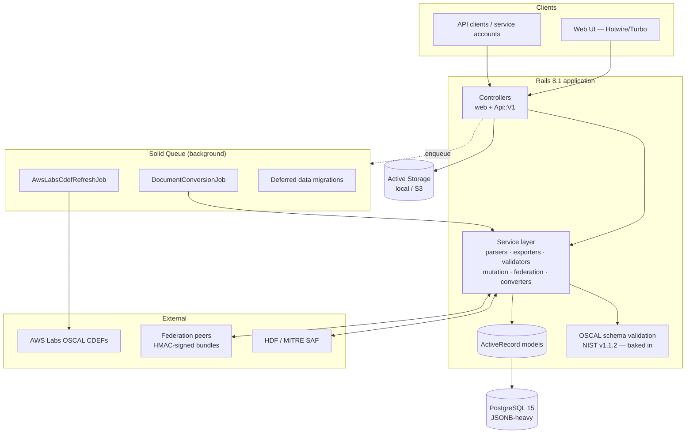
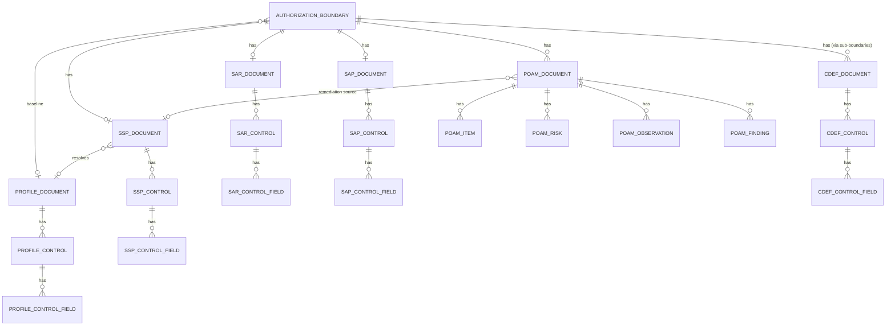
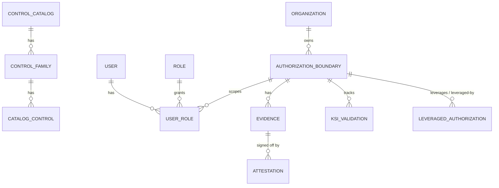

<!-- markdownlint-disable MD013 -->
# SPARC Architecture & Data Model

A single-page architectural overview of SPARC: the request/processing flow and
the domain entity-relationship model. For the narrative service-layer breakdown
see the wiki [Architecture](https://github.com/risk-sentinel/sparc/wiki/Architecture)
page; for OSCAL field-level mapping see [`oscal-data-mapping.md`](oscal-data-mapping.md)
and [`data_mapping/`](data_mapping/).

> Created for #606 to close the "no top-level architecture diagram / no
> consolidated ERD" gaps noted in [`MAP.md`](MAP.md).

---

## 1. Component & data flow

SPARC is a Rails 8.1 monolith: controllers are thin, business logic lives in
`app/services/`, and long-running work runs on Solid Queue. OSCAL is validated
against NIST schemas baked into the container.

**Document import pipeline:** upload → `DocumentConversionJob` → format detected →
dispatched to the per-type/per-format parser → document + controls + fields
persisted → `ConversionJob` status updated (`pending → processing → completed/failed`).

**OSCAL export:** model → `Oscal*ExportService` → schema-validated → JSON/XML
download. CDEF mutations validate **pre-commit** via `CdefMutationService` (v1.8.0).

---

## 2. Domain ERD

The **Authorization Boundary** is the organizing container for a system's
compliance artifacts. Each document type follows a consistent
Document → Control → ControlField hierarchy (POA&M is the exception).

For readability the model is shown in two views: the **documents** an
authorization boundary contains, and the boundary's **context** (organization,
access control, catalog, and evidence). `AUTHORIZATION_BOUNDARY` is the bridge
that appears in both.

#### 2a. Documents within an authorization boundary

Each document type follows a `Document → Control → ControlField` hierarchy;
POA&M is the exception, decomposing into items/risks/observations/findings.

#### 2b. Boundary context — organization, RBAC, catalog & evidence

### Key points

- **Catalog → Profile → SSP:** a `ControlCatalog` (e.g. NIST 800-53 Rev 5) is
  tailored by a `ProfileDocument` (from a baseline), which resolves into the
  controls an `SspDocument` implements.
- **Three-level hierarchy:** SSP / SAR / SAP / CDEF / Profile each follow
  `*Document → *Control → *ControlField`. **POA&M** instead decomposes into
  `PoamItem`, `PoamRisk`, `PoamObservation`, and `PoamFinding`.
- **RBAC:** `User`—`UserRole`—`Role`, where `UserRole` is optionally scoped to an
  `AuthorizationBoundary` (instance-scoped when unscoped). See the wiki
  [RBAC](https://github.com/risk-sentinel/sparc/wiki/RBAC) page.
- **Back-matter** resources (citations, evidence, rlinks) are first-class
  `BackMatterResource` rows across document types (v1.8.0), and can be shared
  through the authoritative-source federation system (#372).
