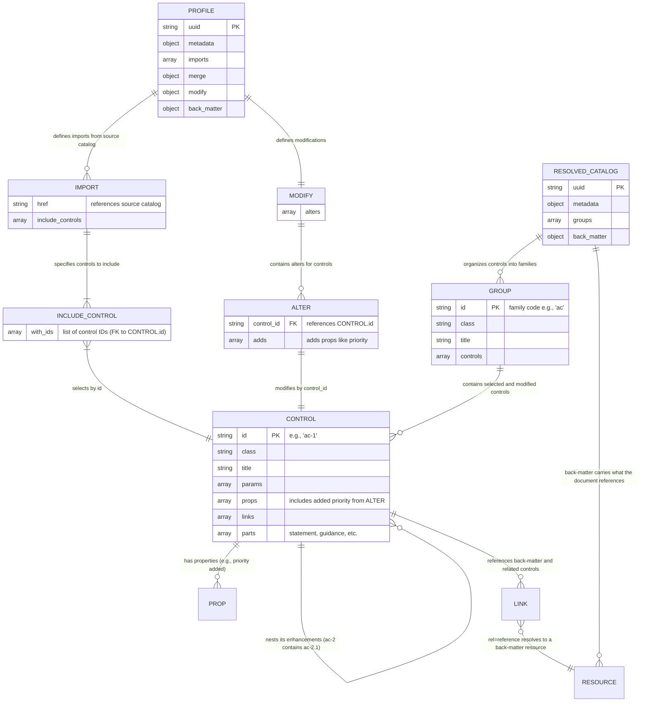

# Baseline to Resolved Profile Relationship

This is a simple diagram showing the Primary Key (PK) and Foreign Key (FK)
Relationships of a Baseline (control list, priority, starting position)
with it's Resolved Profile contains the updated Metadata and Backmatter.
The Backmatter will contain the UUID of the source catalog with the available
types (JSON, YAML, XML).

## Shape rules (#999)

Two structural rules, both read off NIST's own published resolved profile
catalogs rather than asserted from memory. The committed copies under
`spec/fixtures/files/profiles/` are what the conformance spec in
`spec/integration/oscal_e2e_pipeline_spec.rb` compares against.

**An enhancement is nested inside its parent control.** `ac-2` contains
`ac-2.1` … `ac-2.11`; they are not siblings. NIST's Rev 5 HIGH resolved catalog
is 188 top-level controls plus 182 nested, not 370 in a flat list. A consumer
that has to parse the identifier to tell an enhancement from a base control is
doing the inference a structured format exists to remove. An enhancement whose
parent is *not* selected by the profile stays top-level — that is a real
tailoring, and inventing the parent would be worse than the flat list.

**A `reference` link must resolve; a `related` link need not.** Measured on
NIST's LOW and MODERATE resolved catalogs, every `reference` href lands in
back-matter — 128 of 128 and 138 of 138, none dangling — because back-matter
exists to resolve the references the document makes (the rule #959 established
for every other document type). `related` hrefs name other controls and are
kept verbatim even when the target is outside the baseline: NIST's LOW catalog
carries 1523 of them across 149 controls, many pointing at controls LOW does
not select. A related link is a statement *about* the control, not a reference
the document has to satisfy.

Control-level links reach the resolved catalog from `catalog_controls.links_data`,
stored verbatim at import. The `reference` ones are additionally joined to
promoted `BackMatterResource` rows, which is what lets the exporter carry
exactly the resources its controls point at and nothing else.
