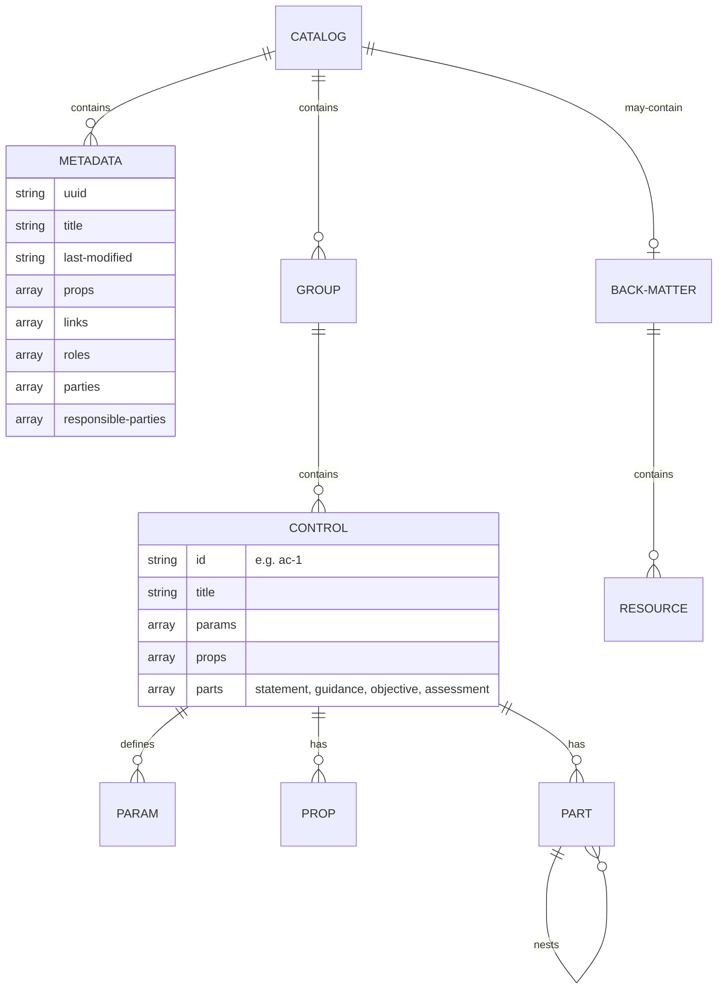

<!-- markdownlint-disable MD013 MD060 -->

# Catalog Data fields and relationship

## Import Format Comparison

SPARC supports four catalog import formats. All formats converge to canonical
OSCAL-style control IDs (e.g., `ac-1`, `ac-2.1`). The table below shows which
data fields are available in each format.

| Field | OSCAL JSON | OSCAL YAML | OSCAL XML | NIST XML (Legacy) |
|---|:---:|:---:|:---:|:---:|
| Families | ✓ | ✓ | ✓ | ✓ |
| Controls | ✓ | ✓ | ✓ | ✓ |
| Enhancements | ✓ | ✓ | ✓ | ✓ |
| Statement sub-parts | ✓ | ✓ | ✓ | ✓ |
| Priority | ✓ | ✓ | ✓ | ✗ |
| Parameters | ✓ | ✓ | ✓ | ✗ |
| Baseline Impact | ✓ | ✓ | ✓ | ✓ |
| Supplemental Guidance | ✓ | ✓ | ✓ | ✓ |
| Related Controls | ✓ | ✓ | ✓ | ✓ |
| Back-matter Resources | ✓ | ✓ | ✓ | ✗ |
| OSCAL Metadata | ✓ | ✓ | ✓ | ✗ |

### Notes

- **OSCAL YAML** shares the same structure as OSCAL JSON. The import service
  parses YAML to a hash, serializes it to JSON, and delegates to the JSON
  importer — ensuring identical field coverage.
- **NIST XML (Legacy)** refers to the SCAP SP 800-53 feed schema (v2.0).
  Enhancement support was added in issue #163; earlier imports skipped
  `<control-enhancement>` elements.
- The `import_format` field stored in `metadata_extra` tracks which format was
  used for a given import (`oscal_json`, `oscal_yaml`, `oscal_xml`, or `nist_xml`).
