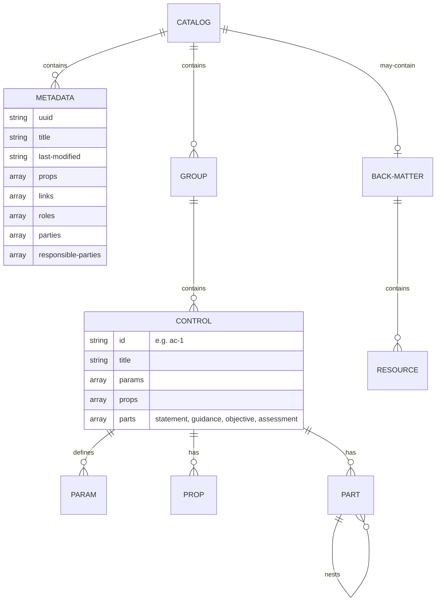

# Catalog Data fields and relationship

```mermaid
erDiagram
    CATALOG ||--o{ METADATA : contains
    CATALOG ||--o{ GROUP : contains
    GROUP ||--o{ CONTROL : contains
    CONTROL ||--o{ PARAM : defines
    CONTROL ||--o{ PROP : has
    CONTROL ||--o{ PART : has
    PART ||--o{ PART : nests
    CATALOG ||--o| BACK-MATTER : may-contain
    BACK-MATTER ||--o{ RESOURCE : contains

    METADATA {
        string uuid
        string title
        string last-modified
        array props
        array links
        array roles
        array parties
        array responsible-parties
    }

    CONTROL {
        string id          "e.g. ac-1"
        string title
        array params
        array props
        array parts        "statement, guidance, objective, assessment"
    }
```
