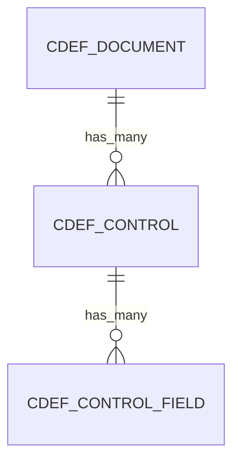

<!-- markdownlint-disable MD013 MD031 MD040 MD060 -->

# Component Definition (CDEF) — OSCAL Data Mapping

This document describes how SPARC internal models map to OSCAL v1.1.2
`component-definition` JSON for import and export.

## Model Hierarchy

CDEF follows the standard three-level document structure:



## OSCAL Root Element

```json
{ "component-definition": { ... } }
```

Export service: `OscalComponentDefinitionExportService`

## Document-Level Field Mapping

### CdefDocument -> `component-definition`

| Internal Field | OSCAL JSON Path | Required | Notes |
|---|---|:---:|---|
| `uuid` | `.uuid` | Yes | RFC 4122 UUID, regenerated on content change |
| `name` | `.metadata.title` | Yes | Also used as `.components[0].title` |
| `cdef_version` | `.metadata.version` | No | Defaults to `"1.0.0"` if blank |
| `oscal_version` | `.metadata.oscal-version` | Yes | Falls back to `"1.1.2"` constant |
| _(generated)_ | `.metadata.last-modified` | Yes | `Time.current.iso8601` at export time |
| `metadata_extra` | `.metadata.*` | No | Preserved metadata merged into base; if absent, default roles/parties are generated |
| `description` | `.components[0].description` | No | Defaults to `"Imported component definition"` |
| `cdef_type` | _(determines source URL)_ | No | One of: `disa_stig`, `scap`, `cis`, `custom` |
| _(back matter)_ | `.back-matter` | No | Via `OscalMetadata#build_oscal_back_matter` |

### CdefDocument Constants and Enums

| Constant | Value |
|---|---|
| `CDEF_TYPES` | `disa_stig`, `scap`, `cis`, `custom` |
| `status` enum | `pending`, `processing`, `completed`, `failed` |

### Source URL by `cdef_type`

| `cdef_type` | OSCAL `source` URL |
|---|---|
| `disa_stig` | `https://public.cyber.mil/stigs/` |
| `cis` | `https://www.cisecurity.org/cis-benchmarks` |
| `scap` | `https://csrc.nist.gov/projects/security-content-automation-protocol` |
| _(other/custom)_ | `https://sparc.local/component-definitions/{id}` |

## Component Structure

The export service wraps all controls into a single component with one control-implementation:

```
component-definition
  components[0]                          (single component)
    uuid                                 (generated)
    type: "software"
    title: CdefDocument.name
    description: CdefDocument.description
    control-implementations[0]           (single implementation)
      uuid                               (generated)
      source                             (derived from cdef_type)
      description                        (includes cdef_type and document name)
      implemented-requirements[]         (one per CdefControl)
```

## Control-Level Field Mapping

### CdefControl -> `implemented-requirements[]`

| Internal Field | OSCAL JSON Path | Required | Notes |
|---|---|:---:|---|
| _(generated)_ | `.implemented-requirements[].uuid` | Yes | `SecureRandom.uuid` per export |
| `control_id` | `.implemented-requirements[].control-id` | Yes | Normalized via `normalize_control_id` (see below) |
| `title` | _(part of description)_ | No | Prepended to description text |
| `severity` | `.implemented-requirements[].props[name=severity]` | No | Added as prop when present |
| `rule_id` | `.implemented-requirements[].props[name=rule-id]` | No | Added as prop when present |
| `group_id` | `.implemented-requirements[].props[name=group-id]` | No | Added as prop when present |
| `cci_references` | `.implemented-requirements[].props[name=cci]` | No | Comma-separated list split into individual props with `ns: "http://cyber.mil/cci"` |
| `control_family` | _(not exported)_ | No | Auto-computed from `control_id` prefix (e.g. `SI`) |
| `row_order` | _(ordering only)_ | No | Controls are sorted by `row_order` for export |

### Control ID Normalization

The `normalize_control_id` method converts raw identifiers to OSCAL TokenDatatype format:

| Input | Output | Rule |
|---|---|---|
| `SI-2 (2)` | `si-2.2` | Lowercase, parenthesized enhancements become dot notation |
| `AC-1` | `ac-1` | Simple lowercase |
| `CM 6` | `cm-6` | Spaces become hyphens |

Priority: `nist_controls` field value (first entry) > `control_id` attribute > `"unknown-{id}"` fallback.

## Control Field Mapping

### CdefControlField -> `implemented-requirements[]` (various paths)

| `field_name` | OSCAL JSON Path | Editable | Notes |
|---|---|:---:|---|
| `nist_controls` | `.control-id` | No | First comma-separated value used for control-id; takes priority over `CdefControl.control_id` |
| `description` | `.description` | No | Appended to title in description block |
| `fix_text` | `.description` | No | Appended with `"Fix: "` prefix |
| `implementation_narrative` | `.statements[0].description` | Yes | Creates a statement entry with `statement-id: "{control-id}_stmt"` |
| `check_content` | _(not exported)_ | No | Preserved internally for reference |
| `check_system` | _(not exported)_ | No | Preserved internally for reference |
| `severity` | _(not exported)_ | No | Redundant with `CdefControl.severity` |
| `cci_refs` | _(not exported)_ | No | Redundant with `CdefControl.cci_references` |
| `rationale` | _(not exported)_ | No | Preserved internally for reference |
| `notes` | _(not exported)_ | Yes | Internal-only notes |
| `status_override` | _(not exported)_ | Yes | Internal status override |

### CdefControlField Constants

| Constant | Values |
|---|---|
| `EDITABLE_FIELDS` | `notes`, `status_override`, `implementation_narrative` |
| `SEVERITY_VALUES` | `high`, `medium`, `low`, `info` |
| `FIELD_DISPLAY_ORDER` | `description`, `fix_text`, `check_content`, `check_system`, `severity`, `cci_refs`, `nist_controls`, `rationale`, `notes`, `status_override`, `implementation_narrative` |

## Import Format Support

CDEF supports more import formats than any other document type:

| Format | Parser Service | Notes |
|---|---|---|
| OSCAL JSON | `CdefJsonParserService` | Primary OSCAL import format |
| OSCAL XML | `CdefXccdfParserService` | Auto-detects `<component-definition>` root and delegates to JSON parser |
| OSCAL YAML | _(via JSON parser)_ | YAML parsed to hash, then processed as JSON |
| XCCDF (STIG/SCAP) | `CdefXccdfParserService` | Parses `<Benchmark>` XML from DISA STIGs and SCAP content |
| InSpec Profile | `CdefXccdfParserService` | InSpec JSON results processed similarly to XCCDF |
| Profile (Resolved Catalog) | `CdefFromProfileService` | Creates CDEF from a published ProfileDocument's `resolved_catalog_json` |

### Profile Import Details (CdefFromProfileService)

When creating a CDEF from a resolved profile:

- Each catalog control becomes a `CdefControl` with corresponding `CdefControlField` records
- Priority-to-severity mapping: P1 -> `high`, P2 -> `medium`, P3 -> `low`
- Editable placeholder fields are created: `implementation_narrative`, `notes`, `status_override`

## Export Service Methods

| Method | Description |
|---|---|
| `OscalComponentDefinitionExportService#export` | Builds OSCAL JSON, validates against NIST schema, returns pretty-printed JSON. Raises `OscalValidationError` on failure. |
| `OscalComponentDefinitionExportService#export_unvalidated` | Builds OSCAL JSON without schema validation. |
| `OscalComponentDefinitionExportService#validation_result` | Builds the document and returns the validation result object without raising. |

## Default Metadata

When `metadata_extra` is empty, the export service generates default metadata extras:

| Field | Default Value |
|---|---|
| `roles[0].id` | `prepared-by` |
| `roles[0].title` | `Prepared By` |
| `parties[0].type` | `organization` |
| `parties[0].name` | `SPARC Export` |
