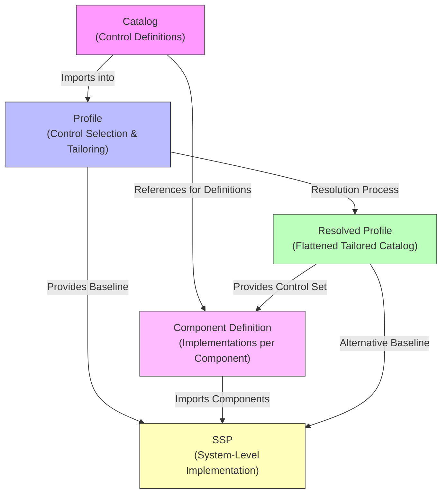

# OSCAL Layer Relationships

## OSCAL Document Relationships and Flow

OSCAL uses a layered, modular approach where documents build on
each other to maintain traceability from control definitions to
tailored baselines to component implementations to system-level
documentation.

### How Documents Feed Each Other

1. **Catalog**
   - Foundational document
   - Defines the full set of security controls
     (e.g., NIST SP 800-53), including statements,
     parameters, and guidance
   - No selection or tailoring
   - Feeds into: Profiles

2. **Profile**
   - Imports from one or more Catalogs (or other Profiles)
   - Performs control **selection** and **tailoring**
     (include/exclude by ID/group, modify parameters,
     merge/alter statements)
   - Represents a baseline (e.g., FedRAMP Moderate, DoD IL4)
   - Feeds into: Resolved Profile, SSP

3. **Resolved Profile**
   - Produced by running the **profile resolution** process
     on a Profile
   - Flattens all imports, merges, modifications, and filters
     into a single, self-contained Catalog-like document
   - Contains only the selected and tailored controls
   - Feeds into: Component Definitions (as the source of
     controls to implement), SSPs

4. **Component Definition (CDEF)**
   - Describes **how** controls are implemented within
     specific reusable components (software, hardware,
     service, policy, etc.)
   - References a Catalog or (preferably) Resolved Profile
     via a `source` URI
   - Lists `implemented-requirements` by control ID from
     the source
   - Groups implementations into **capabilities**
   - Feeds into: SSPs (components can be imported/referenced)

5. **System Security Plan (SSP)**
   - Documents the full system security posture
   - Imports a Profile or Resolved Profile as the control
     baseline
   - Incorporates Component Definitions to describe control
     satisfaction across the system
   - Feeds into: Assessment Plans, Assessment Results, POA&Ms

### Control Statuses in Component Definitions

Unlike XCCDF (which uses statuses such as "Not Applicable",
"Applicable - Configurable", "Applicable - Inherent" mainly for
rule/check applicability), OSCAL uses **implementation-status**
on each `implemented-requirement` in Component Definitions and
SSPs.

Standard OSCAL `implementation-status` values:

- `implemented`
  Fully satisfied by the component (closest to
  "Applicable - Inherent" if built-in)

- `partially-implemented`
  Partially satisfied; needs configuration or additional
  measures (closest to "Applicable - Configurable")

- `planned`
  Will be implemented in the future

- `alternative-implementation`
  Satisfied through an alternative approach

- `not-applicable`
  Not relevant to this component (direct match to XCCDF
  "Not Applicable")

These statuses are **descriptive** rather than evaluative
(OSCAL separates implementation documentation from assessment
results).

### Summary Table -- Document Relationships

<!-- markdownlint-disable MD013 -->

| Document               | Primary Inputs                         | Primary Outputs To             | Main Purpose in Control Lifecycle                     |
| ---------------------- | -------------------------------------- | ------------------------------ | ----------------------------------------------------- |
| **Catalog**            | N/A                                    | Profile, Component Definition  | Raw control definitions (no selection)                |
| **Profile**            | Catalog(s), other Profile(s)           | Resolved Profile, SSP          | Selects, tailors, and baselines controls              |
| **Resolved Profile**   | Profile (via resolution)               | Component Definition, SSP      | Flattened, ready-to-implement control set             |
| **Component Def**      | Catalog or Resolved Profile (source)   | SSP                            | Documents how controls are implemented in components  |
| **SSP**                | Profile/Resolved Profile + Components  | Assessments, POA&Ms            | System-wide control implementation and compliance     |

<!-- markdownlint-enable MD013 -->
