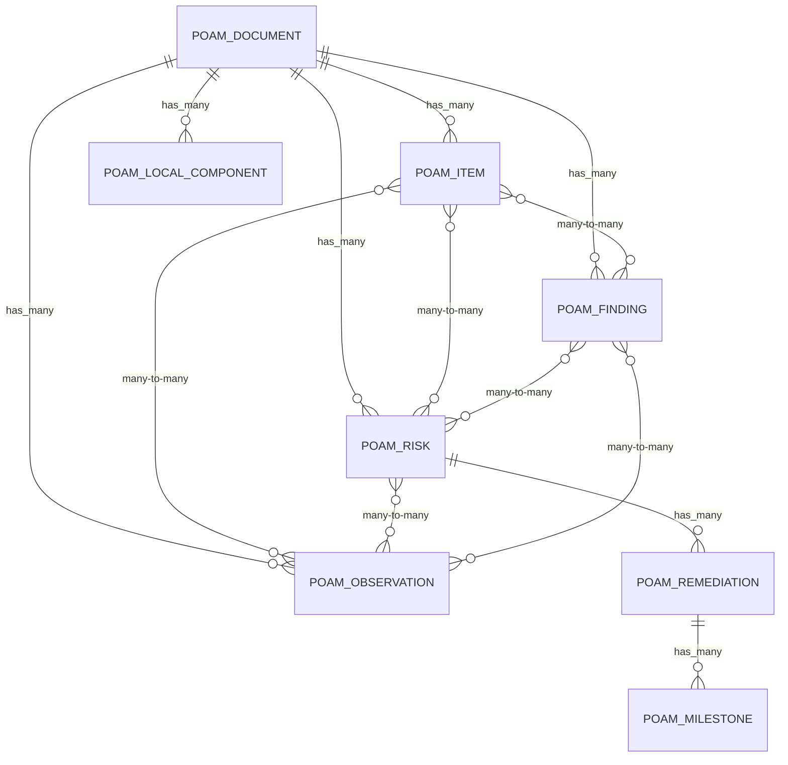

<!-- markdownlint-disable MD013 MD031 MD040 MD060 -->

# POA&M (Plan of Action & Milestones) — OSCAL Data Mapping

This document describes how SPARC internal models map to OSCAL v1.1.2
`plan-of-action-and-milestones` JSON for import and export.

## Model Hierarchy

Unlike SSP/SAR/CDEF documents that follow a three-level Document > Control > ControlField
pattern, POA&M uses a richer relational graph:



## OSCAL Root Element

```json
{ "plan-of-action-and-milestones": { ... } }
```

Export service: `OscalPoamExportService`

## Document-Level Field Mapping

### PoamDocument -> `plan-of-action-and-milestones`

| Internal Field | OSCAL JSON Path | Required | Notes |
|---|---|:---:|---|
| `uuid` | `.uuid` | Yes | RFC 4122 UUID, regenerated on content change |
| `name` | `.metadata.title` | Yes | Document display name |
| `poam_version` | `.metadata.version` | No | Defaults to `"1.0.0"` if blank |
| `oscal_version` | `.metadata.oscal-version` | Yes | Always `"1.1.2"` on export |
| _(generated)_ | `.metadata.last-modified` | Yes | `Time.current.iso8601` at export time |
| `metadata_extra` | `.metadata.*` | No | Preserved metadata (revisions, roles, parties, etc.) merged into base |
| `import_metadata["import_ssp"]` | `.import-ssp` | No | Reference to the parent SSP |
| `system_id` | `.system-id.id` | No | Wrapped with `identifier-type: "http://ietf.org/rfc/rfc4122"` |
| `local_definitions_extra` | `.local-definitions.*` | No | Preserved inventory-items, assessment-assets, etc. |
| _(back matter)_ | `.back-matter` | No | Via `OscalMetadata#build_oscal_back_matter` |

### PoamDocument Constants

| Constant | Value |
|---|---|
| `RISK_STATUSES` | `open`, `investigating`, `remediating`, `deviation-requested`, `deviation-approved`, `closed` |
| `status` enum | `pending`, `processing`, `completed`, `failed` |

## POA&M Items

### PoamItem -> `poam-items[]`

| Internal Field | OSCAL JSON Path | Required | Notes |
|---|---|:---:|---|
| `poam_item_uuid` | `.poam-items[].uuid` | Yes | Falls back to `SecureRandom.uuid` if blank |
| `title` | `.poam-items[].title` | Yes | Short summary of the weakness |
| `description` | `.poam-items[].description` | Yes | Detailed description |
| `origins_data` | `.poam-items[].origins` | No | JSON array, included when present |
| `props_data` | `.poam-items[].props` | No | JSON array of property objects |
| `links_data` | `.poam-items[].links` | No | JSON array of link objects |
| `remarks` | `.poam-items[].remarks` | No | Free-text remarks |
| _(join table)_ | `.poam-items[].related-observations` | No | Array of `{ "observation-uuid": "..." }` via `poam_item_observations` |
| _(join table)_ | `.poam-items[].related-risks` | No | Array of `{ "risk-uuid": "..." }` via `poam_item_risks` |
| _(join table)_ | `.poam-items[].related-findings` | No | Array of `{ "finding-uuid": "..." }` via `poam_item_findings` |

### PoamItem Additional Attributes (internal only, not directly in OSCAL export)

| Field | Type | Notes |
|---|---|---|
| `risk_status` | string | One of `RISK_STATUSES` — derived from linked risks |
| `risk_level` | string | Severity level |
| `likelihood` | string | Likelihood rating |
| `impact` | string | Impact level (high/medium/low) |
| `deadline` | date | Target completion date |
| `row_order` | integer | Display ordering |
| `internal_notes` | text | Internal-only notes, not exported |
| `closure_evidence` | text | Evidence of remediation closure |

## Observations

### PoamObservation -> `observations[]`

| Internal Field | OSCAL JSON Path | Required | Notes |
|---|---|:---:|---|
| `uuid` | `.observations[].uuid` | Yes | |
| `title` | `.observations[].title` | No | |
| `description` | `.observations[].description` | Yes | |
| `methods_data` | `.observations[].methods` | No | JSON array of method strings |
| `types_data` | `.observations[].types` | No | JSON array of type strings |
| `origins_data` | `.observations[].origins` | No | JSON array |
| `subjects_data` | `.observations[].subjects` | No | JSON array |
| `relevant_evidence_data` | `.observations[].relevant-evidence` | No | JSON array |
| `collected` | `.observations[].collected` | No | ISO 8601 datetime |
| `expires` | `.observations[].expires` | No | ISO 8601 datetime |
| `props_data` | `.observations[].props` | No | JSON array |
| `links_data` | `.observations[].links` | No | JSON array |
| `remarks` | `.observations[].remarks` | No | |

## Risks

### PoamRisk -> `risks[]`

| Internal Field | OSCAL JSON Path | Required | Notes |
|---|---|:---:|---|
| `uuid` | `.risks[].uuid` | Yes | |
| `title` | `.risks[].title` | Yes | |
| `description` | `.risks[].description` | Yes | |
| `statement` | `.risks[].statement` | No | Risk statement text |
| `status` | `.risks[].status` | Yes | One of `RISK_STATUSES` |
| `origins_data` | `.risks[].origins` | No | JSON array |
| `threat_ids_data` | `.risks[].threat-ids` | No | JSON array |
| `characterizations_data` | `.risks[].characterizations` | No | JSON array (facets, scoring) |
| `mitigating_factors_data` | `.risks[].mitigating-factors` | No | JSON array |
| `deadline` | `.risks[].deadline` | No | ISO 8601 datetime |
| `risk_log_data` | `.risks[].risk-log` | No | JSON object (log entries) |
| `props_data` | `.risks[].props` | No | JSON array |
| `links_data` | `.risks[].links` | No | JSON array |
| `remarks` | `.risks[].remarks` | No | |
| _(join table)_ | `.risks[].related-observations` | No | Array of `{ "observation-uuid": "..." }` via `poam_risk_observations` |
| _(nested)_ | `.risks[].remediations` | No | See Remediations below |

## Remediations

### PoamRemediation -> `risks[].remediations[]`

| Internal Field | OSCAL JSON Path | Required | Notes |
|---|---|:---:|---|
| `uuid` | `.risks[].remediations[].uuid` | Yes | |
| `lifecycle` | `.risks[].remediations[].lifecycle` | Yes | e.g. `recommendation`, `planned`, `completed` |
| `title` | `.risks[].remediations[].title` | Yes | |
| `description` | `.risks[].remediations[].description` | Yes | |
| `origins_data` | `.risks[].remediations[].origins` | No | JSON array |
| `required_assets_data` | `.risks[].remediations[].required-assets` | No | JSON array |
| `props_data` | `.risks[].remediations[].props` | No | JSON array |
| `links_data` | `.risks[].remediations[].links` | No | JSON array |
| `remarks` | `.risks[].remediations[].remarks` | No | |
| _(nested)_ | `.risks[].remediations[].tasks` | No | See Milestones below |

## Milestones

### PoamMilestone -> `risks[].remediations[].tasks[]`

| Internal Field | OSCAL JSON Path | Required | Notes |
|---|---|:---:|---|
| `uuid` | `.tasks[].uuid` | Yes | |
| `milestone_type` | `.tasks[].type` | Yes | Task type identifier |
| `title` | `.tasks[].title` | Yes | |
| `description` | `.tasks[].description` | Yes | |
| `timing_data` | `.tasks[].timing` | No | JSON object (within-date-range, on-date, etc.) |
| `props_data` | `.tasks[].props` | No | JSON array |
| `links_data` | `.tasks[].links` | No | JSON array |
| `responsible_roles_data` | `.tasks[].responsible-roles` | No | JSON array |
| `subjects_data` | `.tasks[].subjects` | No | JSON array |
| `remarks` | `.tasks[].remarks` | No | |

## Findings

### PoamFinding -> `findings[]`

| Internal Field | OSCAL JSON Path | Required | Notes |
|---|---|:---:|---|
| `uuid` | `.findings[].uuid` | Yes | |
| `title` | `.findings[].title` | Yes | |
| `description` | `.findings[].description` | Yes | |
| `target_data` | `.findings[].target` | No | JSON object (type, target-id, status, etc.) |
| `implementation_statement_uuid` | `.findings[].implementation-statement-uuid` | No | Links to SSP control implementation |
| `origins_data` | `.findings[].origins` | No | JSON array |
| `props_data` | `.findings[].props` | No | JSON array |
| `links_data` | `.findings[].links` | No | JSON array |
| `remarks` | `.findings[].remarks` | No | |
| _(join table)_ | `.findings[].related-observations` | No | Array of `{ "observation-uuid": "..." }` via `poam_finding_observations` |
| _(join table)_ | `.findings[].related-risks` | No | Array of `{ "risk-uuid": "..." }` via `poam_finding_risks` |

## Local Definitions

### PoamLocalComponent -> `local-definitions.components[]`

| Internal Field | OSCAL JSON Path | Required | Notes |
|---|---|:---:|---|
| `uuid` | `.local-definitions.components[].uuid` | Yes | |
| `component_type` | `.local-definitions.components[].type` | Yes | e.g. `software`, `service` |
| `title` | `.local-definitions.components[].title` | Yes | |
| `description` | `.local-definitions.components[].description` | Yes | |
| `purpose` | `.local-definitions.components[].purpose` | No | |
| `status_state` | `.local-definitions.components[].status.state` | No | e.g. `operational`, `under-development` |
| `status_remarks` | `.local-definitions.components[].status.remarks` | No | |
| `responsible_roles_data` | `.local-definitions.components[].responsible-roles` | No | JSON array |
| `protocols_data` | `.local-definitions.components[].protocols` | No | JSON array |
| `props_data` | `.local-definitions.components[].props` | No | JSON array |
| `links_data` | `.local-definitions.components[].links` | No | JSON array |
| `remarks` | `.local-definitions.components[].remarks` | No | |

## Import Format Support

| Format | Parser Service | Notes |
|---|---|---|
| OSCAL JSON | `PoamJsonParserService` | Primary import format |
| OSCAL XML | `PoamXmlParserService` | Converts to JSON hash, delegates to JSON parser |
| OSCAL YAML | `PoamYamlParserService` | Parses YAML to hash, delegates to JSON parser |

## Export Service Methods

| Method | Description |
|---|---|
| `OscalPoamExportService#export` | Builds OSCAL JSON, validates against NIST schema, returns pretty-printed JSON. Raises `OscalValidationError` on failure. |
| `OscalPoamExportService#export_unvalidated` | Builds OSCAL JSON without schema validation. |
| `OscalPoamExportService#validation_result` | Builds the document and returns the validation result object without raising. |
