# Groups and User Relationships

## Users and their Capabilities

| Role | Scope | Key Permissions / Responsibilities | Primary Artifacts / Interactions | Notes / Separation of Duties |
| --- | --- | --- | --- | --- |
| Instance Admin **Restricted** | Application-wide | Full CRUD access to everything; user management, overrides, configuration changes | All artifacts, users, Catalogs, Profiles, Projects | God-mode role; can bypass any restriction |
| Policy Manager | Application-wide | Full management of Catalogs & Profiles (CRUD, tailor, publish, version control) | Master Catalog, Profiles | Controls enterprise baselines; view-only on projects |
| Global Viewer | Application-wide | Read-only access to shared Catalogs and Profiles | Master Catalog, Profiles | Broad visibility into reusable control libraries |
| Authorizing Official (AO) | Project-specific | Accepts residual risk, issues ATO/authorization decision, reviews SAR findings & POA&M progress | SSP (review/approve), SAR (decision), POA&Ms (approval) | Senior official; focuses on risk acceptance |
| System Owner (SO / ISO) | Project-specific | Owns the system; responsible for control implementation, SSP maintenance, system operations | SSP (ownership/implement), Components, Boundaries | Accountable for system security posture |
| Chief Information Security Officer (CISO) | Organization-wide | Provides strategic security oversight, policy direction, risk advice, compliance program leadership | SSP (oversight), AO/SO guidance, enterprise risk posture | High-level oversight; not day-to-day operations |
| Information System Security Officer (ISSO) | Project-specific | Day-to-day security operations; supports SO, maintains controls, coordinates assessments & monitoring | SSP (maintenance), SAP (coordination), SAR, POA&Ms (tracking) | Hands-on security officer for the specific system |
| Project Member | Project-specific | View and contribute to project artifacts; copy/import Profiles into the project for tailoring/use | SSP, Boundaries, Components, POA&Ms, Project-specific Profile | General contributors; cannot alter global baselines |
| Assessor / 3PAO | Project-specific | Full view of all project data; Read/Write access to assessment artifacts only | SAP (R/W), SAR (R/W), all others (view-only) | Independent assessment focus; protected write scope |
| View Only Users | Project-specific | Read-only access to assigned project artifacts (no edit, no copy/import) | SSP, SAR, POA&Ms, Boundaries, Components | Auditors, stakeholders, or read-only reviewers |
| SPARC SME | Project-specific | Broad read/write on SSP, SAR, SAP, POA&M, CDEF, Evidence; catalogs and profiles read-only | SSP (R/W), SAR (R/W), SAP (R/W), POA&Ms (R/W), CDEFs (R/W), Evidence (R/W) | Subject matter expert supporting multiple artifact types |
| Evidence Integration Engineer | Project-specific | Focused on evidence collection and SAR integration; read-only on other artifacts | Evidence (R/W), SAR (R/W), all others (read-only) | Specialized in evidence lifecycle and assessment integration |

## Project and User Associations

```mermaid
graph TD
    subgraph "Instance / Global Level (App-Wide Roles)"
        IA[Instance Admin Full access - can do anything]
        PM[Policy Role / Manager Manage Catalogs & Profiles enterprise-wide]
        GV[Global Viewer / Anyone with access Read-only on Catalogs & Profiles]

        IA -->|full override| MC[Master Catalog]
        IA -->|full override| P[Profiles]
        IA -->|full access| ALL_PROJECTS[All Projects & Artifacts]

        PM -->|CRUD + tailor + publish| MC
        PM -->|CRUD + tailor + publish| P

        GV -->|read only| MC
        GV -->|read only| P
    end

    subgraph Project_Level
        AO["Authorizing Official (AO) Accepts risk & authorizes operation"]
        SO["System Owner (SO / ISO) Owns system, implements controls, maintains SSP"]
        CISO["Chief Information Security Officer (CISO) Org-wide oversight, policy, risk advice"]
        ISSO["Information System Security Officer (ISSO) Day-to-day security, supports SO, coordinates assessments"]
        PMem["Project Member Contributes to project data, copies Profiles"]
        ASS["Assessor / 3PAO View everything + R/W on SAP & SAR"]
        VO["View Only Users Read-only access to project artifacts"]
        SME["SPARC SME Broad R/W on project artifacts"]
        EIE["Evidence Integration Engineer Evidence & SAR focused"]

        PersonnelGroup["Project Personnel Group • AO • SO / ISO • CISO (oversight) • ISSO • SMEs • Assessors • Project Members • Evidence Engineers • View Only"]

        PersonnelGroup -->|roles & responsibilities| SSP[System Security Plan Single per Project]
        PersonnelGroup -->|roles & responsibilities| SAP[Assessment Plan Single]
        PersonnelGroup -->|roles & responsibilities| SAR[Assessment Results Single]
        PersonnelGroup -->|roles & responsibilities| POAM[POA&Ms Multiple]

        AO -.->|authorizes / accepts risk| SSP
        AO -.->|reviews / decides on| SAR
        AO -.->|approves remediations| POAM

        SO -.->|owns & implements| SSP
        SO -.->|coordinates with| ISSO
        SO -.->|provides input to| SAP

        CISO -.->|provides org-level guidance & oversight| SSP
        CISO -.->|advises on risk| AO
        CISO -.->|oversees compliance| ISSO

        ISSO -.->|maintains security posture| SSP
        ISSO -.->|supports assessment coordination| SAP
        ISSO -.->|tracks findings & POA&Ms| POAM

        PMem -->|copy / import Profiles| P -.->|project baseline| ProjP[Project-specific Profile]
        PMem -->|view + contribute| SSP & B[Boundaries] & C[Components] & POAM

        ASS -->|full R/W| SAP
        ASS -->|full R/W| SAR
        ASS -->|view all| SSP & POAM & B & C

        SME -->|full R/W| SSP & SAP & SAR & POAM & C & B
        SME -->|view only| MC & P

        EIE -->|full R/W| E[Evidence]
        EIE -->|full R/W| SAR
        EIE -->|view only| SSP & POAM & C

        IA -.->|app-level override| SSP & SAP & SAR & POAM
        PM -.->|view project artifacts| SSP & SAP & SAR & POAM
    end

    %% Reusability & Sources
    MC -.->|source for| P
    P -.->|reusable across projects| ProjP

    classDef admin fill:#ffcccc,stroke:#990000,stroke-width:2px
    classDef policy fill:#ccffcc,stroke:#006600,stroke-width:2px
    classDef viewer fill:#e6f3ff,stroke:#0066cc,stroke-width:2px
    classDef rmf fill:#fff0f5,stroke:#c71585,stroke-width:2px
    classDef project fill:#fffacd,stroke:#8b8000,stroke-width:2px
    classDef assessor fill:#ffe4e1,stroke:#c71585,stroke-width:2px

    class IA admin
    class PM policy
    class GV viewer
    class AO,SO,CISO,ISSO rmf
    class PMem,VO project
    class ASS assessor
    class SME,EIE project
```

## Projects and User Relationships

```mermaid
graph TD
    subgraph "Shared / Enterprise Level"
        MC[Master Cataloge.g. NIST SP 800-53 Rev. 5 OSCAL]
        P1[Profile: FedRAMP Moderate]
        P2[Profile: DoD IL4 Baseline]
        P3[Profile: Custom Org Baseline]

        MC -->|import / select / tailor| P1
        MC -->|import / select / tailor| P2
        MC -->|import / select / tailor| P3
    end

    subgraph "Project A - e.g. Cloud Web App"
        BoundaryA1[Boundary: Production Env]
        BoundaryA2[Boundary: Dev / Test Env]

        SSP_A[System Security PlanSingle per Project]
        SAP_A[Assessment PlanSingle per Project]
        SAR_A[Assessment Results / SARSingle per Project]

        POAM_A1[POA&M #1e.g. Initial Findings]
        POAM_A2[POA&M #2e.g. Continuous Monitoring]

        PersonnelA["Project Personnel
        • Authorizing Official (AO)
        • Information System Owner (ISO)
        • System Owner (SO)
        • Subject Matter Experts (SMEs)
        • Assessors / 3PAO
        • View Only Users"]

        BoundaryA1 -->|contains many| C1[Component: Web Servervia CDEF]
        BoundaryA1 -->|contains many| C2[Component: Databasevia CDEF]
        BoundaryA1 -->|contains many| C3[Component: Firewallvia CDEF]

        BoundaryA2 -->|contains many| C4[Component: CI/CD Pipeline]
        BoundaryA2 -->|contains many| C5[Component: Logging Service]

        P1 -.->|satisfies baseline| SSP_A
        P2 -.->|satisfies baseline| SSP_A

        C1 -.->|implements / inherits| SSP_A
        C2 -.->|implements / inherits| SSP_A
        C3 -.->|implements / inherits| SSP_A
        C4 -.->|implements / inherits| SSP_A
        C5 -.->|implements / inherits| SSP_A

        SSP_A -->|defines scope & objectives| SAP_A
        SAP_A -->|executes assessment| SAR_A
        SAR_A -->|generates findings → items| POAM_A1
        SAR_A -->|generates findings → items| POAM_A2

        PersonnelA -.->|roles & responsibilities| SSP_A
        PersonnelA -.->|roles & responsibilities| SAP_A
        PersonnelA -.->|roles & responsibilities| SAR_A
        PersonnelA -.->|roles & responsibilities| POAM_Ax[All POA&Ms]
    end

    subgraph "Project B - e.g. Internal Tool Suite"
        BoundaryB1[Boundary: Single Prod Boundary]
        SSP_B[System Security PlanSingle]
        SAP_B[Assessment PlanSingle]
        SAR_B[Assessment ResultsSingle]
        POAM_B1[POA&M #1]
        POAM_B2[POA&M #2]

        PersonnelB[Project Personnel• AO• ISO• SO• SMEs• Assessors• View Only]

        BoundaryB1 -->|contains many| C6[Component: App Servervia CDEF]
        BoundaryB1 -->|contains many| C7[Component: Auth Servicevia CDEF]

        P3 -.->|satisfies baseline| SSP_B

        C6 -.->|implements| SSP_B
        C7 -.->|implements| SSP_B

        SSP_B --> SAP_B --> SAR_B --> POAM_B1
        SSP_B --> SAP_B --> SAR_B --> POAM_B2

        PersonnelB -.-> SSP_B & SAP_B & SAR_B & POAM_Bx[POA&Ms]
    end

    %% Reusability lines
    P1 -.->|reusable across projects| ProjectA
    P1 -.->|reusable across projects| ProjectB
    P2 -.->|reusable across projects| ProjectA
    P3 -.->|reusable across projects| ProjectB

    classDef shared fill:#e6f3ff,stroke:#0066cc,stroke-width:2px
    classDef project fill:#f0fff0,stroke:#228b22,stroke-width:2px
    class MC,P1,P2,P3 shared
    class ProjectA,ProjectB,BoundaryA1,BoundaryA2,BoundaryB1 project
```

