# SPARC Roles and User Relationships

## Overview

SPARC roles are based on the NIST Risk Management Framework (RMF, SP 800-37 Rev. 2) and align with OSCAL (Open Security Controls Assessment Language) responsible-party definitions. OSCAL does not define its own role taxonomy; instead it relies on standard RMF roles referenced in OSCAL metadata (`party` and `role` elements across Catalogs, Profiles, SSPs, Assessment Plans, SARs, and POA&Ms).

The roles below represent the complete canonical set for OSCAL implementation, drawn from NIST SP 800-37 Rev. 2, OSCAL documentation, and FedRAMP-specific guidance (including FedRAMP Rev. 5 baselines and FedRAMP 20x automation). All 29 roles are seeded via `db/seeds.rb` and manageable in the admin UI at `/admin/roles`.

---

## Users and Their Capabilities

### Instance Admin (Application Boolean)

| Role | Scope | Key Permissions / Responsibilities | Primary Artifacts / Interactions | Notes / Separation of Duties |
| --- | --- | --- | --- | --- |
| Instance Admin **Restricted** | Application-wide | Full CRUD access to everything; user management, overrides, configuration changes | All artifacts, users, Catalogs, Profiles, Projects | God-mode role; can bypass any restriction. Boolean on User model, not a seeded role. |

### Instance-Scope Roles (10)

| Role | Scope | Key Permissions / Responsibilities | Primary Artifacts / Interactions | Notes / Separation of Duties |
| --- | --- | --- | --- | --- |
| Policy Manager | Instance | Full management of Catalogs & Profiles (CRUD, tailor, publish, version control) | Master Catalog, Profiles | Controls enterprise baselines; view-only on projects. Maps to OSCAL Catalog/Baseline Creator. |
| Global Viewer | Instance | Read-only access to shared Catalogs and Profiles | Master Catalog, Profiles | Broad visibility into reusable control libraries |
| Senior Accountable Official | Instance | Leads the Risk Executive function; aligns risk management with strategic planning | All artifacts (read-only) | Enterprise-wide risk oversight per NIST SP 800-37 |
| Senior Agency Official for Privacy (SAOP) | Instance | Oversees privacy risk management, PII processing, and privacy controls | All artifacts (read-only) | Organization-wide privacy compliance |
| Head of Agency / CEO | Instance | Ultimate accountability for risk management and RMF integration | All artifacts (read-only) | Ensures programs are resourced and aligned with mission |
| Risk Executive | Instance | Advises on organization-wide risk tolerance, strategy, and acceptable risk levels | All artifacts (read-only) | Coordinates risk activities across the enterprise |
| Chief Information Officer (CIO) | Instance | Oversees information security program; designates the SAISO | All artifacts (read-only) | Ensures IT investments integrate security per FISMA |
| Chief Acquisition Officer | Instance | Integrates security/privacy requirements into acquisition and supply chain | Catalogs, Profiles, Projects, CDEFs, Evidence (read-only) | Procurement-focused reads |
| FedRAMP PMO | Instance | Oversees FedRAMP program; provides OSCAL templates, validation tools, reviews packages | All artifacts (read-only) | FedRAMP program management and guidance |
| Joint Authorization Board (JAB) | Instance | Reviews OSCAL packages for Provisional ATOs (P-ATOs) for government-wide cloud services | All artifacts (read-only) | Composed of CIOs from DHS, DOD, and GSA |

### Project-Scope Roles (19)

| Role | Scope | Key Permissions / Responsibilities | Primary Artifacts / Interactions | Notes / Separation of Duties |
| --- | --- | --- | --- | --- |
| Authorizing Official (AO) | Project | Accepts residual risk, issues ATO decision, reviews SAR findings & POA&M progress | SSP (review), SAR (decision), POA&Ms (R/W) | Senior official; risk acceptance per NIST SP 800-37 |
| Agency Authorizing Official | Project | Issues agency-specific ATOs based on FedRAMP baselines and OSCAL artifacts | SSP (review), SAR (decision), POA&Ms (R/W) | Agency-specific risk context; same permissions as AO |
| System Owner (SO / ISO) | Project | Owns the system; control implementation, SSP maintenance, boundary definition | SSP (R/W), POA&Ms (R/W), CDEFs (R/W), Evidence (R/W) | Accountable for system security posture |
| CISO | Project | Strategic security oversight, policy direction, risk advice, compliance leadership | All project artifacts (read-only) | SAISO per NIST SP 800-37; high-level oversight |
| ISSM | Project | Oversees system security posture; supports SO, coordinates with ISSOs | SSP (R/W), POA&Ms (R/W), Evidence (R/W), SAR/SAP (read) | Management layer between ISSO and SO |
| ISSO | Project | Day-to-day security operations; maintains controls, coordinates assessments | SSP (R/W), SAP (R/W), SAR (R/W), POA&Ms (R/W), Evidence (R/W) | Hands-on security officer for the system |
| Cloud Service Provider (CSP) | Project | Builds OSCAL SSP, implements controls, prepares auth packages, manages POA&Ms | SSP (R/W), POA&Ms (R/W), CDEFs (R/W), Evidence (R/W), SAR/SAP (read) | FedRAMP-specific; the organization being authorized |
| Assessor / 3PAO | Project | Independent assessment; develops SAPs, produces SARs, evaluates control effectiveness | SAP (R/W), SAR (R/W), all others (read-only) | Independent assessment focus; protected write scope |
| Common Control Provider | Project | Implements, assesses, and monitors common/inherited controls shared across systems | SSP (R/W), CDEFs (R/W), Evidence (R/W) | Documents common controls for system-level SSPs |
| System Architect / Engineer | Project | Designs security architecture; contributes to SSP technical sections and CDEFs | SSP (R/W), CDEFs (R/W), Evidence (read) | Security engineering and design documentation |
| Component Supplier / Product Engineer | Project | Provides reusable components with documented control implementations | CDEFs (R/W), Evidence (R/W) | OSCAL Component Definition focused |
| System Operator / Administrator | Project | Daily operations, monitoring, maintenance; implements operational controls | SSP (read), POA&Ms (read), CDEFs (read), Evidence (R/W) | Operational evidence collection |
| Information Owner / Steward | Project | Defines protection requirements for information types; supports categorization | SSP (read), CDEFs (read), Evidence (read) | Data governance per FIPS 199 |
| Vendor Dependency Manager | Project | Tracks vendor-supplied components and inherited controls for CDEFs | SSP (read), CDEFs (R/W), Evidence (R/W) | Supply chain and vendor security documentation |
| Solution Evaluator | Project | Assesses tools/services for OSCAL compliance and integration readiness | SSP (read), SAR (read), CDEFs (read), Evidence (read) | Solution suitability evaluation |
| Project Member | Project | General contributor; view/edit SSP, manage POA&Ms, work with CDEFs and Evidence | SSP (R/W), POA&Ms (R/W), CDEFs (R/W), Evidence (R/W), Profiles (read) | Cannot alter global catalogs or baselines |
| SPARC SME | Project | Broad read/write on all project artifacts | SSP (R/W), SAR (R/W), SAP (R/W), POA&Ms (R/W), CDEFs (R/W), Evidence (R/W) | Subject matter expert; catalogs/profiles read-only |
| Evidence Integration Engineer | Project | Evidence lifecycle management and assessment integration | Evidence (R/W), SAR (R/W), all others (read-only) | Specialized in evidence and attestation workflows |
| View Only | Project | Read-only access to assigned project artifacts | SSP, SAR, POA&Ms, CDEFs, Evidence (read-only) | Auditors, stakeholders, or read-only reviewers |

---

## OSCAL Model and Role Mapping

| OSCAL Model | Primary Responsible Roles | Key Activities |
|---|---|---|
| **Catalog** | Policy Manager, Common Control Provider, FedRAMP PMO | Define and maintain baseline controls |
| **Profile** | Policy Manager, Common Control Provider | Tailor baselines for specific environments |
| **System Security Plan (SSP)** | System Owner, ISSO, ISSM, CSP | Document control implementation |
| **Assessment Plan (SAP)** | Assessor / 3PAO, ISSO | Plan security assessments |
| **Assessment Results (SAR)** | Assessor / 3PAO, AO, Evidence Integration Engineer | Report assessment findings |
| **POA&M** | ISSO, System Owner, AO, CSP | Track remediation of findings |
| **Component Definition** | Component Supplier, System Architect, System Owner, Vendor Dependency Manager | Document reusable component controls |

---

## Project and User Associations

```mermaid
graph TD
    subgraph "Instance / Global Level (App-Wide Roles)"
        IA[Instance Admin Full access - can do anything]
        PM[Policy Manager Catalogs & Profiles CRUD]
        GV[Global Viewer Read-only on Catalogs & Profiles]
        SAO_I[Senior Accountable Official Risk oversight]
        SAOP_I[SAOP Privacy oversight]
        HOA[Head of Agency / CEO Ultimate accountability]
        RE[Risk Executive Risk tolerance & strategy]
        CIO_I[CIO IT security program oversight]
        CAO[Chief Acquisition Officer Supply chain security]
        FPMO[FedRAMP PMO Program oversight]
        JAB_I[JAB P-ATO reviews]

        IA -->|full override| MC[Master Catalog]
        IA -->|full override| P[Profiles]
        IA -->|full access| ALL_PROJECTS[All Projects & Artifacts]

        PM -->|CRUD + tailor + publish| MC
        PM -->|CRUD + tailor + publish| P

        GV -->|read only| MC
        GV -->|read only| P

        SAO_I -->|read only| MC & P
        SAOP_I -->|read only| MC & P
        HOA -->|read only| MC & P
        RE -->|read only| MC & P
        CIO_I -->|read only| MC & P
        CAO -->|read only| MC & P
        FPMO -->|read only| MC & P
        JAB_I -->|read only| MC & P
    end

    subgraph Project_Level
        AO["Authorizing Official (AO) Accepts risk & authorizes operation"]
        AAO["Agency AO Agency-specific ATOs"]
        SO["System Owner (SO / ISO) Owns system, implements controls"]
        CISO["CISO Org-wide oversight, policy, risk advice"]
        ISSM_P["ISSM Oversees security posture"]
        ISSO["ISSO Day-to-day security operations"]
        CSP_P["Cloud Service Provider Builds auth packages"]
        ASS["Assessor / 3PAO Independent assessment"]
        CCP["Common Control Provider Inherited controls"]
        SAE["System Architect / Engineer Security design"]
        CSUP["Component Supplier Component documentation"]
        SYSOP["System Operator / Admin Operational controls"]
        IOW["Information Owner / Steward Data governance"]
        VDM["Vendor Dependency Manager Supply chain"]
        SOLEV["Solution Evaluator OSCAL compliance"]
        PMem["Project Member General contributor"]
        SME["SPARC SME Broad R/W on artifacts"]
        EIE["Evidence Integration Engineer Evidence & SAR"]
        VO["View Only Read-only access"]

        PersonnelGroup["Project Personnel Group All project-scoped roles"]

        PersonnelGroup -->|roles & responsibilities| SSP[System Security Plan]
        PersonnelGroup -->|roles & responsibilities| SAP[Assessment Plan]
        PersonnelGroup -->|roles & responsibilities| SAR[Assessment Results]
        PersonnelGroup -->|roles & responsibilities| POAM[POA&Ms]

        AO -.->|authorizes / accepts risk| SSP
        AO -.->|reviews / decides on| SAR
        AO -.->|approves remediations| POAM

        SO -.->|owns & implements| SSP
        SO -.->|coordinates with| ISSO

        CISO -.->|oversight & guidance| SSP
        ISSM_P -.->|oversees posture| SSP
        ISSM_P -.->|coordinates| ISSO

        ISSO -.->|maintains security| SSP
        ISSO -.->|coordinates assessment| SAP
        ISSO -.->|tracks findings| POAM

        CSP_P -.->|builds package| SSP
        CSP_P -.->|manages| POAM
        CSP_P -.->|provides| CDEF[Component Defs]

        ASS -->|full R/W| SAP
        ASS -->|full R/W| SAR

        CCP -.->|documents common controls| SSP & CDEF
        SAE -.->|designs & documents| SSP & CDEF
        CSUP -.->|supplies components| CDEF
        VDM -.->|tracks vendors| CDEF

        SME -->|full R/W| SSP & SAP & SAR & POAM & CDEF
        EIE -->|full R/W| E[Evidence]
        EIE -->|full R/W| SAR

        IA -.->|app-level override| SSP & SAP & SAR & POAM
    end

    MC -.->|source for| P
    P -.->|reusable across projects| ProjP[Project-specific Profile]

    classDef admin fill:#ffcccc,stroke:#990000,stroke-width:2px
    classDef policy fill:#ccffcc,stroke:#006600,stroke-width:2px
    classDef viewer fill:#e6f3ff,stroke:#0066cc,stroke-width:2px
    classDef rmf fill:#fff0f5,stroke:#c71585,stroke-width:2px
    classDef project fill:#fffacd,stroke:#8b8000,stroke-width:2px
    classDef assessor fill:#ffe4e1,stroke:#c71585,stroke-width:2px
    classDef fedramp fill:#e8f5e9,stroke:#2e7d32,stroke-width:2px

    class IA admin
    class PM policy
    class GV viewer
    class AO,AAO,SO,CISO,ISSM_P,ISSO rmf
    class PMem,VO,SME,EIE project
    class ASS assessor
    class CSP_P,FPMO,JAB_I fedramp
    class SAO_I,SAOP_I,HOA,RE,CIO_I,CAO viewer
    class CCP,SAE,CSUP,SYSOP,IOW,VDM,SOLEV project
```

## Projects and User Relationships

```mermaid
graph TD
    subgraph "Shared / Enterprise Level"
        MC[Master Catalog e.g. NIST SP 800-53 Rev. 5 OSCAL]
        P1[Profile: FedRAMP Moderate]
        P2[Profile: DoD IL4 Baseline]
        P3[Profile: Custom Org Baseline]

        MC -->|import / select / tailor| P1
        MC -->|import / select / tailor| P2
        MC -->|import / select / tailor| P3
    end

    subgraph "Project A - e.g. Cloud Web App"
        BoundaryA1[Boundary: Production Env]
        BoundaryA2[Boundary: Dev / Test Env]

        SSP_A[System Security Plan Single per Project]
        SAP_A[Assessment Plan Single per Project]
        SAR_A[Assessment Results / SAR Single per Project]

        POAM_A1[POA&M #1 e.g. Initial Findings]
        POAM_A2[POA&M #2 e.g. Continuous Monitoring]

        PersonnelA["Project Personnel
        • Authorizing Official (AO)
        • Agency AO
        • System Owner (SO / ISO)
        • CISO (oversight)
        • ISSM
        • ISSO
        • Cloud Service Provider (CSP)
        • Assessors / 3PAO
        • Common Control Provider
        • System Architect / Engineer
        • Component Supplier
        • System Operator / Admin
        • Information Owner / Steward
        • Vendor Dependency Manager
        • Solution Evaluator
        • Project Members
        • SPARC SMEs
        • Evidence Engineers
        • View Only"]

        BoundaryA1 -->|contains many| C1[Component: Web Server via CDEF]
        BoundaryA1 -->|contains many| C2[Component: Database via CDEF]
        BoundaryA1 -->|contains many| C3[Component: Firewall via CDEF]

        BoundaryA2 -->|contains many| C4[Component: CI/CD Pipeline]
        BoundaryA2 -->|contains many| C5[Component: Logging Service]

        P1 -.->|satisfies baseline| SSP_A
        P2 -.->|satisfies baseline| SSP_A

        C1 -.->|implements / inherits| SSP_A
        C2 -.->|implements / inherits| SSP_A
        C3 -.->|implements / inherits| SSP_A
        C4 -.->|implements / inherits| SSP_A
        C5 -.->|implements / inherits| SSP_A

        SSP_A -->|defines scope & objectives| SAP_A
        SAP_A -->|executes assessment| SAR_A
        SAR_A -->|generates findings| POAM_A1
        SAR_A -->|generates findings| POAM_A2

        PersonnelA -.->|roles & responsibilities| SSP_A
        PersonnelA -.->|roles & responsibilities| SAP_A
        PersonnelA -.->|roles & responsibilities| SAR_A
        PersonnelA -.->|roles & responsibilities| POAM_Ax[All POA&Ms]
    end

    subgraph "Project B - e.g. Internal Tool Suite"
        BoundaryB1[Boundary: Single Prod Boundary]
        SSP_B[System Security Plan Single]
        SAP_B[Assessment Plan Single]
        SAR_B[Assessment Results Single]
        POAM_B1[POA&M #1]
        POAM_B2[POA&M #2]

        PersonnelB["Project Personnel
        • AO / Agency AO
        • SO / ISO
        • CISO / ISSM / ISSO
        • CSP
        • Assessors / 3PAO
        • System Architect / Component Supplier
        • System Operator / Info Owner
        • Vendor Dependency Mgr / Solution Evaluator
        • Project Members / SMEs
        • Evidence Engineers / View Only"]

        BoundaryB1 -->|contains many| C6[Component: App Server via CDEF]
        BoundaryB1 -->|contains many| C7[Component: Auth Service via CDEF]

        P3 -.->|satisfies baseline| SSP_B

        C6 -.->|implements| SSP_B
        C7 -.->|implements| SSP_B

        SSP_B --> SAP_B --> SAR_B --> POAM_B1
        SSP_B --> SAP_B --> SAR_B --> POAM_B2

        PersonnelB -.-> SSP_B & SAP_B & SAR_B & POAM_Bx[POA&Ms]
    end

    P1 -.->|reusable across projects| ProjectA
    P1 -.->|reusable across projects| ProjectB
    P2 -.->|reusable across projects| ProjectA
    P3 -.->|reusable across projects| ProjectB

    classDef shared fill:#e6f3ff,stroke:#0066cc,stroke-width:2px
    classDef project fill:#f0fff0,stroke:#228b22,stroke-width:2px
    class MC,P1,P2,P3 shared
    class ProjectA,ProjectB,BoundaryA1,BoundaryA2,BoundaryB1 project
```

---

## Sources and References

- NIST SP 800-37 Rev. 2 -- Risk Management Framework for Information Systems and Organizations
- NIST OSCAL Documentation -- https://pages.nist.gov/OSCAL/
- FedRAMP Authorization Package Template Instructions (Rev. 5) and OSCAL Roadmap
- FedRAMP OSCAL Resources -- https://www.fedramp.gov/oscal/
- FedRAMP 20x -- https://www.fedramp.gov/20x/
- NIST RMF Roles Crosswalk (Appendix D of SP 800-37 Rev. 2)
