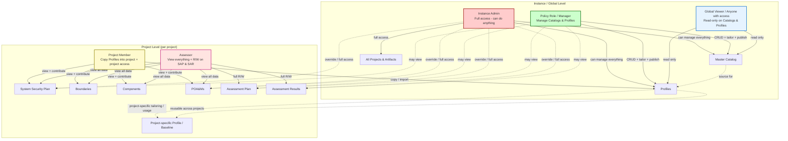

# Groups and User Relationships

## Users and their Capabilities

```mermaid
graph TD
    subgraph "Instance / Global Level"
        IA[Instance Admin<br>Full access - can do anything]
        PM[Policy Role / Manager<br>Manage Catalogs & Profiles]
        GV[Global Viewer / Anyone with access<br>Read-only on Catalogs & Profiles]

        IA -->|can manage everything| MC[Master Catalog]
        IA -->|can manage everything| P[Profiles]
        IA -->|full access| ALL_PROJECTS[All Projects & Artifacts]

        PM -->|CRUD + tailor + publish| MC
        PM -->|CRUD + tailor + publish| P

        GV -->|read only| MC
        GV -->|read only| P
    end

    subgraph "Project Level (per project)"
        PMem[Project Member<br>Copy Profiles into project + project access]
        ASS[Assessor<br>View everything + R/W on SAP & SAR]

        PMem -->|copy / import| P -.->|project-specific tailoring / usage| ProjP[Project-specific Profile / Baseline]
        PMem -->|view + contribute| SSP[System Security Plan]
        PMem -->|view + contribute| B[Boundaries]
        PMem -->|view + contribute| C[Components]
        PMem -->|view + contribute| POAM[POA&Ms]

        ASS -->|view all data| SSP
        ASS -->|view all data| B
        ASS -->|view all data| C
        ASS -->|view all data| POAM
        ASS -->|full R/W| SAP[Assessment Plan]
        ASS -->|full R/W| SAR[Assessment Results]

        IA -.->|override / full access| SSP
        IA -.->|override / full access| SAP
        IA -.->|override / full access| SAR
        IA -.->|override / full access| POAM

        PM -.->|may view| SSP
        PM -.->|may view| SAP
        PM -.->|may view| SAR
        PM -.->|may view| POAM
    end

    %% Cross-level connections
    P -.->|reusable across projects| ProjP
    MC -.->|source for| P

    classDef admin fill:#ffcccc,stroke:#990000,stroke-width:2px
    classDef policy fill:#ccffcc,stroke:#006600,stroke-width:2px
    classDef viewer fill:#e6f3ff,stroke:#0066cc,stroke-width:2px
    classDef project fill:#fffacd,stroke:#8b8000,stroke-width:2px
    classDef assessor fill:#ffe4e1,stroke:#c71585,stroke-width:2px

    class IA admin
    class PM policy
    class GV viewer
    class PMem project
    class ASS assessor
```

## Projects and User Relationships

```mermaid
graph TD
    subgraph "Shared / Enterprise Level"
        MC[Master Cataloge.g. NIST SP 800-53 Rev. 5 OSCAL]
        P1[Profile: FedRAMP Moderate]
        P2[Profile: DoD IL4 Baseline]
        P3[Profile: Custom Org Baseline]
        
        MC -->|import / select / tailor| P1
        MC -->|import / select / tailor| P2
        MC -->|import / select / tailor| P3
    end

    subgraph "Project A - e.g. Cloud Web App"
        BoundaryA1[Boundary: Production Env]
        BoundaryA2[Boundary: Dev / Test Env]
        
        SSP_A[System Security PlanSingle per Project]
        SAP_A[Assessment PlanSingle per Project]
        SAR_A[Assessment Results / SARSingle per Project]
        
        POAM_A1[POA&M #1e.g. Initial Findings]
        POAM_A2[POA&M #2e.g. Continuous Monitoring]
        
        PersonnelA["Project Personnel 
        • Authorizing Official (AO)
        • Information System Owner (ISO)
        • System Owner (SO)
        • Subject Matter Experts (SMEs)
        • Assessors / 3PAO
        • View Only Users"]
        
        BoundaryA1 -->|contains many| C1[Component: Web Servervia CDEF]
        BoundaryA1 -->|contains many| C2[Component: Databasevia CDEF]
        BoundaryA1 -->|contains many| C3[Component: Firewallvia CDEF]
        
        BoundaryA2 -->|contains many| C4[Component: CI/CD Pipeline]
        BoundaryA2 -->|contains many| C5[Component: Logging Service]
        
        P1 -.->|satisfies baseline| SSP_A
        P2 -.->|satisfies baseline| SSP_A
        
        C1 -.->|implements / inherits| SSP_A
        C2 -.->|implements / inherits| SSP_A
        C3 -.->|implements / inherits| SSP_A
        C4 -.->|implements / inherits| SSP_A
        C5 -.->|implements / inherits| SSP_A
        
        SSP_A -->|defines scope & objectives| SAP_A
        SAP_A -->|executes assessment| SAR_A
        SAR_A -->|generates findings → items| POAM_A1
        SAR_A -->|generates findings → items| POAM_A2
        
        PersonnelA -.->|roles & responsibilities| SSP_A
        PersonnelA -.->|roles & responsibilities| SAP_A
        PersonnelA -.->|roles & responsibilities| SAR_A
        PersonnelA -.->|roles & responsibilities| POAM_Ax[All POA&Ms]
    end

    subgraph "Project B - e.g. Internal Tool Suite"
        BoundaryB1[Boundary: Single Prod Boundary]
        SSP_B[System Security PlanSingle]
        SAP_B[Assessment PlanSingle]
        SAR_B[Assessment ResultsSingle]
        POAM_B1[POA&M #1]
        POAM_B2[POA&M #2]
        
        PersonnelB[Project Personnel• AO• ISO• SO• SMEs• Assessors• View Only]
        
        BoundaryB1 -->|contains many| C6[Component: App Servervia CDEF]
        BoundaryB1 -->|contains many| C7[Component: Auth Servicevia CDEF]
        
        P3 -.->|satisfies baseline| SSP_B
        
        C6 -.->|implements| SSP_B
        C7 -.->|implements| SSP_B
        
        SSP_B --> SAP_B --> SAR_B --> POAM_B1
        SSP_B --> SAP_B --> SAR_B --> POAM_B2
        
        PersonnelB -.-> SSP_B & SAP_B & SAR_B & POAM_Bx[POA&Ms]
    end

    %% Reusability lines
    P1 -.->|reusable across projects| ProjectA
    P1 -.->|reusable across projects| ProjectB
    P2 -.->|reusable across projects| ProjectA
    P3 -.->|reusable across projects| ProjectB

    classDef shared fill:#e6f3ff,stroke:#0066cc,stroke-width:2px
    classDef project fill:#f0fff0,stroke:#228b22,stroke-width:2px
    class MC,P1,P2,P3 shared
    class ProjectA,ProjectB,BoundaryA1,BoundaryA2,BoundaryB1 project
```
