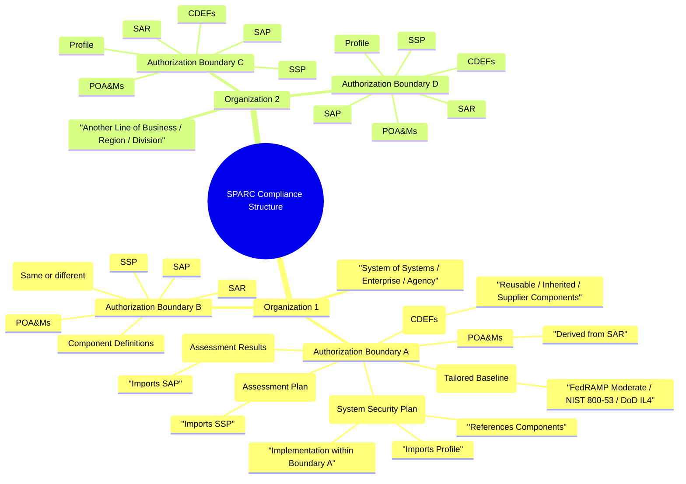

# Organizational Structure

# Describe & Visualize the Hierarchy: Organization → Authorization Boundaries → OSCAL Artifacts

## Description

Create clear documentation (wiki page or README section) that explains the full hierarchical relationship between:

- **Organization** (aligned with DoD's "System of Systems" concept)  
- **Authorization Boundaries** (individual systems or scopes with their own ATO)  
- **Profiles** (tailored baselines)  
- **CDEFs** (Component Definitions)  
- **SSP** (System Security Plan)  
- **SAP** (Security Assessment Plan)  
- **SAR** (Security Assessment Report)  
- **POA&Ms** (Plans of Action and Milestones)

The documentation should include:

- A textual explanation of how these entities relate in a real-world compliance workflow (NIST RMF, FedRAMP, DoD)
- A visual mind map using Mermaid syntax to show:
  - Multiple Organizations
  - Each Organization containing 1 or more Authorization Boundaries
  - Downstream inheritance and import relationships through the OSCAL layers
- Links to relevant NIST/FedRAMP/DoD references

This will serve as the canonical reference for users building multi-system environments in SPARC.

## Textual Explanation (to be added to wiki/docs)

An **Organization** represents a large entity (agency, company, DoD mission area) that oversees multiple systems — similar to DoD's **System of Systems (SoS)** concept, where many independent systems work together toward a shared mission.

Each **Authorization Boundary** is a separately managed scope with its own ATO (or cATO in DoD). Boundaries can inherit controls from shared Profiles, Catalogs, or Components.

The flow through OSCAL layers:

- **Profiles** → Tailored selection and parameterization of controls from Catalogs (e.g., FedRAMP Moderate baseline)
- **CDEFs (Component Definitions)** → Reusable/inherited components that implement controls (mapped into SSPs)
- **SSP** → Documents how controls are implemented within a specific Authorization Boundary, importing Profiles and referencing Components
- **SAP** → Defines how the SSP will be assessed, importing the SSP
- **SAR** → Records assessment findings, importing the SAP
- **POA&Ms** → Tracks remediation of unresolved findings from the SAR

Relationships are maintained via OSCAL `import-*` statements for traceability.

## Mermaid Mind Map (to be embedded in wiki/docs)

