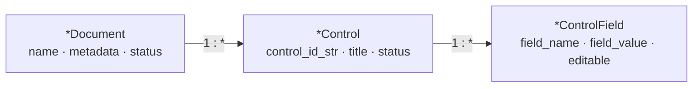
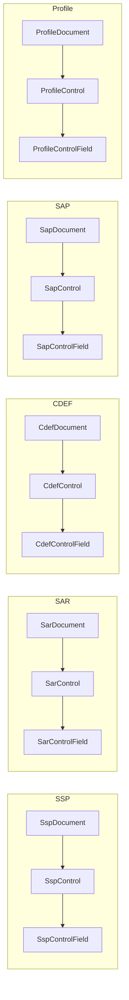
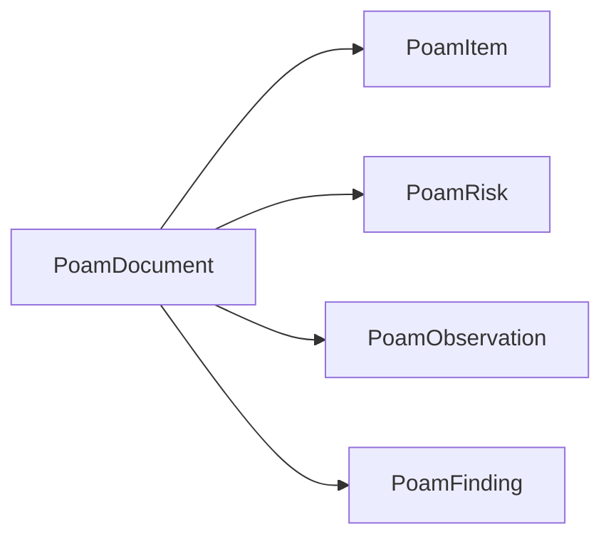
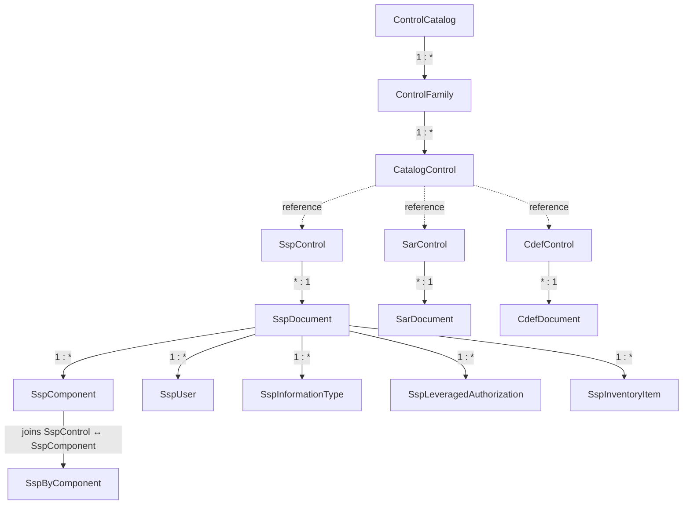
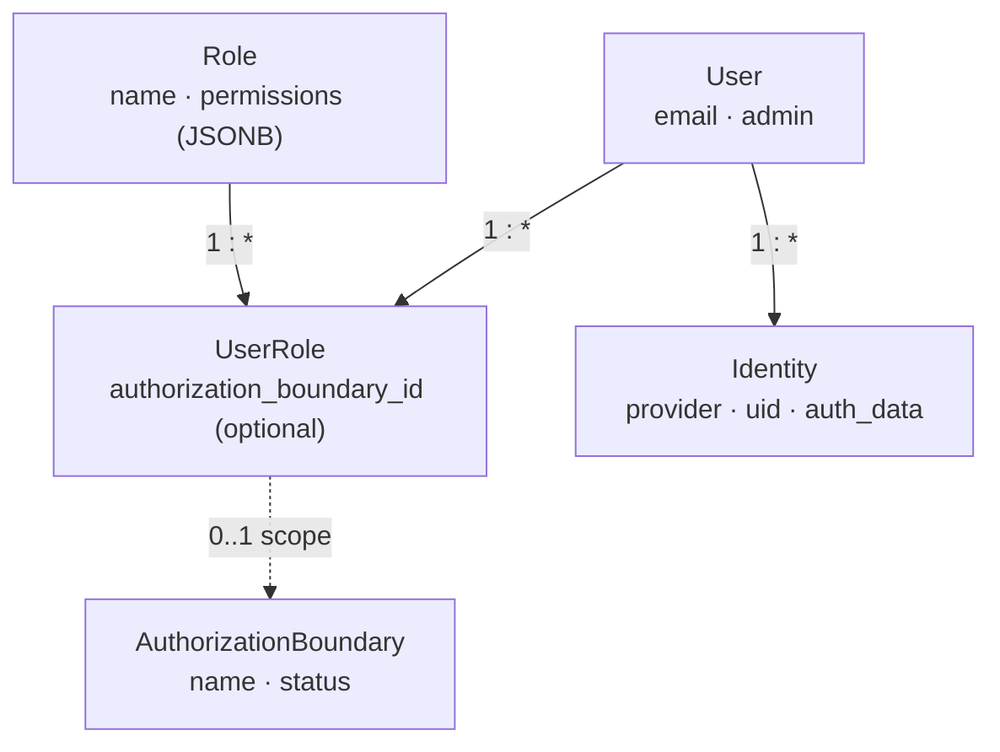
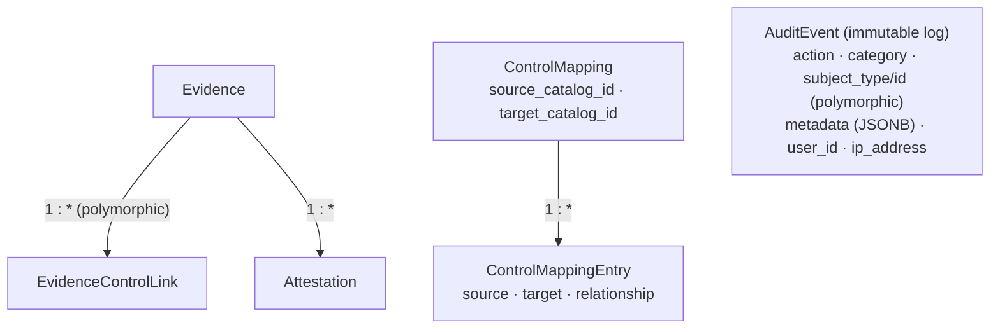
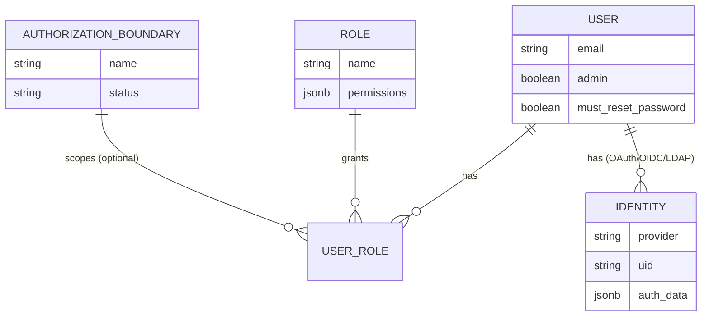
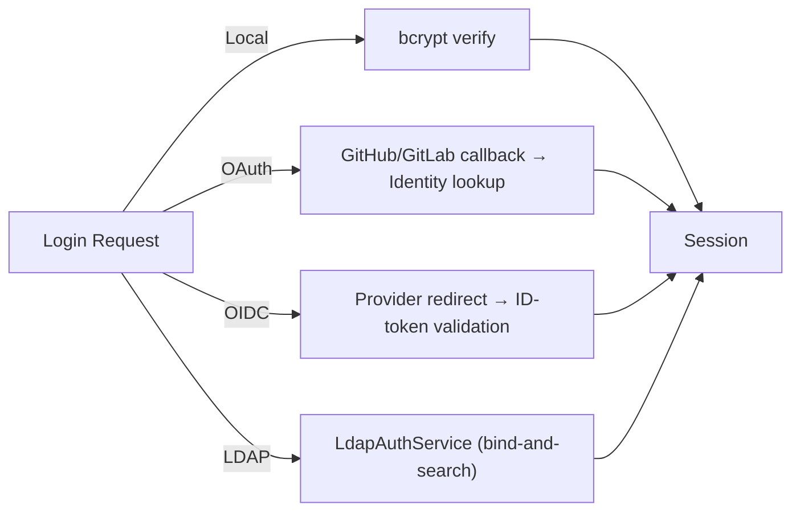

# Architecture

> Reflects SPARC **v1.12.1**.

## Overview

SPARC follows a Rails monolith architecture with Hotwire (Turbo + Stimulus) for interactive frontend behavior, **Solid Queue** for background job processing (Sidekiq + Redis remain available as an optional adapter), and PostgreSQL with JSONB columns for flexible schema storage. The domain model is organized around OSCAL document types, each following a consistent three-level hierarchy.

---

## Core Model Hierarchy

Each document type follows a consistent three-level `*Document → *Control → *ControlField` hierarchy. POA&M is the exception: it decomposes into items, risks, observations, and findings.

**Concrete implementations** (all follow the pattern above):

**Special case — POA&M** decomposes rather than following the three-level pattern:

---

## Relationship Diagram

**Catalog → documents.** A `ControlCatalog` organizes families and controls that the document-level controls reference:

**Users, roles & authorization boundaries.** RBAC is `User`—`UserRole`—`Role`, where `UserRole` is optionally scoped to an `AuthorizationBoundary`:

**Evidence, mappings & audit.** Evidence links polymorphically to any document type; mappings relate catalogs; `AuditEvent` is an immutable log:

---

## Catalog Hierarchy

The control catalog system mirrors the NIST organizational structure:

| Model | Description |
|-------|-------------|
| `ControlCatalog` | A versioned catalog (e.g., "NIST SP 800-53 Rev 5"). Top-level container. |
| `ControlFamily` | A grouping of related controls within a catalog (e.g., AC, AU, SI). |
| `CatalogControl` | An individual control with `guidance_data` (JSONB) for supplemental guidance, references, and parameters. |

---

## Mapping System

Control mappings enable cross-framework analysis (e.g., NIST 800-53 to ISO 27001):

- `ControlMapping` links a source catalog to a target catalog
- `ControlMappingEntry` records individual control-to-control relationships with a relationship type based on NIST IR 8477 set-theory semantics: `equal`, `superset`, `subset`, `intersect`

---

## SSP OSCAL Entities

An `SspDocument` contains the full OSCAL SSP model beyond controls:

| Model | Purpose |
|-------|---------|
| `SspComponent` | A technology component implementing controls (with `port_protocols` JSONB) |
| `SspUser` | An authorized system user/role |
| `SspInformationType` | A categorized information type (FIPS 199 impact levels) |
| `SspLeveragedAuthorization` | A reference to a parent system's authorization |
| `SspInventoryItem` | A deployed instance of a component |
| `SspByComponent` | Join table linking `SspControl` to `SspComponent` with implementation details |

---

## SAR OSCAL Entities

An `SarDocument` contains the full OSCAL Assessment Results model:

| Model | Purpose |
|-------|---------|
| `SarResult` | A discrete assessment result set (e.g., one scan or review session) |
| `SarObservation` | An observation made during assessment |
| `SarFinding` | A finding derived from one or more observations |
| `SarRisk` | A risk identified from findings |

Junction tables connect results to observations, findings, and risks in many-to-many relationships.

---

## User & Auth System

### Entity relationships

### Authentication flow

- `User` holds core profile, `admin` flag, sign-in tracking, and `must_reset_password`
- `Identity` stores OAuth/OIDC/LDAP provider data (`provider`, `uid`, `auth_data` JSONB)
- `UserRole` assigns a `Role` to a `User`, optionally scoped to an `AuthorizationBoundary`
- `Role` contains a `permissions` JSONB field with 20 boolean permission keys

---

## Evidence System

- `Evidence` records are attached to documents via `EvidenceControlLink` (polymorphic association supporting any document type)
- `Attestation` records are linked to evidence for formal sign-off

---

## Audit System

`AuditEvent` provides an immutable audit trail:

- Approximately 80 tracked actions across 16 categories
- Polymorphic subject tracking (`subject_type`/`subject_id`) for any auditable resource
- `metadata` JSONB column for action-specific context (before/after values, parameters)
- Indexed by `user_id`, `action`, `category`, `subject_type`, and `created_at`

---

## Service Layer

SPARC's business logic lives in `app/services/` (~90 service objects). They group
into the following families. The lists below name the representative services in
each family rather than every file.

### Parser Services (Import)

Each document type has a parser **per serialization format**. OSCAL ingestion
auto-detects the format via `OscalFormatDetectionService`, and
`OscalJsonToXmlConverter` bridges JSON↔XML where needed.

| Document type | Parser services |
|---------------|-----------------|
| SSP | `SspJsonParserService`, `SspXmlParserService`, `SspYamlParserService` |
| SAR | `SarJsonParserService`, `SarXmlParserService`, `SarYamlParserService` |
| SAP | `SapJsonParserService`, `SapXmlParserService`, `SapYamlParserService` |
| POA&M | `PoamJsonParserService`, `PoamXmlParserService`, `PoamYamlParserService` |
| Profile | `ProfileJsonParserService`, `ProfileXmlParserService`, `ProfileYamlParserService` |
| CDEF | `CdefJsonParserService`, `CdefXccdfParserService` (DISA STIG), `CdefYamlParserService` |
| Catalog | `CatalogImportService`, `CatalogImportValidationService`, `CatalogBuilderService`, `CatalogPartExtractorService` |

### Export Services

| Service | Output | Notes |
|---------|--------|-------|
| `OscalSspExportService` | OSCAL JSON/XML | SSP export, schema-validated |
| `OscalSarExportService` | OSCAL JSON/XML | SAR (Assessment Results) export |
| `OscalAssessmentPlanExportService` | OSCAL JSON/XML | SAP export |
| `OscalPoamExportService` | OSCAL JSON/XML | POA&M export |
| `OscalProfileExportService` | OSCAL JSON/XML | Profile / baseline export |
| `OscalCatalogExportService` | OSCAL JSON/XML | Control-catalog export |
| `OscalComponentDefinitionExportService` | OSCAL JSON/XML | CDEF export |
| `OscalMappingExportService` | OSCAL JSON | Control-mapping export |
| `JsonExportService` | JSON | Simplified internal format |
| `AuditCsvExportService` | CSV | Audit-log export for compliance reporting |
| `AtoPackageExportService` / `AtoPackageService` | Bundle | Assembles a complete ATO package |
| `CmsAttestationExportService` | CMS format | CMS attestation export (#440) |
| `KsiExportService` | JSON/CSV | FedRAMP 20x KSI validation export (backed by the `KsiValidation` model) |
| `OscalExportFormatService`, `OscalResolvedProfileCatalogService` | — | Shared format helpers / resolved-profile catalog generation |

### Validation

| Service | Purpose |
|---------|---------|
| `OscalSchemaValidationService` | Validates OSCAL against NIST v1.1.2 schemas (`json_schemer`); schemas are baked into the container (air-gap safe) |
| `PublicationValidationService` | Pre-publish readiness checks |
| `CatalogImportValidationService` | Validates imported catalogs before persistence |

### Generation, Wizards & Cross-Document Derivation

| Service | Purpose |
|---------|---------|
| `SspWizardService`, `SarWizardService` | Step-by-step SSP / SAR creation wizards |
| `SapGeneratorService` | Generates SAPs from templates |
| `FrameworkMappingGeneratorService` | Generates STIG/CIS/CCI → OSCAL framework mappings |
| `SspFromProfileService`, `SarFromProfileService`, `SarFromSspService`, `CdefFromProfileService` | Derive one document type from another |
| `CdefToSspInheritanceService` | Pull CDEF implementations into an SSP as provider statements |
| `OdpImportService` | Bulk file import of Organization-Defined Parameters (OSCAL `set-parameter`) onto a baseline/profile (#697) |
| `BaselineReviewService` | Compares a profile's control selection & ODP values against the expected baseline for reviewer sign-off (#633) |
| `DocumentApprovalService` | `draft → pending_review → approved/rejected` review workflow for trust-store docs (Catalog, Profile, Baseline, CDEF) (#630) |

### CDEF Mutation & Baseline

| Service | Purpose |
|---------|---------|
| `CdefMutationService` | Validates post-mutation OSCAL against the NIST schema **before commit** (v1.8.0) |
| `CdefBulkApplyService`, `CdefUpdateService` | Bulk / inline CDEF edits |
| `CdefBaselineGapService`, `BaselineParameterService` | Baseline gap analysis & parameter resolution |

### Back-Matter & Federation (#372)

| Service | Purpose |
|---------|---------|
| `BackMatterBuilderService`, `BackMatterBulkImportService` | Build / bulk-import OSCAL back-matter resources |
| `BackMatterResourcePromotionService`, `BackMatterAudit` | Promote stash → first-class resources with audit trail |
| `AuthoritativeSourceCreator`, `AuthoritativeSourceFederationService`, `AuthoritativeSourceFetchService` | Authoritative-source library creation, exchange & fetch |
| `FederationBundleSigningService`, `FederationPeerReencryptionService` | HMAC-signed bundle exchange between SPARC instances |

Durable OSCAL back-matter URIs (#680) are served by the `ArtifactsController` route family (`GET /artifacts/:uuid`, `/artifacts/versions/:uuid`, `/artifacts/:uuid/versions`, `/artifacts/:uuid/freshness`) rather than a service object: a stable UUID resolves to a signed Active Storage / S3 redirect, decoupling `href` values from mutable slugs.

### Converters & External Ingestion

| Service | Purpose |
|---------|---------|
| `CciRefreshService` | DISA CCI → NIST mapping refresh |
| `AwsConfigRefreshService`, `AwsSecurityHubRefreshService` | AWS Config / Security Hub → NIST (#494) |
| `StigConverterService` | STIG benchmark conversion |
| `AwsLabsCdefImportService`, `AwsLabsCdefSourceClient` | Runtime ingestion of AWS Labs OSCAL CDEFs (#466) |
| `HdfOscalTranslationService`, `HdfRunner` | HDF ↔ OSCAL translation bridge (#449) |

### Auth & Security

| Service | Purpose |
|---------|---------|
| `LdapAuthService` | LDAP bind-and-search authentication |
| `AdminCredentialRotationService` | Rotates the bootstrap admin credential |
| `LoginFailureReason` | Captures structured login-failure reason codes |

### Utilities

`DocumentDuplicationService`, `BulkDestroyService`, `DashboardAggregationService`,
`DataMappingSchema`, `OscalMetadataInheritanceService`, `OscalUuidService`,
`ControlIdNormalizer`, `ControlObjectiveExtractorService`,
`ProfilePriorityAssignmentService`, `BoundaryMetadataSyncService`,
`LeveragedAuthorizationService`,
`DeferredDataMigrationRunner` (runs deferred data migrations post-boot, v1.8.3).

---

## Background Jobs

### DocumentConversionJob

The unified async document processing job:

1. Receives a `ConversionJob` record ID
2. Looks up the document type via `DocumentTypeRegistry`
3. Dispatches to the appropriate parser service
4. Updates `ConversionJob` status: `pending` -> `processing` -> `completed` | `failed`

All 6 document types (SSP, SAR, SAP, CDEF, POA&M, Profile) are processed through this single job class.

---

## Database

### Engine

PostgreSQL 15

### JSONB Usage

SPARC uses PostgreSQL JSONB columns extensively for flexible, schema-less data:

| Model | Column | Contents |
|-------|--------|----------|
| `Role` | `permissions` | 20 boolean permission keys |
| `CatalogControl` | `guidance_data` | Supplemental guidance, references, parameters |
| `Identity` | `auth_data` | OAuth tokens, OIDC claims, LDAP attributes |
| `AuditEvent` | `metadata` | Action-specific context (before/after, params) |
| `SspComponent` | `port_protocols` | Network port and protocol definitions |
| Various documents | `metadata_extra` | Additional OSCAL metadata fields |

### Port Configuration

| Service | Development Port | Notes |
|---------|-----------------|-------|
| PostgreSQL | 5433 | Offset from default 5432 to avoid conflicts |
| Redis | 6380 | Offset from default 6379 to avoid conflicts |
| Web (Rails) | 3000 | Standard Rails port |

### Database Names

- Development: `ssp_tpr_manager_development`
- Test: `ssp_tpr_manager_test`
