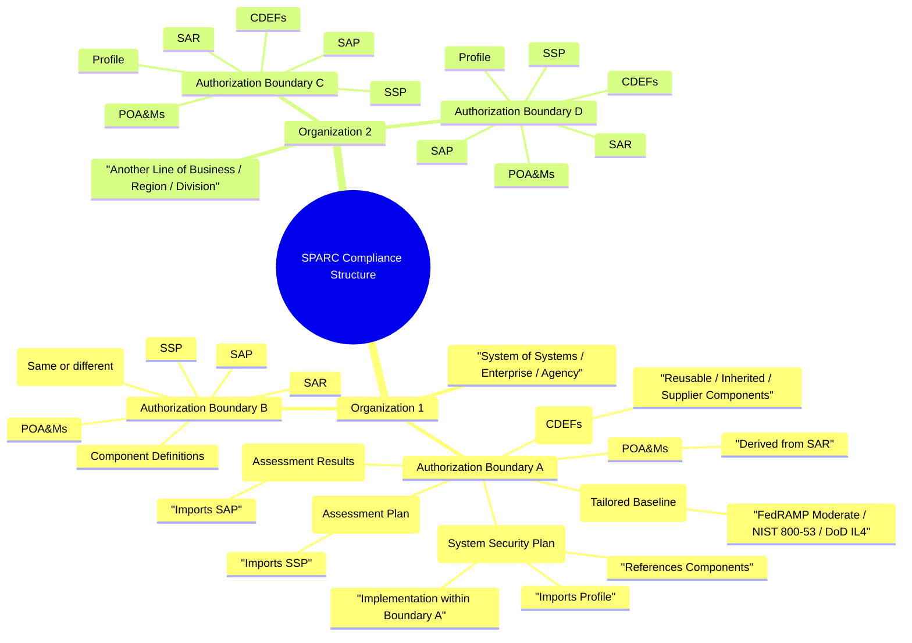

# Data Isolation & Compliance Structure

How SPARC organizes and isolates data across the compliance hierarchy —
from an enterprise down through individual authorization boundaries and the
OSCAL artifacts that document each system. This is the canonical reference
for anyone building **multi-system environments** in SPARC.

*Current as of app version v1.12.1.*

## The hierarchy

SPARC models the real-world NIST RMF / FedRAMP / DoD compliance structure:

- **Organization** — a large entity (agency, company, DoD mission area) that
  oversees multiple systems, analogous to DoD's **System of Systems (SoS)**
  concept where many independent systems work toward a shared mission.
- **Authorization Boundary** — a separately managed scope with its own ATO (or
  cATO in DoD). Each boundary is the primary **isolation unit**: authenticated
  users see and act only on documents in the boundaries they have access to
  (`BoundaryScopedDocument`, NIST AC-3, v1.11.1). Boundaries can inherit
  controls from shared Profiles, Catalogs, or Components.
- **Profiles** — a tailored selection and parameterization of controls from a
  Catalog (e.g. a FedRAMP Moderate baseline).
- **CDEFs (Component Definitions)** — reusable/inherited components that
  implement controls, mapped into SSPs.
- **SSP (System Security Plan)** — documents how controls are implemented within
  a specific Authorization Boundary; imports a Profile and references Components.
- **SAP (Security Assessment Plan)** — defines how the SSP will be assessed;
  imports the SSP.
- **SAR (Security Assessment Report)** — records assessment findings; imports
  the SAP.
- **POA&Ms (Plans of Action & Milestones)** — track remediation of unresolved
  findings from the SAR.

Relationships between the OSCAL layers are maintained via OSCAL `import-*`
statements for end-to-end traceability.

## Isolation model

- **Boundary-scoped access** — the authorization boundary is the access-control
  perimeter. Users only see/act on documents in boundaries they belong to;
  global (nil-boundary) documents remain open to all. The web UI enforces the
  same rules as the API (v1.11.1, NIST AC-3). See [RBAC](RBAC) for how roles are
  scoped to instances vs. boundaries.
- **Organization grouping** — organizations group boundaries for multi-org
  (System-of-Systems) instances, each with UUID-based audit traceability.

## Structure map

## Related

- [RBAC](RBAC) — role scoping (instance vs. authorization boundary) and permissions
- [Core Functions](Core-Functions) — Authorization Boundary Management, the OSCAL layers, and document workflows
- [Architecture](Architecture) — the domain model and how these entities relate in the schema
