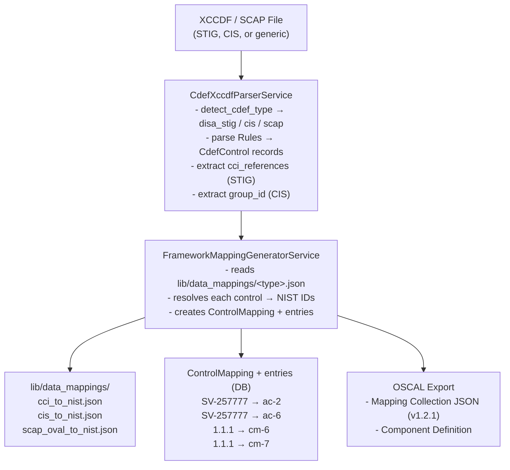

# Framework Mapping (STIG / CIS / CCI / SCAP → NIST 800-53)

This page describes how SPARC builds framework-to-NIST mapping: it takes external
security frameworks — DISA STIG, CIS Benchmarks, DISA CCI references, and
SCAP/OVAL content — and resolves each of their controls to one or more
NIST SP 800-53 controls, then persists the result as a reusable, OSCAL-exportable
mapping collection.

The goal is **80%+ automated coverage** for mapping these frameworks to NIST via
OSCAL, so that manual crosswalk work is the exception rather than the rule.

---

## Architecture Overview

An XCCDF/SCAP file is parsed into `CdefControl` records, those controls are
resolved against a framework-specific lookup table, and the resolved pairs are
persisted as a `ControlMapping` with `ControlMappingEntry` rows that can be
exported to OSCAL.



> **Status:** The full pipeline shown above is **shipped** in the codebase.
> `CdefXccdfParserService`, `FrameworkMappingGeneratorService`,
> `OscalMappingExportService`, `OscalComponentDefinitionExportService`, the
> `ControlMapping` / `ControlMappingEntry` models, and the three
> `lib/data_mappings/*.json` lookup tables all exist today. See
> [What Is Shipped Today](#what-is-shipped-today) for the full inventory.

---

## The Core Pattern: One Source ID → Multiple NIST Controls

Each `ControlMappingEntry` is one source→target pair. A single SV-XXXXX rule or
CIS section that relates to 3 NIST controls becomes **3 entry rows** — all sharing
the same `source_control_id` but each with a different `target_control_id`.

### DISA STIG Flow (CCI Pivot)

```text
SV-257777 → CCI-000015 → ac-2
SV-257777 → CCI-000225 → ac-6
SV-257777 → CCI-000764 → ia-2
```

The **CCI (Control Correlation Identifier)** is the pivot. DISA publishes a CCI
XML file (~7,500 entries) that maps each CCI to a NIST control. STIGs embed CCI
references in each rule's `<ident>` element, so the parser extracts the CCIs and
the generator resolves each one through the CCI→NIST lookup table.

### CIS Benchmark Flow (Direct Mapping)

```text
1.1.1 (Ensure mounting of cramfs disabled) → cm-6, cm-7
5.2.1 (Ensure permissions on sshd_config)  → ac-3, ac-6
```

CIS publishes official NIST mappings. Each benchmark section maps to one or more
NIST controls via a static lookup table.

### SCAP/OVAL Flow (Multi-Tier Resolution)

```text
1. Check system URI → NIST (e.g., OVAL defs → cm-6)
2. OVAL family detection → NIST (e.g., "patch" → si-2)
3. Keyword matching (fallback) → NIST (e.g., "password" → ia-5)
```

---

## Coverage Targets

| Framework | Source ID | Pivot | Auto-Coverage | Notes |
|-----------|-----------|-------|--------------|-------|
| **DISA STIG** | SV-XXXXX | CCI-XXXXX → NIST | **~95%** | CCI XML is comprehensive |
| **CIS Benchmarks** | 1.1.1 etc | CIS→NIST table | **~85%** | CIS publishes official mappings |
| **CCI Direct** | CCI-XXXXX | self → NIST | **~98%** | CCI *is* the mapping |
| **SCAP/OVAL** | OVAL def | family + keywords | **~70%** | Family-level, not rule-level |
| **Combined** | | | **~87%** | Above 80% target |

---

## Relationship Types (NIST IR 8477)

Each mapping entry records a set-theory relationship between the source and target
control, aligned with NIST IR 8477:

- `equal` — exact syntactic match
- `equivalent` — identical in meaning
- `subset` — source is narrower than target
- `superset` — source encompasses target
- `intersects` — partial overlap

These values are enforced by the `ControlMappingEntry` model (`RELATIONSHIPS`
constant and a presence + inclusion validation).

---

## Database Schema

### `control_mappings`

```
uuid, name, description, mapping_version, oscal_version, status,
method_type, matching_rationale, source_catalog_id, target_catalog_id,
metadata_extra (jsonb), timestamps
```

### `control_mapping_entries`

```
uuid, control_mapping_id, source_control_id, source_type,
target_control_id, target_type, relationship, matching_rationale,
remarks, row_order, timestamps
Unique index: (mapping_id, source_control_id, target_control_id)
```

The unique index enforces the "one source→target pair per row" invariant: the
same source ID can appear many times, but never twice pointing at the same target.

---

## Service API

After importing a STIG/CIS/SCAP XCCDF file as a `CdefDocument`, the generator
resolves its controls against the appropriate lookup table:

```ruby
# After importing a STIG/CIS/SCAP XCCDF file:
doc = CdefDocument.find(123)
nist_catalog = ControlCatalog.find_by(name: "NIST SP 800-53 Rev 5")
service = FrameworkMappingGeneratorService.new(doc, nist_catalog)

# Dry-run preview (no DB writes)
service.preview
# => { "SV-257777" => ["ac-2", "ac-6", "ia-2"], "SV-258001" => ["cm-6"] }

# Coverage stats
service.coverage_stats
# => { total: 200, mapped: 170, unmapped: 30, coverage_pct: 85.0 }

# Generate and persist mapping
mapping = service.generate!
# => ControlMapping with auto-populated entries

# Export to OSCAL
OscalMappingExportService.new(mapping).export
# => OSCAL v1.2.1 mapping-collection JSON string
```

The generator picks its lookup table from the document's `cdef_type`
(`disa_stig` → `cci_to_nist`, `cis` → `cis_to_nist`, `scap` → `scap_oval_to_nist`).

---

## What Is Shipped Today

The following components exist in the SPARC codebase and back the pipeline above:

| Component | Path | Role |
|-----------|------|------|
| XCCDF parser | `app/services/cdef_xccdf_parser_service.rb` | STIG + CIS + SCAP auto-detection; extracts CCIs / group IDs |
| Mapping generator | `app/services/framework_mapping_generator_service.rb` | Resolves each control → NIST IDs, builds `ControlMapping` + entries |
| Mapping model | `app/models/control_mapping.rb` | Mapping collection |
| Mapping entry model | `app/models/control_mapping_entry.rb` | Individual source→target entry; IR 8477 relationships |
| CDEF document | `app/models/cdef_document.rb` | `cdef_type`: `disa_stig` / `scap` / `cis` / `custom` |
| CDEF control | `app/models/cdef_control.rb` | Parsed control with CCI references, group ID, rule ID |
| OSCAL mapping export | `app/services/oscal_mapping_export_service.rb` | OSCAL v1.2.1 mapping-collection JSON export |
| OSCAL CDEF export | `app/services/oscal_component_definition_export_service.rb` | OSCAL component-definition export |
| CCI lookup table | `lib/data_mappings/cci_to_nist.json` | CCI → NIST |
| CIS lookup table | `lib/data_mappings/cis_to_nist.json` | CIS Benchmark section → NIST |
| SCAP/OVAL lookup table | `lib/data_mappings/scap_oval_to_nist.json` | SCAP/OVAL families + keywords → NIST |
| CCI import rake task | `lib/tasks/import_cci.rake` | DISA CCI XML → `cci_to_nist.json` |
| Converters UI | `app/controllers/converters_controller.rb` | Manage converters / mapping tables, refresh CCI, import STIG |
| Generator specs | `spec/services/framework_mapping_generator_service_spec.rb` | Coverage / preview / generate |

There is also a related family of `lib/data_mappings/*.json` tables shipped
alongside the three above (e.g. AWS Security Hub → NIST, MITRE AWS Config → NIST,
and a NIST Rev 5 ↔ Rev 4 crosswalk), driving the broader Converters feature.

---

## Getting Full CCI Data

The starter `cci_to_nist.json` ships with a seed set of entries. To populate all
~7,500:

1. Download `U_CCI_List.zip` from:
   `https://dl.dod.cyber.mil/wp-content/uploads/stigs/zip/U_CCI_List.zip`
2. Unzip and place `U_CCI_List.xml` in the `tmp/` directory
3. Run: `rake mapping:import_cci`
4. Verify: `lib/data_mappings/cci_to_nist.json` now has ~7,500 entries

The Converters UI also exposes a **Refresh CCI** action that automates this
ingestion path.

---

## Expanding CIS Coverage

CIS publishes official OSCAL catalogs at their GitHub repository. To expand the
`cis_to_nist.json` mapping table:

1. Download CIS Controls v8.1 OSCAL catalog from CIS
2. Extract section→NIST mappings from the OSCAL profile `imports`
3. Add entries to `lib/data_mappings/cis_to_nist.json`

Platform-specific benchmarks (Ubuntu, RHEL, Windows, etc.) follow the same CIS
section numbering, so one mapping table covers multiple benchmarks.

---

## Future Enhancements

These forward-looking maps are not yet built:

- **Bulk CIS import rake task** — similar to `import_cci` but for CIS OSCAL
  catalog JSON
- **SCAP DataStream support** — parse `<ds:data-stream-collection>` to extract
  OVAL + XCCDF together
- **Reverse mapping** — NIST → STIG/CIS for gap analysis
- **Mapping confidence scores** — weight entries by how they were resolved
  (CCI = high, keyword = low)
- **UI integration** — "Auto-map" button on the `CdefDocument` show page that
  calls the generator and displays coverage stats
- **InSpec profile import** — parse InSpec JSON profiles and extract STIG/CCI
  tags for mapping

---

## Related

- [Core Functions & Features → Converters (CCI / AWS / STIG → NIST)](Core-Functions#16-converters-cci--aws--stig--nist) — how the Converters UI and mapping tables work end to end
- [Architecture](Architecture) — where framework mapping fits in the overall SPARC service and data-model design
