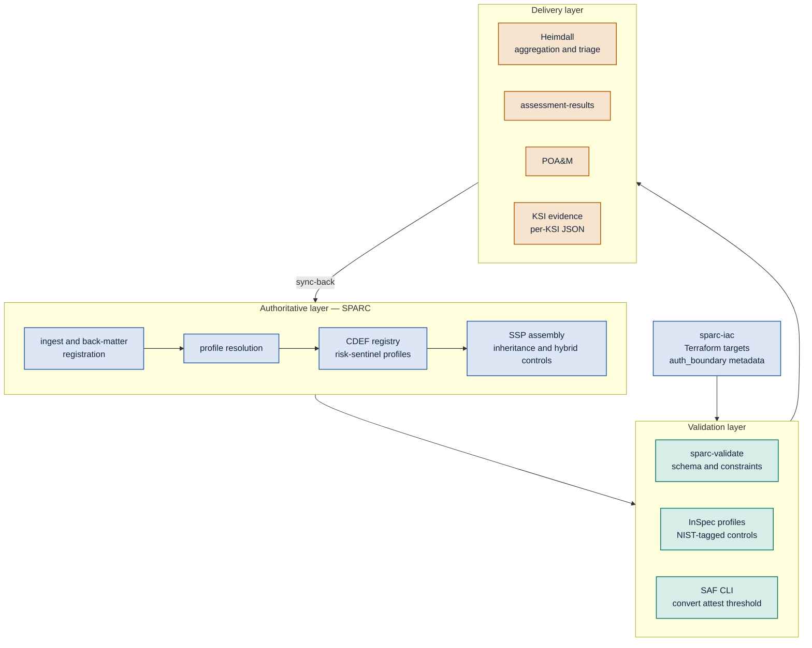
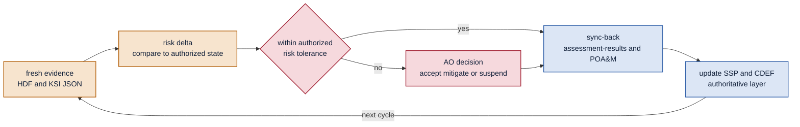
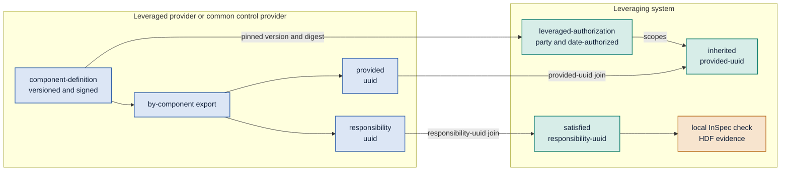
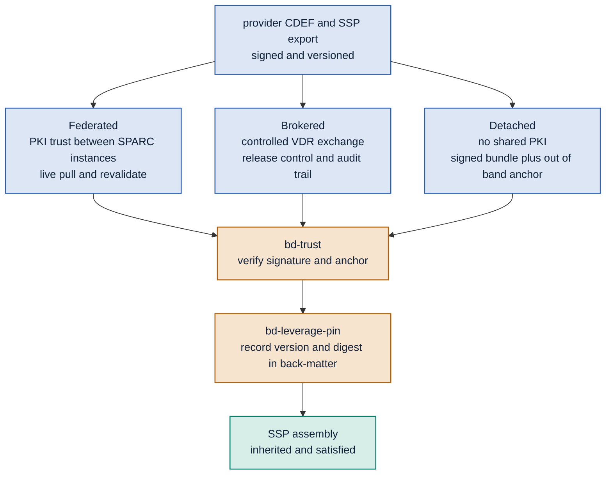
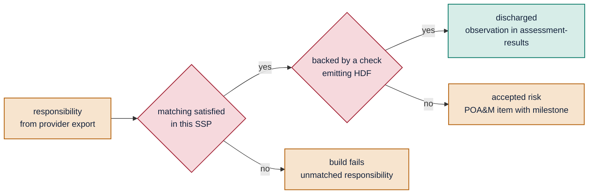
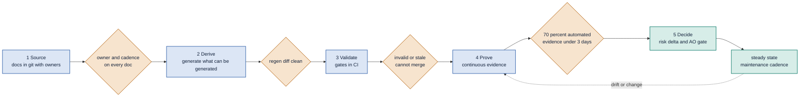
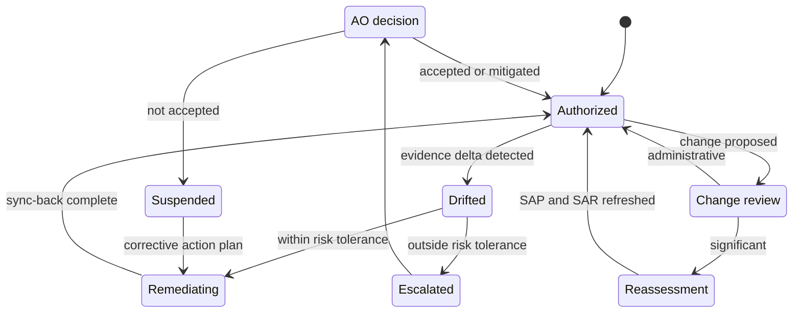

# OSCAL End to End

*How SPARC, SAF CLI, InSpec and Heimdall fit together — one chain of models, one
normalization format, one decision gate.*

> **Scope.** This is the conceptual map of the OSCAL toolchain and where SPARC
> sits in it. For installing SPARC see [Getting Started](Getting-Started); for
> using the screens see [Getting Oriented](User-Guide-Getting-Oriented); for
> field-level spreadsheet-to-OSCAL mapping see `docs/oscal-data-mapping.md`.
> Applies to OSCAL 1.1.x and HDF v1 + v2.

One chain of models. One normalization format. One decision gate. Everything below is either an artifact in the chain, a tool that writes to it, or a scanner that feeds it.

## What binds to what

Most broken OSCAL pipelines break here: the SSP imports a profile that was never resolved, or the SAR imports an assessment plan whose control set no longer matches the SSP. Bind by `href` and UUID, resolve once, and treat the resolved catalog as the only control vocabulary anything downstream is allowed to use.

```mermaid
flowchart LR
  classDef auth fill:#DCE6F5,stroke:#2F5FA8,stroke-width:1.5px,color:#12213A
  classDef claim fill:#D7EDE8,stroke:#0E7C6B,stroke-width:1.5px,color:#12213A
  classDef ev fill:#F7E4CE,stroke:#B4610C,stroke-width:1.5px,color:#12213A
  classDef risk fill:#F6D9DD,stroke:#A32436,stroke-width:1.5px,color:#12213A

  CAT["catalog<br/>SP 800-53 Rev 5"]:::auth
  PRO["profile<br/>baseline plus tailoring"]:::auth
  RES["resolved catalog<br/>the only control vocabulary"]:::auth
  CDEF["component-definition<br/>reusable implementations"]:::claim
  SSP["system-security-plan"]:::claim
  SAP["assessment-plan"]:::ev
  SAR["assessment-results"]:::ev
  POAM["plan-of-action-and-milestones"]:::risk

  CAT -->|"import href"| PRO
  PRO -->|"oscal-cli profile resolve"| RES
  RES -->|"control-implementation source"| CDEF
  CDEF -->|"tooling assembles implemented-requirement"| SSP
  PRO -->|"import-profile href"| SSP
  SSP -->|"import-ssp href"| SAP
  SAP -->|"import-ap href"| SAR
  SSP -->|"import-ssp href"| POAM
  SAR -->|"finding to related-risk"| POAM
```



CDEFs are not imported by the SSP through a schema field — tooling assembles them into `implemented-requirement` entries. That assembly step is where SPARC's authoritative layer earns its keep, and where inheritance and hybrid controls get resolved.

## Three layers, one boundary each

SPARC owns authority. InSpec and SAF CLI own validation. Heimdall owns delivery and triage. The value of holding the line between them is that any layer can be swapped without rewriting the other two — a scanner change touches validation only, an authorization boundary change touches authority only.



`sparc-iac` is not a side quest: the Terraform that stands up the resource is also what supplies `target` and `auth_boundary` as root-level HDF objects, so a result can be attributed to a boundary without a human mapping step.

## Every scanner ends up in the same shape

HDF is the narrow waist. Scanners disagree about everything — severity scales, identifiers, nesting, what counts as a finding — and normalizing them into HDF before anything else is what makes aggregation and control mapping tractable. The join key back to OSCAL is the NIST tag carried on each HDF control.

```mermaid
flowchart LR
  classDef scan fill:#EDEFF5,stroke:#43536F,stroke-width:1.2px,color:#12213A
  classDef norm fill:#F7E4CE,stroke:#B4610C,stroke-width:1.5px,color:#12213A
  classDef oscal fill:#D7EDE8,stroke:#0E7C6B,stroke-width:1.5px,color:#12213A
  classDef risk fill:#F6D9DD,stroke:#A32436,stroke-width:1.5px,color:#12213A

  subgraph SCAN["Scanners and checks"]
    direction TB
    S1["InSpec<br/>STIG and CIS profiles"]:::scan
    S2["Trivy Grype Snyk Sonatype<br/>SCA and image"]:::scan
    S3["Trufflehog<br/>secrets"]:::scan
    S4["Checkov and Prisma Cloud<br/>IaC and runtime"]:::scan
    S5["AWS Config and Security Hub<br/>ASFF"]:::scan
    S6["SAST and DAST<br/>SARIF"]:::scan
  end

  CONV["SAF CLI convert<br/>scanner to HDF"]:::norm
  ATT["saf attest<br/>manual and interview evidence"]:::norm
  HDF["Heimdall Data Format<br/>v1 and v2"]:::norm
  THR["saf validate threshold<br/>pipeline gate"]:::norm
  AGG["Heimdall Server<br/>evidence aggregation"]:::norm
  MAP["control mapping<br/>tags.nist to implemented-requirement"]:::oscal
  OBS["observations and findings<br/>assessment-results"]:::oscal
  RISK["risks and milestones<br/>POA&M"]:::risk

  SCAN --> CONV --> HDF
  ATT --> HDF
  HDF --> THR
  HDF --> AGG --> MAP --> OBS --> RISK
```



Manual and interview evidence enters through `saf attest` rather than bypassing the pipeline, so an examine-method control and an automated control land in assessment-results as the same kind of observation with different `method` values.

```
# normalize — every scanner, same target format
saf convert trivy2hdf    -i trivy.json     -o hdf/trivy.json
saf convert checkov2hdf  -i checkov.json   -o hdf/checkov.json
saf convert asff2hdf     -i securityhub.json -o hdf/
saf convert sarif2hdf    -i semgrep.sarif  -o hdf/semgrep.json
inspec exec profiles/rhel9-stig --reporter json:hdf/rhel9.json

# attach non-automatable evidence instead of hand-waving it
saf attest create -o attestations.json
saf attest apply -i hdf/rhel9.json attestations.json -o hdf/rhel9-attested.json

# gate the pipeline on a threshold, not on a human reading a report
saf validate threshold -i hdf/rhel9-attested.json -T thresholds/moderate.yaml

# authority layer: resolve once, validate always
oscal-cli profile resolve profiles/moderate-tailored.json -o baselines/resolved.json
oscal-cli validate ssp/system-security-plan.json
```

## Who writes it, who checks it, how often

Print this one. Most cATO conversations stall because nobody has agreed on the cadence column.

| OSCAL model | Produced by | Validated by | Consumed by | Cadence under cATO |
|---|---|---|---|---|
| catalog | NIST / agency | oscal-cli | profile authors | On release |
| profile | SPARC authority layer | sparc-validate | SSP, CDEF | On baseline change |
| component-definition | Component owner, risk-sentinel/* | sparc-validate + InSpec profile pairing | SSP assembly | On component version change |
| system-security-plan | SPARC assembly from CDEFs | sparc-validate | SAP, POA&M, AO | On drift or component change |
| assessment-plan | Assessor + SPARC | oscal-cli | SAR generation | On SSP change |
| assessment-results | Heimdall aggregation of HDF | Threshold gate | POA&M, AO dashboard | Every pipeline run; ≤ 3 days for moderate |
| plan-of-action-and-milestones | Risk delta engine | sparc-validate | AO, ConMon reporting | Continuous, with milestone SLAs |
| KSI evidence (20x) | Per-component emitter | Schema + freshness check | FedRAMP 20x package | ≥ 70% automated, ≤ 3 days |

## ATO acceleration is not cATO

They use the same pipeline. The difference is what happens on the right-hand side after evidence lands — and whether the authorization decision itself has been made continuous.

### Accelerated ATO

### Continuous ATO

The honest test for cATO: can the system tell you, without a human, that today's authorization state differs from the authorized state, by how much, and against which controls? If not, what you have is fast ATO with good dashboards.

## Closing the right-hand side

Evidence ingestion is the well-solved half. The half that decides whether authorization actually holds is risk delta, the AO decision gate, and sync-back into the authoritative layer.



Sync-back is the step most stacks skip. Without it the SSP describes a system that no longer exists, and every subsequent assessment measures against a fiction.

### The reusable unit

- **CDEF statement** — the control implementation narrative, written once per component, not once per system.
- **InSpec control** — NIST-tagged, so its HDF output maps back to the same control ID the statement claims.
- **KSI evidence emitter** — per-KSI JSON with cadence metadata, so freshness is machine-checkable.

Ship those three together as one versioned artifact and a component becomes portable across systems, boundaries, and agencies. Ship them separately and you have three things that drift apart by the second system.

## The documents are outputs, not inputs

An SSP is only one of the artifacts an AO looks at. The inventory workbook, boundary and data-flow diagrams, PPSM table, CRM, and the narrative attachments all drift independently, and they drift silently because nothing fails when they go stale. The fix is to demote every one of them to a build output with exactly one upstream source of truth.

```mermaid
flowchart LR
  classDef src fill:#EDEFF5,stroke:#43536F,stroke-width:1.2px,color:#12213A
  classDef gen fill:#DCE6F5,stroke:#2F5FA8,stroke-width:1.5px,color:#12213A
  classDef gate fill:#F6D9DD,stroke:#A32436,stroke-width:1.5px,color:#12213A
  classDef out fill:#D7EDE8,stroke:#0E7C6B,stroke-width:1.5px,color:#12213A

  subgraph SRC["Sources of truth"]
    direction TB
    T1["Terraform state<br/>sparc-iac"]:::src
    T2["CDEF registry<br/>risk-sentinel"]:::src
    T3["narrative markdown<br/>owner and review cadence"]:::src
    T4["HDF evidence<br/>Heimdall"]:::src
  end

  subgraph GEN["Generators"]
    direction TB
    G1["bd-inventory<br/>components and inventory-items"]:::gen
    G2["bd-diagram<br/>boundary network dataflow"]:::gen
    G3["bd-ppsm<br/>ports protocols services"]:::gen
    G4["bd-crm<br/>customer responsibility"]:::gen
    G5["bd-narrative<br/>render docx and pdf"]:::gen
    G6["bd-poam-sync<br/>deterministic risk ids"]:::gen
  end

  subgraph GATES["Merge gates"]
    direction TB
    K1["oscal validate<br/>sparc-validate"]:::gate
    K2["regen diff<br/>generated equals committed"]:::gate
    K3["bd-freshness<br/>review cadence not exceeded"]:::gate
    K4["bd-deviation<br/>waivers unexpired"]:::gate
    K5["bd-sigchange<br/>classify and raise SCR"]:::gate
  end

  PKG["bd-package and bd-manifest<br/>signed authorization package"]:::out

  SRC --> GEN
  GEN --> GATES
  GATES --> PKG
```



The regen-diff gate is the load-bearing one: CI regenerates every derived document and fails the merge if the result differs from what is committed. A hand edit to a generated file becomes a build break instead of a discrepancy someone finds during assessment.

### Script inventory

| Script | Runtime | Trigger | Reads | Writes |
|---|---|---|---|---|
| bd-inventory | Python | PR + nightly | Terraform state, AWS Config | system-implementation components and inventory-items |
| bd-diagram | Python → Mermaid | PR | OSCAL components, TF graph | Boundary, network, data-flow diagrams as committed source |
| bd-ppsm | Python | PR + nightly | Security groups, NACLs, listeners | PPSM table and component props |
| bd-crm | Python | On CDEF change | CDEF responsible-role, control origination | CRM/CIS worksheet, inheritance export |
| bd-narrative | Bash + pandoc | On tag | Markdown with front-matter | Rendered DOCX/PDF attachments |
| bd-freshness | Python | Daily + PR | last_reviewed, review_cadence | Freshness report; fails CI; opens issues |
| bd-poam-sync | Python | Nightly | HDF from Heimdall | POA&M risks with stable UUIDv5 ids; auto-close on clean evidence |
| bd-sigchange | Python | PR | Diff of inventory and component set | Significant vs administrative classification; SCR draft |
| bd-deviation | Python | PR | Deviation YAML (DR, FP, OR) | Gate result; expiring-waiver queue |
| bd-manifest | Bash | On tag | All artifacts | SHA-256 manifest plus signature |
| bd-package | TypeScript | On tag | OSCAL, rendered docs, manifest | Release bundle; VDR and GRC export |
| bd-inherit | Python | PR + on provider bump | Provider CDEF exports | Resolved inherited and satisfied; fails on unmatched responsibility UUIDs |
| bd-leverage-pin | Python | PR | Provider bundle version and digest | Back-matter provenance record; bump raises change review |
| bd-trust | Bash | On fetch | Signed bundle, trust anchor | Verification result; refuses unverified inheritance |

### Two patterns that carry the weight

**Front-matter as the currency contract.** Every narrative document declares its own review terms, so staleness is machine-detectable rather than a calendar reminder someone snoozes.

```
# docs/attachments/incident-response-plan.md
---
title: Incident Response Plan
oscal_ref: urn:uuid:8b1c...          # back-matter resource uuid
owner: platform-security
approver: system-owner
last_reviewed: 2026-05-14
review_cadence: P1Y                  # ISO 8601 duration
covers_controls: [IR-1, IR-4, IR-6, IR-8]
evidence_class: narrative            # narrative | derived | machine
---
```

**Deterministic risk identity.** POA&M items must survive re-generation. Derive the OSCAL risk UUID as a v5 UUID over a fixed namespace and a stable tuple, so the same finding produces the same identifier on every run — no duplicates, and auto-close becomes safe.

```
risk_uuid = uuid5(NS_POAM, f"{control_id}|{component_uuid}|{check_id}")

# same finding tomorrow  -> same uuid -> updated in place
# finding gone tomorrow  -> uuid absent -> closed with evidence link
```

## Leveraged, federated, and reused

This is where CDEFs stop being a convenience and become the wire format. A leveraged authorization is a contract between two systems, and OSCAL expresses that contract as four assemblies and two UUID joins — `export/provided` pairs with `inherited/provided-uuid`, and `export/responsibility` pairs with `satisfied/responsibility-uuid`. Everything else is packaging.



The CDEF is the provider side of the contract; the leveraging SSP is the consumer side. A provider that ships CDEFs with stable exports can be leveraged by any number of systems without ever seeing their SSPs.

### UUID stability is the whole ballgame

If a provider re-issues its CDEF and the `provided` and `responsibility` UUIDs change, every leveraging SSP silently orphans its inheritance. Use the same deterministic derivation you use for POA&M risks, so exports are reproducible across regenerations and across federated instances.

```
provided_uuid       = uuid5(NS_EXPORT, f"{provider_id}|{component_key}|{control_id}|{statement_id}|provided")
responsibility_uuid = uuid5(NS_EXPORT, f"{provider_id}|{component_key}|{control_id}|{statement_id}|responsibility")

# exports become content-addressed: same contract -> same uuids -> no orphaned inheritance
# a deliberate contract change is then a visible uuid change, which bd-sigchange can catch
```

### Origination is not binary

"Inherited" collapses six distinct situations that carry different evidence obligations. Modelling them separately is what keeps hybrid controls from becoming the place assessments go to die.

| Control origination | OSCAL representation | Evidence held by | Leveraging system must |
|---|---|---|---|
| Inherited from leveraged ATO | inherited + provided-uuid | Provider | Verify authorization currency; record an EXAMINE observation |
| Shared | inherited + satisfied on one by-component | Both | Test only its own half; cite the provider for the remainder |
| Service provider hybrid | partial inherited + local implementation-status | Both, split by statement | Emit local HDF for the locally-implemented statement parts |
| Configured by customer | responsibility → satisfied | Consumer | Ship an InSpec check per responsibility |
| Provided by customer | responsibility + consumer component | Consumer | Model the supplied thing as its own component and CDEF |
| Common control provider (corporate) | org-scope CDEF, reused across systems | Provider org | Pin the CDEF version; no local test |
| System specific | local by-component, no export | This system | Full local evidence |

### Three distribution modes, one verification step

Federation is a delivery detail, not a model change. The same signed CDEF bundle travels three ways depending on whether the two parties share a trust fabric — and the detached mode matters, because plenty of environments will never have federated PKI with anyone.



Whichever path a bundle takes, it converges on the same two steps: verify the signature against a trust anchor, then pin version and digest into SSP back-matter so the provenance of every inherited claim is recorded in the artifact itself.

### Every responsibility must be discharged

The most common leveraged-authorization failure is quiet: the CRM says the customer must configure something, the leveraging SSP marks the control inherited, and nobody ever tests the customer half. Make it a build gate rather than an assessment finding.



Three outcomes, all of them explicit: discharged with evidence, accepted as risk with a milestone, or a failed build. There is no fourth state where a responsibility exists and nothing happened.

### What this does to cATO

- **Inherited controls carry an authorization, not evidence.** Raw scanner output does not cross the boundary. The leveraging system's assessment-results hold an EXAMINE observation citing the leveraged authorization, its date, and its currency.
- **Provider staleness is your finding.** Run the leveraged ATO through bd-freshness like any other document. A lapsed or expiring provider authorization should surface as a risk in your POA&M before it surfaces in someone else's report.
- **Continuous on top of point-in-time is a half-measure.** If the provider runs cATO, consume its evidence-freshness and risk-delta signal as an input to your own. If it does not, say so plainly — your continuous authorization rests on a snapshot foundation, and the AO should know which controls that affects.
- **A provider CDEF bump is a change event.** Pinning makes upgrades deliberate: bd-leverage-pin records version and digest, and bd-sigchange classifies the delta as administrative or significant.

## A finite ramp that ends in a loop

Adoption is a ratchet with five stages and a real exit criterion at each one. It is worth being strict about the gates: teams that skip straight to continuous evidence end up with a fast pipeline pointed at documents nobody trusts.

#### Source

Boundary docs move into git. Narrative in Markdown with front-matter. Nothing generated yet — this stage is only about custody and history.

#### Derive

Inventory, diagrams, PPSM, and CRM become generated artifacts. CDEFs become the reuse unit; the SSP is assembled, not written.

#### Validate

Gates land in CI: OSCAL schema and constraints, regen diff, freshness, deviation expiry, significant-change classification.

#### Prove

Scanners normalize to HDF, aggregate in Heimdall, and land as assessment-results on a defined cadence. Thresholds gate the pipeline.

#### Decide

Risk delta against the authorized state, an AO decision gate, and sync-back into SSP, CDEF, and POA&M. Adoption ends here; maintenance begins.



****The dashed return edge is the honest part: steady state is not stage 6. Drift and change push the system back into stage 4, and it re-earns stage 5 on every cycle.

## Steady state, by cadence

Once adopted, the programme is a set of recurring obligations with different clocks. Publishing this band is usually what turns "we're doing cATO" from an aspiration into something a team can staff.

- OSCAL validate
- Regen diff
- Deviation expiry check
- Significant-change classify

- Scanner sweep → HDF
- Assessment-results refresh
- Freshness report
- POA&M sync

- Risk delta review
- Milestone slippage check
- Waiver renewal queue

- ConMon submission
- Inventory reconciliation
- CRM re-issue if changed

- Narrative review sweep
- Threshold recalibration
- Deviation renewal

- SAP refresh
- Full package re-assembly
- AO re-affirmation



Modelling authorization as a state machine rather than a milestone is what makes suspension a normal, recoverable transition instead of a programme failure. Every edge here maps to a script and a gate in the table above.
