# Role-Based Access Control (RBAC)

_Reflects SPARC **v1.13.0**. Authoritative source: `app/models/role.rb` (permission keys) and the role seeds in `db/seeds.rb`._

## Overview

SPARC implements a granular Role-Based Access Control system with **29 roles** aligned with [NIST SP 800-37 Rev. 2](https://csrc.nist.gov/publications/detail/sp/800-37/rev-2/final) (Risk Management Framework). The system is designed to mirror real-world security authorization workflows, ensuring that each user in the compliance lifecycle has precisely the access they need and nothing more.

The role taxonomy is grounded in the NIST RMF and aligns with **OSCAL (Open Security Controls Assessment Language) responsible-party definitions**. OSCAL does not define its own role taxonomy; instead it relies on standard RMF roles referenced in OSCAL metadata (`party` and `role` elements across Catalogs, Profiles, SSPs, Assessment Plans, SARs, and POA&Ms). The 29 roles represent the complete canonical set for OSCAL implementation, drawn from NIST SP 800-37 Rev. 2, OSCAL documentation, and FedRAMP-specific guidance (including FedRAMP Rev. 5 baselines and FedRAMP 20x automation). All roles are seeded via `db/seeds.rb` and manageable in the admin UI at `/admin/roles`.

Authorization is enforced through **three layers**, evaluated in order:

| Layer | Mechanism | Scope |
|-------|-----------|-------|
| 1. Instance Admin | Boolean flag on `User` model | Global bypass -- all checks pass |
| 2. Role-based | `has_role?(role_name, authorization_boundary_id:)` | Structural access by job function |
| 3. Permission-based | `has_permission?(key, authorization_boundary_id:)` | Granular control over specific resources |

**Backward Compatibility:** All authorization checks are no-ops when `SparcConfig.any_auth_enabled?` returns `false`. This allows existing deployments to upgrade without breaking changes until RBAC is explicitly enabled.

---

## Instance Admin

Instance Admin is a **boolean column on the User model**, not a role. It provides unrestricted access to the entire SPARC instance.

- Bypasses ALL authorization checks across all authorization boundaries and resources.
- The first Instance Admin account is bootstrapped during `db:seed` with a randomly generated 16-character password.
- The bootstrapped admin **must change their password on first login**.
- Instance Admin status can only be granted by another Instance Admin through the admin interface.

> Instance Admin is intended for platform operators and initial setup only. Day-to-day users should be assigned appropriate roles instead.

---

## Organization ↔ Boundary Assignment

Authorization boundaries can be associated with an organization. Who may change that association:

- **Attaching an _unassigned_ boundary** to an organization requires the **Org Admin** role (`org_admin` organization membership) on that target organization — or Instance Admin.
- **Moving a boundary between organizations** (it already belongs to a different org) is **Instance Admin only**. The admin organization screen surfaces this with a confirmation and a note; non-admin attempts are refused.

Both surfaces — the admin organization screen and the API (`PATCH /api/v1/authorization_boundaries/:id/organization`) — enforce the same rule through a single authorization service, so they cannot drift. Personnel assigned to a boundary through the admin screen (canonical `user_roles`) and through the boundary screen (legacy memberships) are both shown on the boundary's Personnel Roster. (#770)

---

## Role Scoping

SPARC roles are divided into two categories based on their scope:

- **Instance-Scoped Roles** (10 roles) -- Apply globally across all authorization boundaries. Stored with `authorization_boundary_id = NULL` in the `user_roles` table.
- **Authorization-Boundary-Scoped Roles** (19 roles) -- Apply only to the specific authorization boundary they are assigned to. Stored with an `authorization_boundary_id` value in the `user_roles` table.

A single user can hold:
- Multiple instance-scoped roles simultaneously.
- Different authorization-boundary-scoped roles across different authorization boundaries.
- A combination of instance-scoped and authorization-boundary-scoped roles.

---

## Permission Keys

SPARC defines **34 permission keys** across 13 resource areas (`Role::PERMISSION_KEYS` in `app/models/role.rb`). Each key is a `resource.action` string and controls a specific operation on a resource type. Permissions are stored as a JSONB `"resource.action" => boolean` hash on each `Role`.

| Key | Description |
|-----|-------------|
| `catalogs.read` | View control catalogs |
| `catalogs.write` | Create / edit control catalogs |
| `catalogs.approve` | Approve / publish a control catalog |
| `profiles.read` | View baselines / profiles |
| `profiles.write` | Create / edit baselines / profiles |
| `profiles.approve` | Approve / publish a baseline / profile |
| `authorization_boundaries.read` | View authorization boundaries |
| `authorization_boundaries.write` | Create / edit authorization boundaries |
| `authorization_boundaries.manage_members` | Add / remove members and assign roles within a boundary |
| `ssp.read` | View System Security Plans |
| `ssp.write` | Create / edit System Security Plans |
| `sar.read` | View Security Assessment Results |
| `sar.write` | Create / edit Security Assessment Results |
| `sap.read` | View Security Assessment Plans |
| `sap.write` | Create / edit Security Assessment Plans |
| `poam.read` | View POA&Ms |
| `poam.write` | Create / edit POA&Ms |
| `cdef.read` | View Component Definitions |
| `cdef.write` | Create / edit Component Definitions |
| `cdef.approve` | Approve / publish a Component Definition |
| `evidence.read` | View evidence artifacts |
| `evidence.write` | Upload / edit / link evidence artifacts |
| `mappings.read` | View control mappings |
| `mappings.write` | Create / edit control mappings |
| `converters.read` | View / run OSCAL and HDF converter tooling |
| `converters.write` | Configure / manage converter definitions |
| `back_matter.read` | View back-matter resources |
| `back_matter.write` | Create / edit back-matter resources |
| `back_matter.promote` | Promote a back-matter resource to the next version / boundary |
| `back_matter.approve_promotion` | Approve a pending back-matter promotion |
| `back_matter.archive` | Archive a back-matter resource |
| `back_matter.bulk_import` | Bulk-import back-matter resources |
| `back_matter.federate` | Federate back-matter resources across authorization boundaries / peers |
| `admin.rotate_credentials` | Rotate instance credentials / master secrets |

**Resource groups** (`Role::RESOURCE_LABELS`): Control Catalogs, Baselines / Profiles, Authorization Boundaries, System Security Plans, Security Assessment Results, Security Assessment Plans, POA&Ms, Component Definitions, Evidence, Control Mappings, Converters, Back-Matter Resources, Instance Administration.

> **Note on seeded assignments.** The permission *keys* above are the full set the platform can enforce. The **default role seeds do not yet grant** the approval, back-matter write/promote/approve/archive/bulk-import/federate, `converters.write`, or `admin.rotate_credentials` keys to any role — those are reserved for the Instance Admin bypass and future role tailoring, or must be granted explicitly via the Admin > Roles interface. The only new keys picked up by the default seeds are `converters.read` and `back_matter.read`, which are included in the all-read permission set used by the broad read-only roles (see matrices below).

---

## Permission Resolution

When a permission check is performed, the system resolves the effective permission set by combining both instance-scoped and authorization-boundary-scoped roles:

```
Effective permissions = permissions from user_roles
                        WHERE authorization_boundary_id IN (target_authorization_boundary_id, NULL)
```

This means:
1. Instance-scoped role permissions always apply, regardless of the target authorization boundary.
2. Authorization-boundary-scoped role permissions apply only when the target authorization boundary matches.
3. If a user has multiple roles (instance or authorization-boundary-scoped), their permissions are the **union** of all granted permissions.

### Example

A user with the **Global Viewer** instance role and the **ISSO** authorization-boundary-scoped role on Authorization Boundary A would have:
- Read access to all resources globally (from Global Viewer).
- Read/write access to SSP, SAR, SAP, POA&M, and Evidence on Authorization Boundary A (from ISSO).
- Only read access on Authorization Boundary B (from Global Viewer alone).

---

## Instance-Scoped Roles

These 10 roles apply across the entire SPARC instance and are not tied to any specific authorization boundary.

### Policy Manager

Full CRUD on catalogs and profiles. Controls enterprise baselines and organizational policy overlays.

### Global Viewer

Read-only access to all shared catalogs, profiles, and organizational resources. Intended for auditors and oversight staff who need visibility without modification rights.

### Senior Accountable Official

Risk oversight role with read access to all resources. Responsible for ensuring organizational risk posture aligns with mission objectives.

### Senior Agency Official for Privacy (SAOP)

Privacy risk management role. Read access to all resources for reviewing privacy controls and ensuring PII protections are adequate.

### Head of Agency / CEO

Ultimate accountability for the organization's security program. Read access to all resources.

### Risk Executive

Organization-wide risk tolerance and strategy. Read access to all resources for making enterprise risk decisions.

### Chief Information Officer (CIO)

Oversees the IT security program. Read access to all resources for strategic technology and security oversight.

### Chief Acquisition Officer

Supply chain security oversight. Read access to catalogs, profiles, authorization boundaries, CDEFs, evidence, and mappings. Does not have access to SSP, SAR, SAP, or POA&M resources.

### FedRAMP PMO

FedRAMP program management office oversight. Read access to all resources for monitoring FedRAMP authorization activities.

### Joint Authorization Board (JAB)

Provisional Authority to Operate (P-ATO) reviews. Read access to all resources for evaluating cloud service provider security packages.

---

### Instance-Scoped Permission Matrix

Columns cover the resources the default seeds touch. The approval / back-matter-write / promotion / `converters.write` / `admin.rotate_credentials` keys are not granted by any seed and are omitted. `Conv` = Converters, `Back` = Back-Matter Resources.

| Role | Catalogs | Profiles | Auth Boundaries | SSP | SAR | SAP | POA&M | CDEF | Evidence | Mappings | Conv | Back |
|------|----------|----------|-----------------|-----|-----|-----|-------|------|----------|----------|------|------|
| Policy Manager | R/W | R/W | R | R | R | R | R | R | R | R/W | R | R |
| Global Viewer | R | R | R | R | R | R | R | R | R | R | R | R |
| Senior Accountable Official | R | R | R | R | R | R | R | R | R | R | - | - |
| SAOP | R | R | R | R | R | R | R | R | R | R | - | - |
| Head of Agency / CEO | R | R | R | R | R | R | R | R | R | R | R | R |
| Risk Executive | R | R | R | R | R | R | R | R | R | R | R | R |
| CIO | R | R | R | R | R | R | R | R | R | R | R | R |
| Chief Acquisition Officer | R | R | R | - | - | - | - | R | R | R | - | - |
| FedRAMP PMO | R | R | R | R | R | R | R | R | R | R | R | R |
| JAB | R | R | R | R | R | R | R | R | R | R | R | R |

---

## Authorization-Boundary-Scoped Roles

These 19 roles are assigned per authorization boundary and only grant access within the context of that authorization boundary.

### Authorizing Official (AO)

Accepts risk and issues Authority to Operate (ATO) decisions. Has read access to authorization boundary documentation and write access to POA&M items to track risk acceptance.

### Agency Authorizing Official

Agency-specific ATO authority. Same permission set as the Authorizing Official role, scoped to agency-level authorization decisions.

### System Owner (SO/ISO)

Owns the information system. Broad read/write access to SSP, POA&M, CDEF, and evidence to maintain the system's security posture documentation.

### CISO

Chief Information Security Officer. Strategic oversight with read access across all authorization boundary resources. Does not have direct write access to authorization boundary artifacts.

### ISSM (Information System Security Manager)

Oversees the security posture of the system. Read/write access to SSP, POA&M, and evidence. Read access to SAR, SAP, CDEF, and mappings.

### ISSO (Information System Security Officer)

Day-to-day security operations. Broadest write access among authorization-boundary-scoped roles -- read/write to SSP, SAR, SAP, POA&M, and evidence.

### Cloud Service Provider (CSP)

SSP and CDEF implementation for cloud systems. Read/write access to SSP, POA&M, CDEF, and evidence. Read access to SAR, SAP, and mappings.

### Assessor / 3PAO

Independent assessment role (Third Party Assessment Organization). Read/write access to SAR and SAP. Read access to SSP, POA&M, CDEF, evidence, and mappings.

### Common Control Provider

Manages shared/inherited controls. Read/write access to SSP, CDEF, and evidence.

### System Architect / Engineer

Security design and architecture. Read/write access to SSP and CDEF. Read access to evidence.

### Component Supplier / Product Engineer

Builds reusable security components. Read/write access to CDEF and evidence.

### System Operator / Administrator

Daily system operations. Read access to SSP and POA&M. Read/write access to evidence.

### Information Owner / Steward

Data governance and classification. Read access to SSP, CDEF, and evidence.

### Vendor Dependency Manager

Tracks vendor security dependencies. Read access to SSP. Read/write access to CDEF and evidence.

### Solution Evaluator

Evaluates tools and services for security fitness. Read access to SSP, SAR, CDEF, and evidence.

### Team Member

General authorization boundary contributor. Read/write access to SSP, POA&M, CDEF, and evidence. Read access to profiles.

### SPARC SME (Subject Matter Expert)

Broad expertise across the SPARC platform. Read access to catalogs, profiles, and mappings. Read/write access to SSP, SAR, SAP, POA&M, CDEF, and evidence. Scoped to a specific authorization boundary.

### Evidence Integration Engineer

Manages the evidence lifecycle including collection, validation, and linking to controls. Read access to catalogs, profiles, SSP, SAP, POA&M, CDEF, and mappings. Read/write access to SAR and evidence.

### View Only

Read-only authorization boundary access for stakeholders who need visibility but no modification rights. Read access to authorization boundaries, SSP, SAR, POA&M, CDEF, and evidence.

---

### Authorization-Boundary-Scoped Permission Matrix

No authorization-boundary-scoped role is granted `converters.*` or `back_matter.*` in the default seeds, so those columns are omitted here; the columns match the instance-scoped matrix.

| Role | Catalogs | Profiles | Auth Boundaries | SSP | SAR | SAP | POA&M | CDEF | Evidence | Mappings |
|------|----------|----------|-----------------|-----|-----|-----|-------|------|----------|----------|
| Authorizing Official (AO) | - | - | R | R | R | R | R/W | R | R | R |
| Agency Authorizing Official | - | - | R | R | R | R | R/W | R | R | R |
| System Owner (SO/ISO) | - | - | R | R/W | R | R | R/W | R/W | R/W | R |
| CISO | R | R | R | R | R | R | R | R | R | R |
| ISSM | - | - | R | R/W | R | R | R/W | R | R/W | R |
| ISSO | - | - | R | R/W | R/W | R/W | R/W | R | R/W | R |
| CSP | - | - | R | R/W | R | R | R/W | R/W | R/W | R |
| Assessor / 3PAO | - | - | R | R | R/W | R/W | R | R | R | R |
| Common Control Provider | - | - | R | R/W | - | - | - | R/W | R/W | - |
| System Architect / Engineer | - | - | R | R/W | - | - | - | R/W | R | - |
| Component Supplier / Product Engineer | - | - | R | - | - | - | - | R/W | R/W | - |
| System Operator / Administrator | - | - | R | R | - | - | R | R | R/W | - |
| Information Owner / Steward | - | - | R | R | - | - | - | R | R | - |
| Vendor Dependency Manager | - | - | R | R | - | - | - | R/W | R/W | - |
| Solution Evaluator | - | - | R | R | R | - | - | R | R | - |
| Team Member | - | R | R | R/W | - | - | R/W | R/W | R/W | - |
| SPARC SME | R | R | R | R/W | R/W | R/W | R/W | R/W | R/W | R |
| Evidence Integration Engineer | R | R | R | R | R/W | R | R | R | R/W | R |
| View Only | - | - | R | R | R | - | R | R | R | - |

---

## OSCAL Model and Role Mapping

Because SPARC roles align with OSCAL responsible-party definitions, each OSCAL model has a set of roles primarily responsible for authoring and maintaining it. This mapping describes editorial responsibility and typical workflow ownership; it is a narrative complement to the permission matrices above, not an independent enforcement layer.

| OSCAL Model | Primary Responsible Roles | Key Activities |
|-------------|---------------------------|----------------|
| **Catalog** | Policy Manager, Common Control Provider, FedRAMP PMO | Define and maintain baseline controls |
| **Profile** | Policy Manager, Common Control Provider | Tailor baselines for specific environments |
| **System Security Plan (SSP)** | System Owner, ISSO, ISSM, CSP | Document control implementation |
| **Assessment Plan (SAP)** | Assessor / 3PAO, ISSO | Plan security assessments |
| **Assessment Results (SAR)** | Assessor / 3PAO, AO, Evidence Integration Engineer | Report assessment findings |
| **POA&M** | ISSO, System Owner, AO, CSP | Track remediation of findings |
| **Component Definition** | Component Supplier, System Architect, System Owner, Vendor Dependency Manager | Document reusable component controls |

---

## Structural Relationships

The following diagrams show how users, roles, authorization boundaries, projects, and artifacts relate. **Instance-scoped roles** operate at the global level over shared Catalogs and Profiles; **authorization-boundary-scoped roles** (the "project personnel") operate within a specific authorization boundary over that boundary's SSP, SAP, SAR, POA&Ms, CDEFs, and evidence. A single project has a single SSP, SAP, and SAR but may carry multiple POA&Ms, and its authorization boundaries contain components documented via CDEFs. Published Profiles are reusable across projects.

### Roles, Users, and Artifacts

```mermaid
graph TD
    subgraph "Instance / Global Level (App-Wide Roles)"
        IA[Instance Admin Full access - can do anything]
        PM[Policy Manager Catalogs & Profiles CRUD]
        GV[Global Viewer Read-only on Catalogs & Profiles]
        SAO_I[Senior Accountable Official Risk oversight]
        SAOP_I[SAOP Privacy oversight]
        HOA[Head of Agency / CEO Ultimate accountability]
        RE[Risk Executive Risk tolerance & strategy]
        CIO_I[CIO IT security program oversight]
        CAO[Chief Acquisition Officer Supply chain security]
        FPMO[FedRAMP PMO Program oversight]
        JAB_I[JAB P-ATO reviews]

        IA -->|full override| MC[Master Catalog]
        IA -->|full override| P[Profiles]
        IA -->|full access| ALL_PROJECTS[All Projects & Artifacts]

        PM -->|CRUD + tailor + publish| MC
        PM -->|CRUD + tailor + publish| P

        GV -->|read only| MC
        GV -->|read only| P

        SAO_I -->|read only| MC & P
        SAOP_I -->|read only| MC & P
        HOA -->|read only| MC & P
        RE -->|read only| MC & P
        CIO_I -->|read only| MC & P
        CAO -->|read only| MC & P
        FPMO -->|read only| MC & P
        JAB_I -->|read only| MC & P
    end

    subgraph Boundary_Level
        AO["Authorizing Official (AO) Accepts risk & authorizes operation"]
        AAO["Agency AO Agency-specific ATOs"]
        SO["System Owner (SO / ISO) Owns system, implements controls"]
        CISO["CISO Org-wide oversight, policy, risk advice"]
        ISSM_P["ISSM Oversees security posture"]
        ISSO["ISSO Day-to-day security operations"]
        CSP_P["Cloud Service Provider Builds auth packages"]
        ASS["Assessor / 3PAO Independent assessment"]
        CCP["Common Control Provider Inherited controls"]
        SAE["System Architect / Engineer Security design"]
        CSUP["Component Supplier Component documentation"]
        SYSOP["System Operator / Admin Operational controls"]
        IOW["Information Owner / Steward Data governance"]
        VDM["Vendor Dependency Manager Supply chain"]
        SOLEV["Solution Evaluator OSCAL compliance"]
        PMem["Team Member General contributor"]
        SME["SPARC SME Broad R/W on artifacts"]
        EIE["Evidence Integration Engineer Evidence & SAR"]
        VO["View Only Read-only access"]

        PersonnelGroup["Boundary Personnel Group All boundary-scoped roles"]

        PersonnelGroup -->|roles & responsibilities| SSP[System Security Plan]
        PersonnelGroup -->|roles & responsibilities| SAP[Assessment Plan]
        PersonnelGroup -->|roles & responsibilities| SAR[Assessment Results]
        PersonnelGroup -->|roles & responsibilities| POAM[POA&Ms]

        AO -.->|authorizes / accepts risk| SSP
        AO -.->|reviews / decides on| SAR
        AO -.->|approves remediations| POAM

        SO -.->|owns & implements| SSP
        SO -.->|coordinates with| ISSO

        CISO -.->|oversight & guidance| SSP
        ISSM_P -.->|oversees posture| SSP
        ISSM_P -.->|coordinates| ISSO

        ISSO -.->|maintains security| SSP
        ISSO -.->|coordinates assessment| SAP
        ISSO -.->|tracks findings| POAM

        CSP_P -.->|builds package| SSP
        CSP_P -.->|manages| POAM
        CSP_P -.->|provides| CDEF[Component Defs]

        ASS -->|full R/W| SAP
        ASS -->|full R/W| SAR

        CCP -.->|documents common controls| SSP & CDEF
        SAE -.->|designs & documents| SSP & CDEF
        CSUP -.->|supplies components| CDEF
        VDM -.->|tracks vendors| CDEF

        SME -->|full R/W| SSP & SAP & SAR & POAM & CDEF
        EIE -->|full R/W| E[Evidence]
        EIE -->|full R/W| SAR

        IA -.->|app-level override| SSP & SAP & SAR & POAM
    end

    MC -.->|source for| P
    P -.->|reusable across projects| ProjP[Project-specific Profile]

    classDef admin fill:#ffcccc,stroke:#990000,stroke-width:2px
    classDef policy fill:#ccffcc,stroke:#006600,stroke-width:2px
    classDef viewer fill:#e6f3ff,stroke:#0066cc,stroke-width:2px
    classDef rmf fill:#fff0f5,stroke:#c71585,stroke-width:2px
    classDef project fill:#fffacd,stroke:#8b8000,stroke-width:2px
    classDef assessor fill:#ffe4e1,stroke:#c71585,stroke-width:2px
    classDef fedramp fill:#e8f5e9,stroke:#2e7d32,stroke-width:2px

    class IA admin
    class PM policy
    class GV viewer
    class AO,AAO,SO,CISO,ISSM_P,ISSO rmf
    class PMem,VO,SME,EIE project
    class ASS assessor
    class CSP_P,FPMO,JAB_I fedramp
    class SAO_I,SAOP_I,HOA,RE,CIO_I,CAO viewer
    class CCP,SAE,CSUP,SYSOP,IOW,VDM,SOLEV project
```



### Projects, Boundaries, and Profile Reuse

```mermaid
graph TD
    subgraph "Shared / Enterprise Level"
        MC[Master Catalog e.g. NIST SP 800-53 Rev. 5 OSCAL]
        P1[Profile: FedRAMP Moderate]
        P2[Profile: DoD IL4 Baseline]
        P3[Profile: Custom Org Baseline]

        MC -->|import / select / tailor| P1
        MC -->|import / select / tailor| P2
        MC -->|import / select / tailor| P3
    end

    subgraph "Project A - e.g. Cloud Web App"
        BoundaryA1[Boundary: Production Env]
        BoundaryA2[Boundary: Dev / Test Env]

        SSP_A[System Security Plan Single per Project]
        SAP_A[Assessment Plan Single per Project]
        SAR_A[Assessment Results / SAR Single per Project]

        POAM_A1[POA&M #1 e.g. Initial Findings]
        POAM_A2[POA&M #2 e.g. Continuous Monitoring]

        PersonnelA["Boundary Personnel
        • Authorizing Official (AO)
        • Agency AO
        • System Owner (SO / ISO)
        • CISO (oversight)
        • ISSM
        • ISSO
        • Cloud Service Provider (CSP)
        • Assessors / 3PAO
        • Common Control Provider
        • System Architect / Engineer
        • Component Supplier
        • System Operator / Admin
        • Information Owner / Steward
        • Vendor Dependency Manager
        • Solution Evaluator
        • Team Members
        • SPARC SMEs
        • Evidence Engineers
        • View Only"]

        BoundaryA1 -->|contains many| C1[Component: Web Server via CDEF]
        BoundaryA1 -->|contains many| C2[Component: Database via CDEF]
        BoundaryA1 -->|contains many| C3[Component: Firewall via CDEF]

        BoundaryA2 -->|contains many| C4[Component: CI/CD Pipeline]
        BoundaryA2 -->|contains many| C5[Component: Logging Service]

        P1 -.->|satisfies baseline| SSP_A
        P2 -.->|satisfies baseline| SSP_A

        C1 -.->|implements / inherits| SSP_A
        C2 -.->|implements / inherits| SSP_A
        C3 -.->|implements / inherits| SSP_A
        C4 -.->|implements / inherits| SSP_A
        C5 -.->|implements / inherits| SSP_A

        SSP_A -->|defines scope & objectives| SAP_A
        SAP_A -->|executes assessment| SAR_A
        SAR_A -->|generates findings| POAM_A1
        SAR_A -->|generates findings| POAM_A2

        PersonnelA -.->|roles & responsibilities| SSP_A
        PersonnelA -.->|roles & responsibilities| SAP_A
        PersonnelA -.->|roles & responsibilities| SAR_A
        PersonnelA -.->|roles & responsibilities| POAM_Ax[All POA&Ms]
    end

    subgraph "Project B - e.g. Internal Tool Suite"
        BoundaryB1[Boundary: Single Prod Boundary]
        SSP_B[System Security Plan Single]
        SAP_B[Assessment Plan Single]
        SAR_B[Assessment Results Single]
        POAM_B1[POA&M #1]
        POAM_B2[POA&M #2]

        PersonnelB["Boundary Personnel
        • AO / Agency AO
        • SO / ISO
        • CISO / ISSM / ISSO
        • CSP
        • Assessors / 3PAO
        • System Architect / Component Supplier
        • System Operator / Info Owner
        • Vendor Dependency Mgr / Solution Evaluator
        • Team Members / SMEs
        • Evidence Engineers / View Only"]

        BoundaryB1 -->|contains many| C6[Component: App Server via CDEF]
        BoundaryB1 -->|contains many| C7[Component: Auth Service via CDEF]

        P3 -.->|satisfies baseline| SSP_B

        C6 -.->|implements| SSP_B
        C7 -.->|implements| SSP_B

        SSP_B --> SAP_B --> SAR_B --> POAM_B1
        SSP_B --> SAP_B --> SAR_B --> POAM_B2

        PersonnelB -.-> SSP_B & SAP_B & SAR_B & POAM_Bx[POA&Ms]
    end

    P1 -.->|reusable across projects| ProjectA
    P1 -.->|reusable across projects| ProjectB
    P2 -.->|reusable across projects| ProjectA
    P3 -.->|reusable across projects| ProjectB

    classDef shared fill:#e6f3ff,stroke:#0066cc,stroke-width:2px
    classDef project fill:#f0fff0,stroke:#228b22,stroke-width:2px
    class MC,P1,P2,P3 shared
    class ProjectA,ProjectB,BoundaryA1,BoundaryA2,BoundaryB1 project
```



---

## Authorization Enforcement

### Controller Methods

Authorization is enforced in controllers using three methods, each corresponding to one of the three authorization layers:

```ruby
# Layer 1: Require Instance Admin (boolean flag check)
authorize_admin!

# Layer 2: Require a specific role (instance or authorization-boundary-scoped)
authorize_role!("isso", authorization_boundary_id: @authorization_boundary.id)

# Layer 3: Require a specific permission (most granular)
authorize_permission!("ssp.write", authorization_boundary_id: @authorization_boundary.id)
```

### Failure Handling

All three methods raise `Authorization::NotAuthorizedError` on failure. When this exception is raised:

1. An `authorization_failure` audit event is logged with details about the user, requested resource, and missing authorization.
2. The user receives an appropriate HTTP error response (typically 403 Forbidden).

### Usage Guidelines

| Use Case | Method |
|----------|--------|
| Admin-only settings pages | `authorize_admin!` |
| Pages restricted to a job function (e.g., only assessors) | `authorize_role!` |
| Actions on specific resource types (e.g., editing an SSP) | `authorize_permission!` |

For most controller actions, `authorize_permission!` is the preferred method because it provides the most granular control and automatically accounts for both instance-scoped and authorization-boundary-scoped roles.

---

## Related Issues and Pull Requests

| Reference | Description |
|-----------|-------------|
| PR #73 | Initial authentication, users, roles, and registration |
| PR #112 | RBAC Admin Screens (Issues #92, #93, #94) |
| PR #115 | RBAC enforcement, summary tiles, full role coverage |
| Issue #96 | Added SPARC SME and Evidence Integration Engineer roles |
| Issue #99 | Restricted catalog/baseline edit to Policy Manager and Admin |
| Legacy `docs/groups_users/` | Foundation RBAC reference, since consolidated into this page |

---

## Sources and References

- NIST SP 800-37 Rev. 2 — Risk Management Framework for Information Systems and Organizations
- NIST OSCAL Documentation — https://pages.nist.gov/OSCAL/
- FedRAMP Authorization Package Template Instructions (Rev. 5) and OSCAL Roadmap
- FedRAMP OSCAL Resources — https://www.fedramp.gov/oscal/
- FedRAMP 20x — https://www.fedramp.gov/20x/
- NIST RMF Roles Crosswalk (Appendix D of SP 800-37 Rev. 2)
