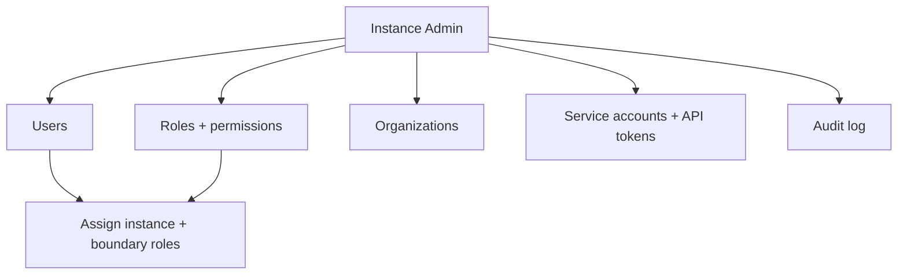

# User Guide: Administration

The **Administration** area is where Instance Admins manage people and
instance-wide settings: user accounts, roles and permissions, organizations,
service accounts and API tokens, the audit log, and deferred data migrations.
This guide covers the day-to-day admin tasks.

**Who this is for:** Instance Admins. Everything here lives under
*Administration* in the user menu and requires the Instance Admin role — see
[RBAC](RBAC) for the full permission model.

---

## Before you start

- **Access:** the **Instance Admin** role. The Administration submenu only
  appears in the user menu for Instance Admins.
- **Where to find it:** user menu (top right) → **Administration** → Users,
  Roles, Authorization Boundaries, Audit Log; plus Organizations and Service
  Accounts.

---

## At a glance

---

## Primary use cases

- **Manage people** — create/suspend users and assign their roles.
- **Define permissions** — create roles scoped to the instance or a boundary.
- **Enable automation** — issue service accounts and API tokens for the REST API.
- **Audit activity** — search and export the audit log.

---

## How to manage users

1. Go to **Administration → Users** (`/admin/users`).
2. Search or filter by status; the list is paginated (25 per page).
3. **View** a user (`/admin/users/:id`) to see their identities (local, OIDC,
   LDAP, GitHub, GitLab), assigned instance and boundary roles, and recent audit
   events.
4. **Edit** a user (`/admin/users/:id/edit`) to change their display name and
   **assign roles** — both instance roles and boundary-specific roles.
5. Use **Suspend** / **Reactivate** from the list to disable or restore an
   account.
6. If a user has lost their security key, open their profile and click **Reset
   security keys** to revoke all of their FIDO2 keys (the only recovery path —
   there are no self-service codes). They must then re-enroll. See
   [Security Keys & Smart Cards](User-Guide-Security-Keys).

## How to create and assign roles

1. Go to **Administration → Roles** (`/admin/roles`).
2. Click **Create New** (`/admin/roles/new`).
3. Set the **name**, **display name**, and **scope** — *instance* or
   *authorization boundary*.
4. Tick the **permission checkboxes** (CRUD across document types and admin
   features).
5. Save. Open a role (`/admin/roles/:id`) to see its assigned users and full
   permission matrix. Assign the role to users from the user's Edit screen.

See [RBAC](RBAC) for how instance vs. boundary scope and the Instance Admin
bypass work.

## How to manage organizations

Go to **Administration → Organizations** (`/admin/organizations`) to create,
edit, and view organizations, and to add/remove members. Organizations are
**never hard-deleted** — use **Deactivate** / **Reactivate** instead, preserving
UUID-based audit traceability.

## How to issue service accounts and API tokens

1. Go to **Administration → Service Accounts** (`/admin/service_accounts`).
2. Create a service account — a non-interactive identity for automation.
3. Issue an **API token**; the plaintext `sparc_sa_<token>` is shown **once** at
   creation (only a SHA-256 digest is stored), so copy it immediately.
4. Revoke tokens from the same screen when they're no longer needed.

Service accounts authenticate the REST API and can bridge to a UI session via
`POST /api/v1/sessions/from_token`.

## How to use the audit log

1. Go to **Administration → Audit Log** (`/admin/audit_logs`).
2. Use the **filter panel** — free-text search, user, category, resource type,
   and a start/end **date range** — then **Filter** (or **Clear**).
3. The results table shows time, user, a colour-coded action badge, category,
   subject, and IP. Click **Details** for full event metadata
   (`/admin/audit_logs/:id`).
4. Click **Export CSV** to download the currently-filtered events.

## How to check data migrations

Go to **Administration → Data Migrations** (`/admin/data_migrations`) to confirm
that **deferred** migrations (which run post-boot via a background job) have
finished — each shows a state of pending, running, completed, or failed. Use
this after a deploy that included a long-running backfill.

---

## Tips & best practices

- Assign roles at the **narrowest scope** that works — prefer a boundary role
  over an instance role unless the person truly operates instance-wide.
- **Copy the API token immediately** on creation; it can't be retrieved later,
  only regenerated.
- Prefer **Suspend** over deletion for users and **Deactivate** for
  organizations — both preserve the audit trail.
- Use the audit log's **CSV export** with a date range for periodic access
  reviews and evidence gathering.

---

## Troubleshooting

| Symptom | Likely cause | What to do |
|---|---|---|
| No Administration menu | You aren't an Instance Admin | Only Instance Admins see it — request the role |
| A user can't access a boundary's docs | Role assigned at wrong scope | Assign the boundary-scoped role on the user's Edit screen |
| Lost an API token | Plaintext is shown only once | Revoke it and issue a new token |
| Backfill seems incomplete after deploy | Deferred migration still running | Check Data Migrations for its state |
| Audit export is huge | No filters applied | Narrow by date range/user before **Export CSV** |

---

## Related guides

- [User Guides index](User-Guides)
- [Getting Oriented](User-Guide-Getting-Oriented)
- [Authorization Boundaries](User-Guide-Authorization-Boundaries) — boundary-side
  membership.
- [RBAC](RBAC) — full role and permission model.
- [Screens & UI](Screens) — exhaustive element-level reference.
