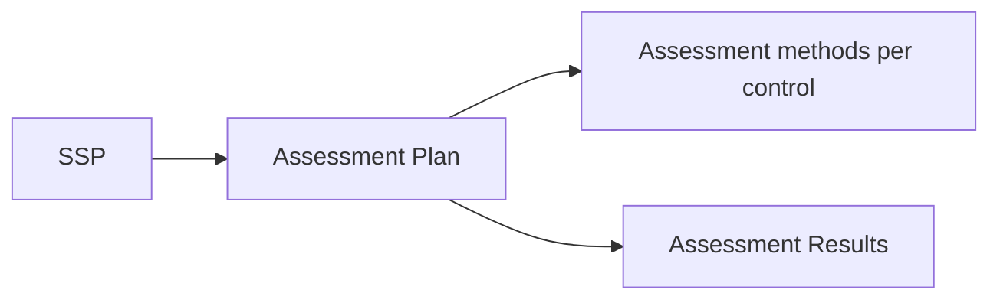

# User Guide: Assessment Plans (SAP)

An **Assessment Plan** describes *how* the controls in a system will be assessed
— the methods, scope, and objectives — before the assessment happens. In OSCAL
it is the `assessment-plan` document. It sits between the SSP (what is
implemented) and the SAR (what was found). This guide covers creating and
managing SAPs.

**Who this is for:** assessors and assessment coordinators. Working with SAPs
requires authentication and a role with SAP permissions — see [RBAC](RBAC).

---

## Before you start

- **Access:** signed in, with a role that permits creating/editing SAPs.
- **Prerequisites:** a completed **SSP** for the system being assessed — see
  [System Security Plans](User-Guide-System-Security-Plans).
- **Where to find it:** *Assessment → Assessment Plans* (`/sap_documents`).

---

## At a glance

---

## Primary use cases

- **Plan an assessment** — define which controls are assessed and by what method
  before fieldwork begins.
- **Import an existing OSCAL SAP** and manage it in SPARC.
- **Hand off to results** — the SAP is the basis the SAR is created from.

The SAP is the OSCAL `assessment-plan`; the SAR (see
[Assessment Results](User-Guide-Assessment-Results)) records the outcome.

---

## How to create an assessment plan

1. Go to *Assessment → Assessment Plans* (`/sap_documents`).
2. Click **Create New**, or **Upload** to import an existing SAP from JSON.
3. Provide the plan metadata.
4. Save. The detail page (`/sap_documents/:id`) shows controls organized by
   family with an **assessment method heatmap**.

## How to review assessment coverage

On the SAP detail page, the **method heatmap** (grouped by NIST family) shows
how controls are distributed across assessment methods — a quick way to confirm
coverage before the assessment starts. Edit the document metadata inline via the
edit toggle.

## How to export an assessment plan

On the detail page use **Export OSCAL** (validated / unvalidated) or **JSON**.

---

## Tips & best practices

- Create the SAP only **after the SSP is complete** — the plan should reflect the
  controls actually in scope.
- Use the **method heatmap** to catch families with thin coverage before
  fieldwork, not after.
- Keep the SAP and the SAR **paired**: create the SAR from this SAP so the
  results trace cleanly back to the plan.

---

## Troubleshooting

| Symptom | Likely cause | What to do |
|---|---|---|
| Upload rejected | File isn't a valid OSCAL SAP | Validate the JSON before importing |
| OSCAL export fails validation | Missing required plan metadata | Fill the flagged fields, then use the validated export |
| SAR wizard can't find this SAP | SAP not saved/complete | Confirm the SAP exists and is saved before creating the SAR |
| Can't edit the SAP | View-only role | Request SAP write permission ([RBAC](RBAC)) |

---

## Related guides

- [User Guides index](User-Guides)
- [System Security Plans (SSP)](User-Guide-System-Security-Plans) — the input to
  the plan.
- [Assessment Results (SAR)](User-Guide-Assessment-Results) — the next step.
- [Screens & UI](Screens) — exhaustive element-level reference.
