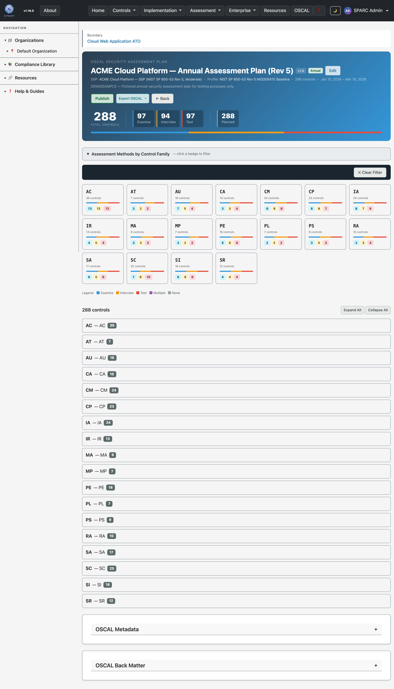
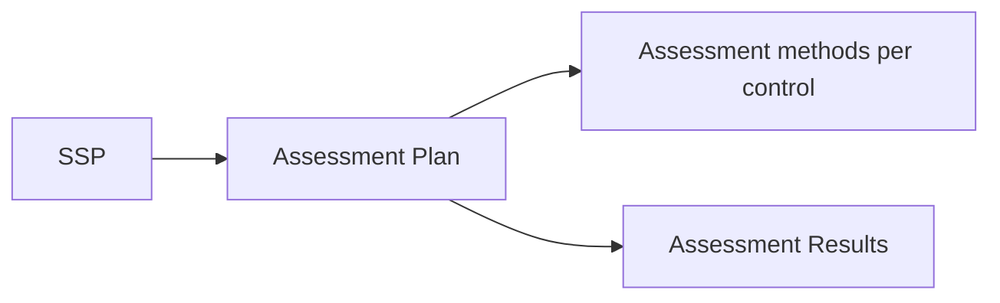

# User Guide: Security Assessment Plan (SAP)

An **Assessment Plan** describes *how* the controls in a system will be assessed
— the methods, scope, and objectives — before the assessment happens. In OSCAL
it is the `assessment-plan` document. It sits between the SSP (what is
implemented) and the SAR (what was found). This guide covers creating and
managing SAPs.

**Who this is for:** assessors and assessment coordinators. Working with SAPs
requires authentication and a role with SAP permissions — see [RBAC](RBAC).

---

> **A boundary is required.** From v1.16.0 this document type must belong to an
> authorization boundary, chosen when you create it. One created before that rule
> without a boundary is visible to Instance Admins only until it is attached —
> see [Authorization Boundaries](User-Guide-Authorization-Boundaries) for how.

## Before you start

- **Access:** signed in, with a role that permits creating/editing SAPs.
- **Prerequisites:** a completed **SSP** for the system being assessed — see
  [System Security Plans](User-Guide-System-Security-Plans).
- **Where to find it:** *Assessment → Assessment Plans* (`/sap_documents`).

---

*A Security Assessment Plan (SAP) detail view.*

## At a glance

```mermaid
flowchart LR
    SSP[SSP] --> SAP[Assessment Plan]
    SAP --> METHOD[Assessment methods per control]
    SAP --> SAR[Assessment Results]
```

---

## Primary use cases

- **Plan an assessment** — define which controls are assessed and by what method
  before fieldwork begins.
- **Import an existing OSCAL SAP** and manage it in SPARC.
- **Hand off to results** — the SAP is the basis the SAR is created from.

The SAP is the OSCAL `assessment-plan`; the SAR (see
[Assessment Results](User-Guide-Assessment-Results)) records the outcome.

---

## How to create an assessment plan

1. Go to *Assessment → Assessment Plans* (`/sap_documents`).
2. Click **Create New**, or **Upload** to import an existing SAP from JSON.
3. Provide the plan metadata.
4. Choose the **System Security Plan** being assessed. The **Baseline Profile**
   fills in automatically from whatever that SSP records as its baseline — that
   is the baseline the assessment is scoped against, so you normally leave it
   alone. You can override it if the assessment is deliberately scoped to a
   different one.
5. Save. The detail page (`/sap_documents/:id`) shows controls organized by
   family with an **assessment method heatmap**.

**If Baseline stays blank**, the SSP you picked does not record what it is based
on. SPARC will not guess one — a baseline invented for an assessment is not a
baseline anyone approved. Fix it on the SSP: open it and set its profile, or
re-import it from OSCAL that declares `import-profile`. See
[System Security Plans](User-Guide-System-Security-Plans).

## How to review assessment coverage

On the SAP detail page, the **method heatmap** (grouped by NIST family) shows
how controls are distributed across assessment methods — a quick way to confirm
coverage before the assessment starts. Edit the document metadata inline via the
edit toggle.

## How to export an assessment plan

On the detail page use **Export OSCAL** (validated / unvalidated) or **JSON**.

---

## Tips & best practices

- Create the SAP only **after the SSP is complete** — the plan should reflect the
  controls actually in scope.
- Use the **method heatmap** to catch families with thin coverage before
  fieldwork, not after.
- Keep the SAP and the SAR **paired**: create the SAR from this SAP so the
  results trace cleanly back to the plan.

---

## Troubleshooting

| Symptom | Likely cause | What to do |
|---|---|---|
| Upload rejected | File isn't a valid OSCAL SAP | Validate the JSON before importing |
| OSCAL export fails validation | Missing required plan metadata | Fill the flagged fields, then use the validated export |
| SAR wizard can't find this SAP | SAP not saved/complete | Confirm the SAP exists and is saved before creating the SAR |
| Can't edit the SAP | View-only role | Request SAP write permission ([RBAC](RBAC)) |

---

## Finding what you need

The assessment plans list opens as **cards**, with a **☰ List** toggle if you prefer a
table. Your choice is remembered for this screen.

See [Browsing a list of documents](User-Guide-Getting-Oriented#browsing-a-list-of-documents) for how cards, lists, search and filters work — they behave the same on every list screen.

---

## Related guides

- [User Guides index](User-Guides)
- [System Security Plans (SSP)](User-Guide-System-Security-Plans) — the input to
  the plan.
- [Security Assessment Results (SAR)](User-Guide-Assessment-Results) — the next step.
- [Screens & UI](Screens) — exhaustive element-level reference.
