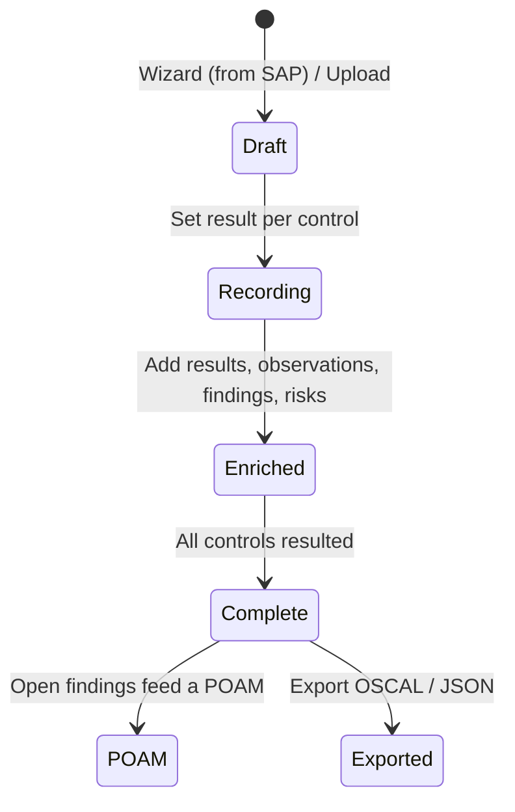

# User Guide: Assessment Results (SAR)

An **Assessment Results** document records *what the assessment found* — the
pass/fail result and findings for each control that was tested. In OSCAL it is
the `assessment-results` document. You create a SAR from a SAP, record results
per control (filtering by asset, environment, and section), and export it. Open
findings flow onward into a POA&M. This guide walks the lifecycle.

**Who this is for:** assessors recording results. Working with SARs requires
authentication and a role with SAR permissions — see [RBAC](RBAC).

---

## Before you start

- **Access:** signed in, with a role that permits creating/editing SARs.
- **Prerequisites:** an **Assessment Plan (SAP)** to build from — see
  [Assessment Plans](User-Guide-Assessment-Plans).
- **Where to find it:** *Assessment → Assessment Results* (`/sar_documents`).

---

## At a glance

---

## Primary use cases

- **Record assessment outcomes** — mark each control pass/fail with tester notes.
- **Import an existing OSCAL SAR** and continue in SPARC.
- **Enrich a SAR** with OSCAL results, observations, findings, and risks.
- **Drive a POA&M** — open findings become the input to remediation tracking.

The SAR is the OSCAL `assessment-results`; it consumes the SAP and feeds the
POA&M (see [POA&M](User-Guide-POAM)).

---

## How to create a SAR with the wizard

1. Go to *Assessment → Assessment Results* (`/sar_documents`).
2. Click **Create New SAR** to open the wizard (`/sar_documents/wizard`).
3. **Select the SAP** to base results on.
4. Set the **assessment date(s)**.
5. Submit. SPARC generates the SAR with a control entry per assessed control.

You can also use **Upload File** to import an existing SAR; uploaded files parse
asynchronously with the same **processing spinner / failure banner** pattern as
SSPs.

## How to record results per control

The SAR detail page (`/sar_documents/:id`) is built for high-volume result
entry.

1. Use the **status chips**, **results heatmap**, or the **filter bar** to focus
   the control list. Filters (all combinable) are **section**, **family**,
   **status**, **asset**, and **environment**; an active-filter banner shows
   "Showing X of Y controls" with **Clear All**.
2. Expand a **control card** to see its assessment context (subject, control
   status, responsibility, impact, control text, and the SSP implementation).
3. Click **Edit** on the card and set:
   - **Result** (pass/fail/…)
   - **Working status**
   - Tester, date, **notes/weakness**, **recommended fix**, working comments,
     coverage level, inherited.
4. Save. The **pass-rate** percentage and progress bar at the top update. Control
   cards are paginated (50 per page), and filters persist across pages.

## How to enrich a SAR

Click **Enrich** (`/sar_documents/:id/enrich`) to add OSCAL assessment metadata:
**results**, **observations**, **findings**, and **risks**. Enrichment is what
makes the OSCAL export complete and lets findings map cleanly into a POA&M.

## How to export a SAR

On the detail page use **Download OSCAL** (the `assessment-results` document) or
**Download JSON**.

---

## Tips & best practices

- Record results by **section or family** using the filters, rather than
  scrolling the whole list — it's faster and less error-prone.
- Use **asset** and **environment** filters when the same control is assessed
  across multiple environments so results stay attributable.
- **Enrich before export** — observations and findings are what downstream POA&M
  generation relies on.
- Every **failed** control is a candidate POA&M item; capture a clear
  *recommended fix* so remediation planning starts from good notes.

---

## Troubleshooting

| Symptom | Likely cause | What to do |
|---|---|---|
| SAR stuck on the processing spinner | Async parse running or failed | Wait for auto-refresh; on a failure banner, check the file and re-upload |
| Wizard shows no SAP to pick | No saved SAP exists | Create the SAP first ([Assessment Plans](User-Guide-Assessment-Plans)) |
| Filters hide controls you expect | An active filter is applied | Use **Clear All** in the active-filter banner |
| Findings don't carry into a POA&M | SAR not enriched with findings/risks | Enrich the SAR, then generate/populate the POA&M |
| Can't edit result cards | View-only role | Request SAR write permission ([RBAC](RBAC)) |

---

## Related guides

- [User Guides index](User-Guides)
- [Assessment Plans (SAP)](User-Guide-Assessment-Plans) — the input to results.
- [POA&M](User-Guide-POAM) — where open findings are tracked to closure.
- [Evidence & Attestations](User-Guide-Evidence-and-Attestations)
- [Screens & UI](Screens) — exhaustive element-level reference.
