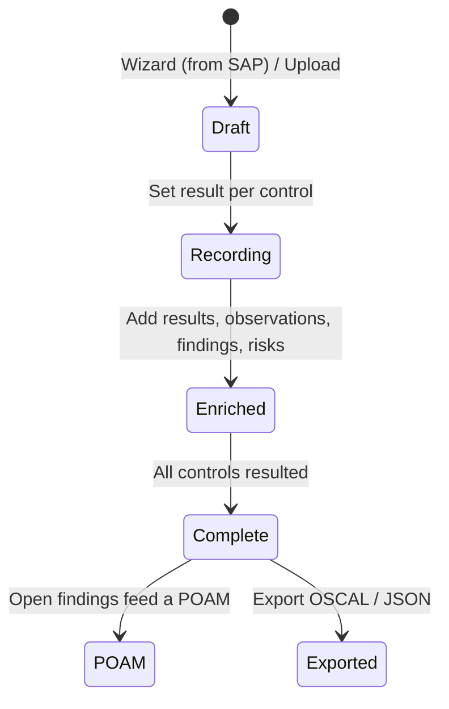

# User Guide: Security Assessment Results (SAR)

An **Assessment Results** document records *what the assessment found* — the
pass/fail result and findings for each control that was tested. In OSCAL it is
the `assessment-results` document. You create a SAR from a SAP, record results
per control (filtering by asset, environment, and section), and export it. Open
findings flow onward into a POA&M. This guide walks the lifecycle.

**Who this is for:** assessors recording results. Working with SARs requires
authentication and a role with SAR permissions — see [RBAC](RBAC).

---

> **A boundary is required.** From v1.16.0 this document type must belong to an
> authorization boundary, chosen when you create it. One created before that rule
> without a boundary is visible to Instance Admins only until it is attached —
> see [Authorization Boundaries](User-Guide-Authorization-Boundaries) for how.

## Before you start

- **Access:** signed in, with a role that permits creating/editing SARs.
- **Prerequisites:** an **Assessment Plan (SAP)** to build from — see
  [Assessment Plans](User-Guide-Assessment-Plans).
- **Where to find it:** *Assessment → Assessment Results* (`/sar_documents`).

---

*A Security Assessment Results (SAR) detail view.*

## At a glance

```mermaid
stateDiagram-v2
    [*] --> Draft: Wizard (from SAP) / Upload
    Draft --> Recording: Set result per control
    Recording --> Enriched: Add results, observations, findings, risks
    Enriched --> Complete: All controls resulted
    Complete --> POAM: Open findings feed a POAM
    Complete --> Exported: Export OSCAL / JSON
```

---

## Primary use cases

- **Record assessment outcomes** — mark each control pass/fail with tester notes.
- **Import an existing OSCAL SAR** and continue in SPARC.
- **Enrich a SAR** with OSCAL results, observations, findings, and risks.
- **Drive a POA&M** — open findings become the input to remediation tracking.

The SAR is the OSCAL `assessment-results`; it consumes the SAP and feeds the
POA&M (see [POA&M](User-Guide-POAM)).

---

## How to create a SAR with the wizard

1. Go to *Assessment → Assessment Results* (`/sar_documents`).
2. Click **Create New SAR** to open the wizard (`/sar_documents/wizard`).
3. **Select the SAP** to base results on.
4. Set the **assessment date(s)**.
5. Submit. SPARC generates the SAR with a control entry per assessed control.

You can also use **Upload File** to import an existing SAR; uploaded files parse
asynchronously with the same **processing spinner / failure banner** pattern as
SSPs.

## How to record results per control

The SAR detail page (`/sar_documents/:id`) is built for high-volume result
entry.

1. Use the **status chips**, the **Results by Control Family** heatmap, or the
   **filter bar** to focus the control list. Filters (all combinable) are
   **section**, **family**, **status**, **asset**, and **environment**; an
   active-filter banner shows "Showing X of Y controls" with **Clear All**.
   Clicking a family tile filters the list to that family.
2. Expand a **control card** to see its assessment context (subject, control
   status, responsibility, impact, control text, and the SSP implementation).
3. Click **Edit** on the card and set:
   - **Result** (pass/fail/…)
   - **Working status**
   - Tester, date, **notes/weakness**, **recommended fix**, working comments,
     coverage level, inherited.
4. Save. The **pass-rate** percentage and progress bar at the top update. Control
   cards are paginated (50 per page), and filters persist across pages.

Controls are listed in **NIST catalog order** — family, then base number, then
enhancement (AC-1, AC-2, AC-2(1), AC-3 … AC-17, AC-18), not the order they
arrived in from the source spreadsheet. The ordering is applied by the query, so
it holds across page boundaries rather than only within the page you are looking
at.

## How to enrich a SAR

Enrichment adds the OSCAL assessment metadata that per-control results do not
carry: **results**, **observations**, **findings**, and **risks**. It is what
makes the OSCAL export complete and lets findings map cleanly into a POA&M.

Open it from the SAR detail page's action bar (`/sar_documents/:id/enrich`). The
button is there in **both** states and always in the same place — it reads
**Enrich** on a SAR that has not been enriched yet, and **Edit Enrichment** once
it has. Enrichment is iterative; you are expected to come back to it.

Each section expands independently, so you can work on risks without scrolling
past results.

### What a risk records

A risk is the assessor's judgement about a weakness, and SPARC captures it the
way OSCAL does:

| Field | What to put in it |
|---|---|
| **Title** / **Description** | What the risk is, in your own words. |
| **Statement** | What could happen, and to what. OSCAL requires it on every risk. |
| **Status** | `Open`, `Investigating`, `Remediating`, `Deviation Requested`, `Deviation Approved`, `Closed` — the six values the OSCAL `risk-status` vocabulary defines, and the only six. |
| **Impact** / **Likelihood** | The rating, on the five-level scale NIST SP 800-30 and FedRAMP use: **Very Low, Low, Moderate, High, Very High**. Both are exported as OSCAL risk *characterization facets*, so a rating chosen here reaches the artifact. |
| **Threat IDs** | The threat this risk realises, as a published catalogue names it — the catalogue's address plus the identifier inside it, e.g. `https://attack.mitre.org` + `T1078`, or `https://cve.mitre.org` + `CVE-2026-80212`. |
| **Mitigating Factors** | Anything already in place that reduces the risk — a compensating control, a network restriction, a manual check. |

**Threat IDs** and **Mitigating Factors** live under a collapsed *Threat IDs and
Mitigating Factors* heading inside the risk card you are already editing. Each is
a repeatable row: **+ Add** appends one, **×** removes one, and removing the last
row and saving clears the collection. You do not manage OSCAL identifiers by
hand — SPARC assigns and preserves them.

Two further OSCAL collections a risk can carry — **origins** (attribution for a
rating) and the append-only **risk log** — are authorable through
[the API](API-Reference) rather than this form. Origins are written by SPARC for
the ratings it produces, and a risk log is history rather than something to type;
the endpoints exist for an integrator migrating an existing risk register.

Saving the form updates the **Download OSCAL** output immediately.

## How to export a SAR

On the detail page use **Download OSCAL** (the `assessment-results` document) or
**Download JSON**.

---

## Tips & best practices

- Record results by **section or family** using the filters, rather than
  scrolling the whole list — it's faster and less error-prone.
- Use **asset** and **environment** filters when the same control is assessed
  across multiple environments so results stay attributable.
- **Enrich before export** — observations and findings are what downstream POA&M
  generation relies on.
- Every **failed** control is a candidate POA&M item; capture a clear
  *recommended fix* so remediation planning starts from good notes.

---

## Troubleshooting

| Symptom | Likely cause | What to do |
|---|---|---|
| SAR stuck on the processing spinner | Async parse running or failed | Wait for auto-refresh; on a failure banner, check the file and re-upload |
| Wizard shows no SAP to pick | No saved SAP exists | Create the SAP first ([Assessment Plans](User-Guide-Assessment-Plans)) |
| Filters hide controls you expect | An active filter is applied | Use **Clear All** in the active-filter banner |
| A risk rated **Medium** now reads **Moderate** | The rating scale moved to the five NIST SP 800-30 / FedRAMP levels, and existing `medium` ratings were migrated | Nothing to do — the rating is unchanged, only its spelling |
| Findings don't carry into a POA&M | SAR not enriched with findings/risks | Enrich the SAR, then generate/populate the POA&M |
| Can't edit result cards | View-only role | Request SAR write permission ([RBAC](RBAC)) |

---

## Finding what you need

The assessment results list opens as **cards**, with a **☰ List** toggle if you prefer a
table. Your choice is remembered for this screen.

See [Browsing a list of documents](User-Guide-Getting-Oriented#browsing-a-list-of-documents) for how cards, lists, search and filters work — they behave the same on every list screen.

---

## Related guides

- [User Guides index](User-Guides)
- [Security Assessment Plan (SAP)](User-Guide-Assessment-Plans) — the input to results.
- [POA&M](User-Guide-POAM) — where open findings are tracked to closure.
- [Evidence & Attestations](User-Guide-Evidence-and-Attestations)
- [Screens & UI](Screens) — exhaustive element-level reference.
