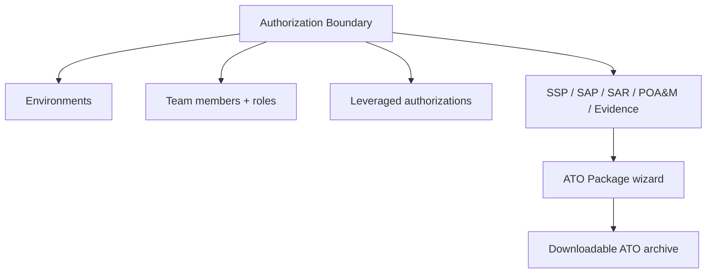

# User Guide: Authorization Boundaries

An **authorization boundary** represents the system you are getting authorized —
roughly one ATO. It is the hub that ties together your environments, team, and
all of the OSCAL documents (SSP, SAP, SAR, POA&M, evidence) for that system.
This guide covers creating and managing boundaries, their environments and
members, recording leveraged authorizations, and assembling an ATO package.

**Who this is for:** ISSOs, system owners, and anyone coordinating an
authorization. Creating and editing boundaries requires the appropriate role —
see [RBAC](RBAC). Instance Admins can also manage boundaries under
*Administration* (see [Administration](User-Guide-Administration)).

---

## Before you start

- **Access:** a role that permits viewing/editing authorization boundaries.
- **Where to find it:** *Authorization Boundaries* in the top nav
  (`/authorization_boundaries`), or expand an organization in the left sidebar.

---

## At a glance

---

## Primary use cases

- **Stand up a new system for authorization** — create the boundary, define its
  environments, and add the team.
- **Record inherited controls** from a leveraged system (e.g. a FedRAMP-authorized
  cloud service) via a leveraged authorization.
- **Assemble an ATO package** — bundle the boundary's SSP/SAP/SAR/POA&M and
  evidence into a single downloadable archive for submission.

---

## How to create an authorization boundary

1. Go to *Authorization Boundaries* (`/authorization_boundaries`).
2. Click **Create New**.
3. Enter a **name** and **description** for the system.
4. Save. You land on the boundary **detail** page, the home base for this
   system.

## How to add an environment

Environments (dev, test, prod, …) are the system boundaries within an
authorization boundary.

1. Open the authorization boundary detail page.
2. In the **System boundaries** section, click to add a new one
   (`/authorization_boundaries/:id/boundaries/new`).
3. Fill in **name**, **description**, and the **environment classification**.
4. Save. The environment now appears on the boundary, and can be referenced when
   filtering assessment results by environment.

## How to add team members

1. On the boundary detail page, find the **Team members** section.
2. Click to add a member
   (`/authorization_boundaries/:id/authorization_boundary_memberships/new`).
3. Choose the user and assign a **role** from the dropdown (the role governs what
   they can do *within this boundary* — see [RBAC](RBAC)).
4. Save. Use the same section to **edit** a member's role or **remove** them.

## How to record a leveraged authorization

Use this when your system inherits controls from an underlying authorized system
(a leveraged authorization is recorded on *your* — the leveraging — boundary).

1. On the boundary detail page, start a new leveraged authorization
   (`/authorization_boundaries/:id/leveraged_authorizations/new`).
2. Enter the **leveraged system name/ID** and the responsible **party**.
3. Save, then open the leveraged authorization's detail view.
4. Click **Populate** to pull inherited controls/components from the underlying
   system into your boundary.

The leveraging side can also view inherited POA&Ms read-only — see
[POA&M](User-Guide-POAM).

## How to assemble and download an ATO package

1. On the boundary detail page, open the **ATO Package Wizard**
   (`/authorization_boundaries/:id/ato_wizard`).
2. The wizard assembles the boundary's SSP, SAP, SAR, POA&M, and evidence
   artifacts into one Authorization-to-Operate package.
3. Create the package, then use **Download** to get the bundled archive
   (`download_ato_package`).

Make sure the constituent documents are complete before you build the package —
the wizard bundles their current state.

---

## Tips & best practices

- Treat the boundary detail page as your **command center** for a system: its
  documents, environments, and team are all one click away here and in the
  sidebar.
- Define **environments early** — SARs can filter results by environment, which
  is far more useful when your environments are already modeled.
- Record **leveraged authorizations** before writing SSP control narratives, so
  inherited controls are already populated and you don't re-document them.
- Keep boundary **membership tight** — access to every document under a boundary
  flows from membership plus role.

---

## Troubleshooting

| Symptom | Likely cause | What to do |
|---|---|---|
| ATO package is missing a document | That document doesn't exist or isn't complete for the boundary | Create/complete the SSP/SAP/SAR/POA&M first, then rebuild |
| "Populate" pulls nothing | The leveraged system reference is incomplete | Re-check the leveraged system name/ID on the leveraged authorization |
| Can't create a boundary | Your role lacks the permission | Ask an Instance Admin ([Administration](User-Guide-Administration)) |
| A member can't see documents | Role assigned at the wrong scope | Confirm the boundary-scoped role in the Team members section |

---

## Related guides

- [User Guides index](User-Guides)
- [Getting Oriented](User-Guide-Getting-Oriented)
- [System Security Plans (SSP)](User-Guide-System-Security-Plans)
- [POA&M](User-Guide-POAM)
- [Administration](User-Guide-Administration) — instance-side boundary and member
  management.
- [Screens & UI](Screens) — exhaustive element-level reference.
