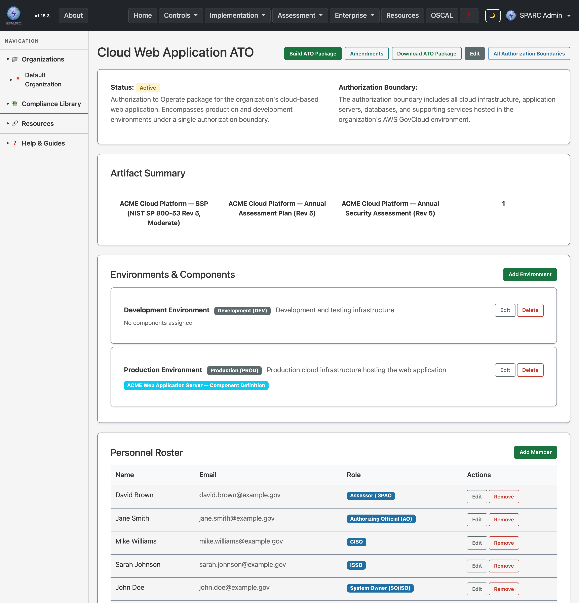
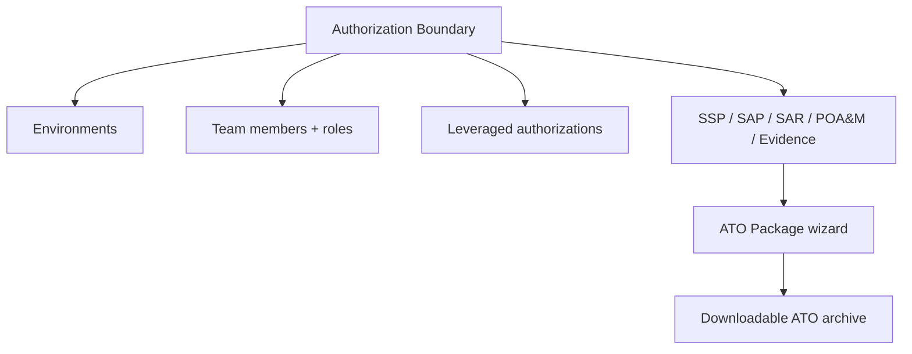

# User Guide: Authorization Boundaries

An **authorization boundary** represents the system you are getting authorized —
roughly one ATO. It is the hub that ties together your environments, team, and
all of the OSCAL documents (SSP, SAP, SAR, POA&M, evidence) for that system.
This guide covers creating and managing boundaries, their environments and
members, recording leveraged authorizations, and assembling an ATO package.

**Who this is for:** ISSOs, system owners, and anyone coordinating an
authorization. Creating and editing boundaries requires the appropriate role —
see [RBAC](RBAC). Instance Admins can also manage boundaries under
*Administration* (see [Administration](User-Guide-Administration)).

---

## Before you start

- **Access:** a role that permits viewing/editing authorization boundaries.
- **Where to find it:** *Authorization Boundaries* in the top nav
  (`/authorization_boundaries`), or expand an organization in the left sidebar.

---

*An Authorization Boundary / ATO package — environments, personnel roster, artifacts, and document metadata sync.*

## At a glance

```mermaid
flowchart TD
    AB[Authorization Boundary] --> ENV[Environments]
    AB --> MEM[Team members + roles]
    AB --> LEV[Leveraged authorizations]
    AB --> DOCS["SSP / SAP / SAR / POA&M / Evidence"]
    DOCS --> ATO[ATO Package wizard]
    ATO --> ZIP[Downloadable ATO archive]
```

---

## Primary use cases

- **Stand up a new system for authorization** — create the boundary, define its
  environments, and add the team.
- **Record inherited controls** from a leveraged system (e.g. a FedRAMP-authorized
  cloud service) via a leveraged authorization.
- **Assemble an ATO package** — bundle the boundary's SSP/SAP/SAR/POA&M and
  evidence into a single downloadable archive for submission.

---

## How to create an authorization boundary

1. Go to *Authorization Boundaries* (`/authorization_boundaries`).
2. Click **Create New**.
3. Enter a **name** and **description** for the system.
4. Save. You land on the boundary **detail** page, the home base for this
   system.

## How to add an environment

Environments (dev, test, prod, …) are the system boundaries within an
authorization boundary.

1. Open the authorization boundary detail page.
2. In the **System boundaries** section, click to add a new one
   (`/authorization_boundaries/:id/boundaries/new`).
3. Fill in **name**, **description**, and the **environment classification**.
4. Save. The environment now appears on the boundary, and can be referenced when
   filtering assessment results by environment.

## How to add team members

1. On the boundary detail page, find the **Team members** section.
2. Click to add a member
   (`/authorization_boundaries/:id/authorization_boundary_memberships/new`).
3. Choose the user and assign a **role** from the dropdown (the role governs what
   they can do *within this boundary* — see [RBAC](RBAC)).
4. Save. Use the same section to **edit** a member's role or **remove** them.

The dropdown offers seven built-in roles — Authorizing Official (AO), System
Owner (SO/ISO), CISO, ISSO, Team Member, Assessor / 3PAO and View Only. An
operator can narrow that list or add roles of their own with
`SPARC_AUTH_BOUNDARY_ROLES` ([Configuration](Configuration)), so what you see may
differ from the defaults. If a role is later removed from that setting, members
already holding it keep it and stay editable — it simply stops being offered for
new assignments.

## How to record a leveraged authorization

Use this when your system inherits controls from an underlying authorized system
(a leveraged authorization is recorded on *your* — the leveraging — boundary).

1. On the boundary detail page, start a new leveraged authorization
   (`/authorization_boundaries/:id/leveraged_authorizations/new`).
2. Enter the **leveraged system name/ID** and the responsible **party**.
3. Save, then open the leveraged authorization's detail view.
4. Click **Populate** to pull inherited controls/components from the underlying
   system into your boundary.

The leveraging side can also view inherited POA&Ms read-only — see
[POA&M](User-Guide-POAM).

## How to attach a document to this boundary

Every SSP, SAP, SAR and POA&M belongs to exactly one authorization boundary. You
normally choose it on the upload form, but a document that arrived without one —
or one you need to move — can be attached afterwards.

**From the boundary (the usual way).** On the boundary detail page, the
**Artifact Summary** shows a tile per document type. A tile reading **Add…**
means no document of that type is attached yet; click it to open the attach
screen, which offers both options:

1. **Attach an existing document** — lists documents of that type that belong to
   no boundary, with an **Attach** button on each.
2. **Upload a new one** — takes you to the upload form with this boundary
   already selected.

**From the document.** Open the document, expand **OSCAL Metadata**, choose the
boundary and save.

A few rules worth knowing:

- You need write permission on the boundary you are attaching **to**, not just
  the one the document is currently in. Moving a document into a boundary you
  cannot write to is refused.
- A document with **no** boundary can be attached whatever its state, including
  a published one — that is the case this exists to repair. Moving a document
  from one boundary to **another** requires a draft.
- A document that belongs to no boundary is visible to **Instance Admins only**,
  so a boundary member may see an empty attach list. Ask an Instance Admin to
  attach it.
- Component definitions work differently: a CDEF has no single boundary. Use
  **Scope** on the CDEF page to make it boundary-specific or available to the
  whole organization. Component definitions imported from AWS Labs are read-only
  — copy one first, then scope the copy.

---

## How to assemble and download an ATO package

1. On the boundary detail page, open the **ATO Package Wizard**
   (`/authorization_boundaries/:id/ato_wizard`).
2. The wizard assembles the boundary's SSP, SAP, SAR, POA&M, and evidence
   artifacts into one Authorization-to-Operate package.
3. Create the package, then use **Download** to get the bundled archive
   (`download_ato_package`).

Since v1.15.2 the archive contains **every document in JSON, YAML and XML**
(previously JSON only), so consumers standardised on OSCAL XML can use it
directly. Each file is validated against the schema matching its serialization,
and `manifest.json` records the format and conformance of every one.

Two things the manifest tells you that are worth reading:

- **`documents[].files[].schema_valid`** — whether that file passes its OSCAL
  schema. The archive deliberately ships documents that do not yet conform, so a
  partial package stays recoverable; presence in the archive is **not** evidence
  of conformance.
- **`omitted`** — any document whose export failed, with the reason. Before
  v1.15.2 a failed export was skipped silently while the manifest went on listing
  the missing file, so a package could claim to contain an SSP that was not
  there.

Make sure the constituent documents are complete before you build the package —
the wizard bundles their current state.

---

## Tips & best practices

- Treat the boundary detail page as your **command center** for a system: its
  documents, environments, and team are all one click away here and in the
  sidebar.
- Define **environments early** — SARs can filter results by environment, which
  is far more useful when your environments are already modeled.
- Record **leveraged authorizations** before writing SSP control narratives, so
  inherited controls are already populated and you don't re-document them.
- Keep boundary **membership tight** — access to every document under a boundary
  flows from membership plus role.

---

## Troubleshooting

| Symptom | Likely cause | What to do |
|---|---|---|
| ATO package is missing a document | That document doesn't exist or isn't complete for the boundary | Create/complete the SSP/SAP/SAR/POA&M first, then rebuild |
| "Populate" pulls nothing | The leveraged system reference is incomplete | Re-check the leveraged system name/ID on the leveraged authorization |
| Can't create a boundary | Your role lacks the permission | Ask an Instance Admin ([Administration](User-Guide-Administration)) |
| A member can't see documents | Role assigned at the wrong scope | Confirm the boundary-scoped role in the Team members section |
| An SSP/SAP/SAR/POA&M is missing from every list | It belongs to no boundary, so only Instance Admins can see it | Ask an Instance Admin to attach it from the boundary's Artifact Summary |
| Upload form shows no boundary to pick | You are not on the roster of any boundary | Ask to be added — these document types cannot be created without one |
| "Add…" tile lists nothing to attach | No unattached document of that type exists, or you are not an Instance Admin | Upload a new one from the same screen |

---

## Finding what you need

The authorization boundaries list opens as **cards**, with a **☰ List** toggle if you prefer a
table. Your choice is remembered for this screen.

Instance Admins can select boundaries for bulk delete in either view — the
tick-boxes are on the cards as well as the table rows.

See [Browsing a list of documents](User-Guide-Getting-Oriented#browsing-a-list-of-documents) for how cards, lists, search and filters work — they behave the same on every list screen.

---

## Related guides

- [User Guides index](User-Guides)
- [Getting Oriented](User-Guide-Getting-Oriented)
- [System Security Plans (SSP)](User-Guide-System-Security-Plans)
- [POA&M](User-Guide-POAM)
- [Administration](User-Guide-Administration) — instance-side boundary and member
  management.
- [Screens & UI](Screens) — exhaustive element-level reference.
