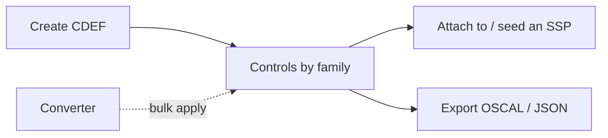

# User Guide: Component Definitions (CDEF)

A **Component Definition** describes a reusable system component — a managed
database, a logging pipeline, a hardened OS image — and the controls it
satisfies. In OSCAL terms it is the `component-definition` document. CDEFs let
you write a component's control implementation once and reuse it across many
SSPs. This guide covers creating CDEFs, applying converters in bulk, and
exporting.

**Who this is for:** platform and compliance engineers who maintain reusable
component control sets. Working with CDEFs requires authentication and a role
with CDEF permissions — see [RBAC](RBAC).

---

## Before you start

- **Access:** signed in, with a role that permits creating/editing CDEFs.
- **Prerequisites:** none to start; a **converter** is needed only if you plan to
  bulk-apply rule → control mappings (see
  [Converters & Imports](User-Guide-Converters-and-Imports)).
- **Where to find it:** *Implementation → Component Definitions*
  (`/cdef_documents`).

---

## At a glance

---

## Primary use cases

- **Define a reusable component** and the controls it provides, once.
- **Bulk-apply a converter** to populate a component's controls from scanner /
  benchmark mappings.
- **Feed SSPs** — attach a CDEF during SSP creation so its component
  implementations seed the plan.

The CDEF is the OSCAL `component-definition`; SSPs consume it (see
[System Security Plans](User-Guide-System-Security-Plans)).

---

## How to create a component definition

1. Go to *Implementation → Component Definitions* (`/cdef_documents`).
2. Click **Create New**.
3. Enter the component metadata (name/title, version, description).
4. Save. The detail page (`/cdef_documents/:id`) shows the component's controls
   organized by family, with a **severity heatmap**.

## How to populate controls with a converter (bulk apply)

Instead of adding controls one by one, apply a converter to map source rules to
NIST controls in bulk.

1. Open the CDEF detail page.
2. Use the **bulk-apply** action and choose the converter whose mappings you want
   (e.g. an AWS Config or STIG-derived converter).
3. Apply. The converter's rule → control mappings populate the component's
   control set; review the results in the family/heatmap view.

Keep the converter fresh first — see
[Converters & Imports](User-Guide-Converters-and-Imports).

## How to reuse a CDEF in an SSP

When creating an SSP with the wizard, select this CDEF at the **CDEF selector**
step. Its component implementations seed the new SSP so you don't re-author them.
See [System Security Plans](User-Guide-System-Security-Plans).

## How to copy or export a CDEF

On the detail page:

- **Copy** duplicates the document as a starting point for a variant component.
- **Export OSCAL** (validated / unvalidated) emits the `component-definition`.
- **Download JSON** gives the raw document.

---

## Tips & best practices

- Build a **library of small, focused CDEFs** (one per real component) rather
  than one giant catch-all — they compose better into SSPs.
- **Bulk-apply a converter** to bootstrap coverage, then refine the narratives by
  hand.
- **Copy** an existing CDEF when a new component is a close variant of one you've
  already documented.
- Keep CDEF versions in step with the components they describe so SSP authors
  know which revision they're pulling in.

---

## Troubleshooting

| Symptom | Likely cause | What to do |
|---|---|---|
| Bulk-apply adds no controls | Converter has no entries, or wrong converter | Refresh/verify the converter, then re-apply |
| CDEF doesn't seed the SSP | Not selected at the wizard's CDEF step | Re-run the SSP wizard and pick the CDEF |
| OSCAL export fails validation | Missing required component metadata | Fill the flagged fields, then use the validated export |
| Can't edit the CDEF | View-only role | Request CDEF write permission ([RBAC](RBAC)) |

---

## Related guides

- [User Guides index](User-Guides)
- [Converters & Imports](User-Guide-Converters-and-Imports)
- [System Security Plans (SSP)](User-Guide-System-Security-Plans) — consumes
  CDEFs.
- [Control Catalogs & Baselines](User-Guide-Control-Catalogs-and-Baselines)
- [Screens & UI](Screens) — exhaustive element-level reference.
