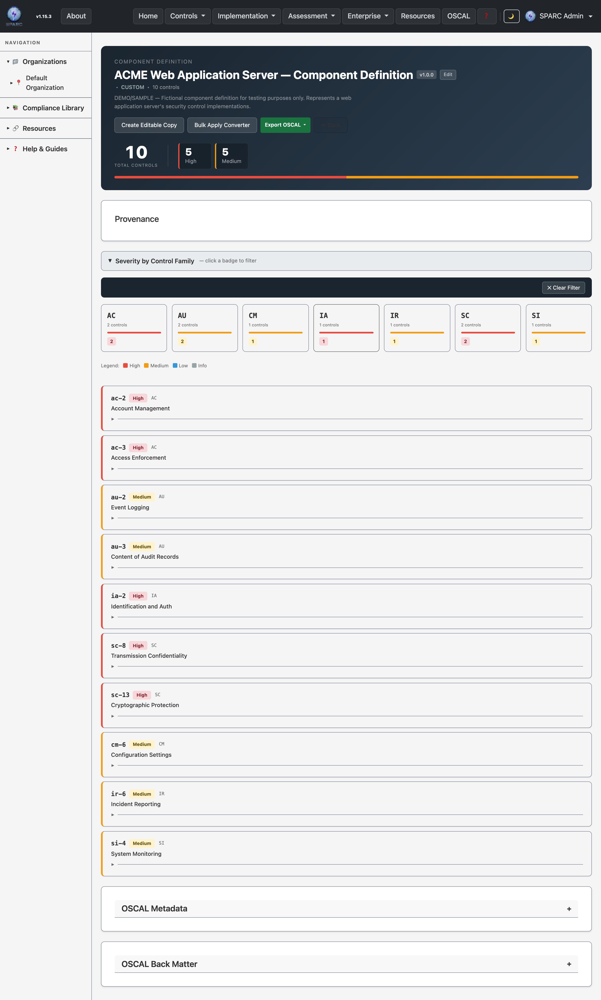
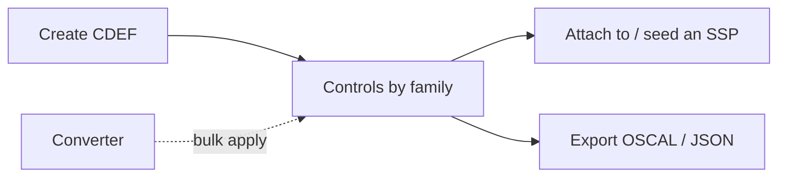

# User Guide: Component Definitions (CDEF)

A **Component Definition** describes a reusable system component — a managed
database, a logging pipeline, a hardened OS image — and the controls it
satisfies. In OSCAL terms it is the `component-definition` document. CDEFs let
you write a component's control implementation once and reuse it across many
SSPs. This guide covers creating CDEFs, applying converters in bulk, and
exporting.

**Who this is for:** platform and compliance engineers who maintain reusable
component control sets. Working with CDEFs requires authentication and a role
with CDEF permissions — see [RBAC](RBAC).

---

## Before you start

- **Access:** signed in, with a role that permits creating/editing CDEFs.
- **Prerequisites:** none to start; a **converter** is needed only if you plan to
  bulk-apply rule → control mappings (see
  [Converters & Imports](User-Guide-Converters-and-Imports)).
- **Where to find it:** *Implementation → Component Definitions*
  (`/cdef_documents`).

---

*A Component Definition (CDEF) detail view.*

## At a glance

```mermaid
flowchart LR
    NEW[Create CDEF] --> CTRL[Controls by family]
    CV[Converter] -. bulk apply .-> CTRL
    CTRL --> SSP[Attach to / seed an SSP]
    CTRL --> EXP[Export OSCAL / JSON]
```

---

## Primary use cases

- **Define a reusable component** and the controls it provides, once.
- **Bulk-apply a converter** to populate a component's controls from scanner /
  benchmark mappings.
- **Feed SSPs** — attach a CDEF during SSP creation so its component
  implementations seed the plan.

The CDEF is the OSCAL `component-definition`; SSPs consume it (see
[System Security Plans](User-Guide-System-Security-Plans)).

---

## How to create a component definition

There are three ways in, on the same **Create New** page (`/cdef_documents/new`):
upload a file someone else authored, generate one from a published profile, or
**author one yourself**.

### Author one from scratch

1. Go to *Implementation → Component Definitions* (`/cdef_documents`).
2. Click **Create New**, then use the **Author a Component Definition** form.
3. Fill in what the component *is*:
   - **Document name** — what it is called inside SPARC.
   - **Component type** — what kind of thing it is: service, hardware, policy,
     process-procedure, and so on. OSCAL constrains this list. Leave it blank and
     the export falls back to `software`.
     - **`validation` is only partly supported here.** OSCAL models a
       third-party product validation — "this module is FIPS 140-2 validated,
       certificate #4282" — as a *pair* of components: the product, and a
       separate `validation` component carrying the certificate, joined by a
       link from one to the other. **A component definition exports exactly one
       component**, so it cannot carry that pair. A CDEF typed `validation` will
       carry any props and links it was imported with, but it cannot say which
       product it validates. Record validations on the
       [System Security Plan](User-Guide-System-Security-Plans#how-to-record-a-product-validation)
       instead, where a document holds many components.
   - **Component title** and **description** — what a reader of the exported
     OSCAL sees. Leave them blank to reuse the document's name and description.
   - **Control implementation source** — the catalog or profile whose controls
     this component implements. Worth setting: without it the export synthesises
     a placeholder that resolves to nothing.
   - **Control implementation description** — the narrative that accompanies the
     implemented requirements.
4. Save. You now have a component definition with no controls yet — give it a
   control basis next, either from a published profile or by adding controls
   directly.

### Upload or generate

1. Click **Create New** and either drop a file into **Upload Component
   Definition**, or pick a baseline under **Create from Published Profile**.
2. The detail page (`/cdef_documents/:id`) shows the component's controls
   organized by family, with a **severity heatmap**.

## How to edit a component definition

1. Open the component definition and click **Edit**.
2. Change any of the fields above and save.

The **Edit** button appears only where an edit is actually allowed. It is absent
on a **published** component definition and on one **imported from AWS Labs** —
both are read-only by design. To change either, use **Copy** to make an editable
clone; the clone records what it came from, so upstream refreshes never touch it.

## How to populate controls with a converter (bulk apply)

Instead of adding controls one by one, apply a converter to map source rules to
NIST controls in bulk.

1. Open the CDEF detail page.
2. Use the **bulk-apply** action and choose the converter whose mappings you want
   (e.g. an AWS Config or STIG-derived converter).
3. Apply. The converter's rule → control mappings populate the component's
   control set; review the results in the family/heatmap view.

Keep the converter fresh first — see
[Converters & Imports](User-Guide-Converters-and-Imports).

## How to reuse a CDEF in an SSP

When creating an SSP with the wizard, select this CDEF at the **CDEF selector**
step. Its component implementations seed the new SSP so you don't re-author them.
See [System Security Plans](User-Guide-System-Security-Plans).

## How to copy or export a CDEF

On the detail page:

- **Copy** duplicates the document as a starting point for a variant component.
- **Export OSCAL** (validated / unvalidated) emits the `component-definition`.
- **Download JSON** gives the raw document.

---

## Tips & best practices

- Build a **library of small, focused CDEFs** (one per real component) rather
  than one giant catch-all — they compose better into SSPs.
- **Bulk-apply a converter** to bootstrap coverage, then refine the narratives by
  hand.
- **Copy** an existing CDEF when a new component is a close variant of one you've
  already documented.
- Keep CDEF versions in step with the components they describe so SSP authors
  know which revision they're pulling in.

---

## Troubleshooting

| Symptom | Likely cause | What to do |
|---|---|---|
| Bulk-apply adds no controls | Converter has no entries, or wrong converter | Refresh/verify the converter, then re-apply |
| CDEF doesn't seed the SSP | Not selected at the wizard's CDEF step | Re-run the SSP wizard and pick the CDEF |
| OSCAL export fails validation | Missing required component metadata | Fill the flagged fields, then use the validated export |
| A `validation` CDEF cannot say what it validates | A component definition exports one component, and the OSCAL validation model needs a pair | Record the validation on the SSP ([how](User-Guide-System-Security-Plans#how-to-record-a-product-validation)) |
| Can't edit the CDEF | View-only role | Request CDEF write permission ([RBAC](RBAC)) |

---

## Finding what you need

The component definitions list opens as **cards**, with a **☰ List** toggle if you prefer a
table. Your choice is remembered for this screen.

The component-definition list filters by **cloud partition** (AWS Commercial,
GovCloud, China), by **capability** (MFA, Encryption at Rest, and similar), and
by whether a definition carries **automated checks** — the difference between a
definition that only documents a control and one that contributes to continuous
assessment.

Search here reaches further than the name: region IDs, control IDs, capabilities
and Config-rule check IDs all match, so `us-east-1` or `SC-28` finds definitions
their titles never would.

Each card names the services inside the definition rather than just counting
them — an upstream file is often a service *family* — and flags when the services
it contains are not available in the same regions, so a partition badge never
quietly overstates where something can be used.

See [Browsing a list of documents](User-Guide-Getting-Oriented#browsing-a-list-of-documents) for how cards, lists, search and filters work — they behave the same on every list screen.

---

## Related guides

- [User Guides index](User-Guides)
- [Converters & Imports](User-Guide-Converters-and-Imports)
- [System Security Plans (SSP)](User-Guide-System-Security-Plans) — consumes
  CDEFs.
- [Control Catalogs & Baselines](User-Guide-Control-Catalogs-and-Baselines)
- [Screens & UI](Screens) — exhaustive element-level reference.
