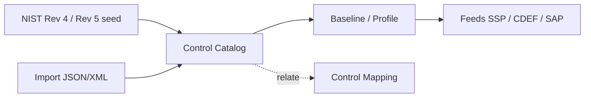

# User Guide: Control Catalogs & Baselines

The controls layer is the foundation everything else builds on. A **control
catalog** is the full set of controls from a source like NIST SP 800-53; a
**baseline** (also called a profile) is a tailored selection of those controls
for a given impact level or system. **Control mappings** relate one catalog's
controls to another's. This guide covers loading catalogs, tailoring baselines,
and building mappings.

**Who this is for:** control authors and compliance engineers. Viewing catalogs,
baselines, and mappings is public on most instances; creating and editing
requires the appropriate role — see [RBAC](RBAC).

---

## Before you start

- **Access:** viewing is typically public; creating/editing catalogs, baselines,
  and mappings requires a role with the matching write permission.
- **Where to find it:** the **Controls** menu → *Control Catalogs*
  (`/control_catalogs`), *Baselines* (`/profile_documents`), *Mappings*
  (`/control_mappings`).

---

## At a glance

---

## Primary use cases

- **Load a control catalog** from NIST seed data or by importing an OSCAL
  catalog file.
- **Tailor a baseline** — pick the subset of controls that applies to your
  system's impact level.
- **Map between frameworks** — relate controls in one catalog to another (e.g.
  Rev 4 → Rev 5) with NIST IR 8477 relationship types.

---

## Working with control catalogs

### How to create a catalog from NIST seed data

1. Go to *Controls → Control Catalogs* (`/control_catalogs`).
2. Click **New**.
3. Enter **name**, **version**, **source**, and **description**.
4. In the **template selector**, choose **NIST SP 800-53 Rev 4** or **Rev 5** to
   seed the catalog with that control set (or **blank** to start empty).
5. Save. Open the catalog to see its **control families**, each listing its
   controls.

### How to import a catalog

1. From the catalog list, click **Import** (`/control_catalogs/import`).
2. Upload a catalog file — **JSON or XML** OSCAL catalog format.
3. Submit. The catalog is created with its families and controls populated.

### How to edit families and controls

- Open a catalog and drill into a **family** to see its controls; use **Edit**
  on the family to change its code, name, or description.
- **Edit** an individual control (`/catalog_controls/:id/edit`) to change its ID,
  title, description, or statement.
- To add many controls at once, use **Batch Create** on a family
  (`.../catalog_controls/batch_new`) — fill multiple rows and submit together.

### How to export a catalog

On the catalog detail page use the **OSCAL** export buttons. Two variants are
offered: **validated** (schema-checked) and **unvalidated**.

---

## Working with baselines (profiles)

A baseline selects and prioritizes controls from a catalog.

### How to create a baseline from a catalog

1. Go to *Controls → Baselines* (`/profile_documents`).
2. Click **Create from Catalog** (`/profile_documents/select_catalog`).
3. **Step 1:** choose the source catalog.
4. **Step 2:** use the checklist to select which controls to include.
5. Submit to create the baseline. Its detail page shows the selected controls
   with a **priority heatmap** grouped by NIST family.

You can also click **Create New** for an empty baseline, or **Copy** an existing
baseline's detail page to duplicate it as a starting point.

### How to set control priorities

Open a baseline, then **Edit** an individual profile control
(`/profile_documents/:id/profile_controls/:id/edit`) to set its **priority**.
The priority heatmap on the detail page reflects your selections.

### How to export a baseline

On the baseline detail page: **JSON** for the raw document, or **OSCAL**
(validated / unvalidated) for the profile.

---

## Working with control mappings

### How to build a mapping between two catalogs

1. Go to *Controls → Mappings* (`/control_mappings`) and click **Create New**.
2. Give the mapping a **name** and set its **source** and **target** catalogs.
3. Open the mapping detail page. In the **Add Entry** row, enter the **source
   control ID**, **target control ID**, their types, and a **relationship**,
   then click **Add Entry**. Relationship types (per NIST IR 8477) are:
   **equal**, **equivalent**, **subset**, **superset**, **intersects**.
4. Repeat for each pair. Entries appear in the **Mapping Entries** table.

### How to publish or deprecate a mapping

Use the action buttons on the mapping detail page: **Publish** moves a draft to
complete; **Deprecate** retires a completed mapping. **Export OSCAL** emits the
mapping in OSCAL form.

---

## Tips & best practices

- Seed from **NIST Rev 5** unless you have a specific reason to stay on Rev 4 —
  it's the current FedRAMP baseline.
- Build the **baseline once, reuse it** across every SSP for that impact level
  rather than re-selecting controls each time.
- Keep a mapping in **draft** until every entry is reviewed, then **Publish** —
  downstream consumers should rely on published mappings.
- Prefer **import** for authoritative OSCAL catalogs and **seed** for the
  standard NIST sets; hand-editing is best reserved for small corrections.

---

## Troubleshooting

| Symptom | Likely cause | What to do |
|---|---|---|
| Import rejected | File isn't valid OSCAL JSON/XML | Validate the catalog file before importing |
| OSCAL export fails validation | Missing required metadata on a control | Fix the flagged fields, then use the validated export |
| Can't add a mapping entry / edit a control | View-only access | You need the write permission ([RBAC](RBAC)) |
| Baseline shows no controls | None selected in the checklist step | Re-run **Create from Catalog** and select controls |

---

## Related guides

- [User Guides index](User-Guides)
- [Converters & Imports](User-Guide-Converters-and-Imports)
- [System Security Plans (SSP)](User-Guide-System-Security-Plans) — consumes
  baselines.
- [Framework Mapping](Framework-Mapping) — how external frameworks relate to NIST.
- [Screens & UI](Screens) — exhaustive element-level reference.
