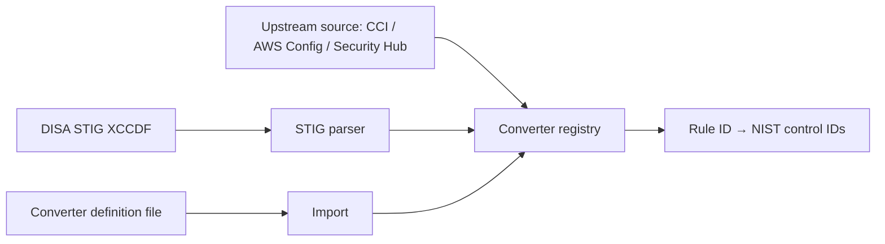

# User Guide: Converters & Imports

**Converters** are registries that map a source rule identifier (a DISA CCI, an
AWS Config rule, an AWS Security Hub control, a STIG rule) to the NIST 800-53
control IDs it satisfies. They let SPARC translate scanner and benchmark output
into control coverage. This guide covers browsing converters, refreshing them
from upstream, importing definitions, and parsing a STIG.

**Who this is for:** compliance engineers wiring scanner/benchmark data into
SPARC. Viewing converters is public on most instances; mutations require the
`converters.write` permission — see [RBAC](RBAC).

---

## Before you start

- **Access:** viewing is typically public; creating, editing, refreshing, and
  importing require `converters.write`.
- **Where to find it:** *Controls → Converters* (`/converters`).

---

## At a glance

---

## Primary use cases

- **Translate scanner findings to controls** — use a converter so an AWS Config
  or Security Hub result counts toward the right NIST controls.
- **Keep mappings current** — refresh a converter from its upstream source.
- **Extract mappings from a STIG** — parse a DISA STIG XCCDF into rule → control
  mappings.

---

## How to browse converters

1. Go to *Controls → Converters* (`/converters`).
2. The list shows each registry (e.g. **DISA CCI**, **AWS Config**, **AWS
   Security Hub**) with its source, entry count, and last-refresh timestamp.
3. Open one to see its **mapping entries** — each row is a source rule ID mapped
   to one or more NIST control IDs.

## How to refresh a converter from upstream

On a converter's detail page, use the refresh button that matches its source to
pull the latest published mappings:

- **Refresh CCI** — reloads DISA CCI → NIST mappings.
- **Refresh AWS Config** — reloads AWS Config rule → NIST mappings.
- **Refresh AWS Security Hub** — reloads Security Hub control → NIST mappings.

After a refresh, check the updated entry count and last-refresh timestamp.

## How to add or remove entries by hand

On the converter detail page, use the inline entry rows to **add** a single
mapping (source rule ID → NIST control IDs) or **remove** an existing one. Use
this for corrections; prefer refresh/import for bulk changes.

## How to create or import a converter

- **New** (`/converters/new`) — enter **name**, **source**, and **description**
  to register an empty converter.
- **Import** (`/converters/import`) — upload a converter definition file to
  populate entries in bulk.

## How to parse a STIG

1. From the converter list, open the **STIG parser**
   (`/converters/stig_parser`).
2. Upload a **DISA STIG XCCDF** file.
3. Submit. The parser extracts the STIG's rule → control mappings, which you can
   review as converter entries.

---

## Tips & best practices

- **Refresh before a scan cycle** so scanner output maps against current control
  associations.
- Use **import/refresh for bulk** changes and reserve hand-edited entries for
  one-off corrections — manual entries are easy to lose track of.
- Converters pair naturally with **Component Definitions**: a parsed/refreshed
  converter can drive a CDEF bulk-apply (see
  [Component Definitions](User-Guide-Component-Definitions)).

---

## Troubleshooting

| Symptom | Likely cause | What to do |
|---|---|---|
| Refresh button does nothing | You lack `converters.write` | Request the permission ([RBAC](RBAC)) |
| STIG parse yields no entries | File isn't a valid XCCDF STIG | Confirm you uploaded the XCCDF (not a checklist/CKL) |
| Import rejected | Definition file format not recognized | Match the expected converter definition format |
| Entry count unchanged after refresh | Upstream had no changes | Expected — check the last-refresh timestamp updated |

---

## Related guides

- [User Guides index](User-Guides)
- [Control Catalogs & Baselines](User-Guide-Control-Catalogs-and-Baselines)
- [Component Definitions (CDEF)](User-Guide-Component-Definitions) — bulk-apply
  a converter.
- [Framework Mapping](Framework-Mapping)
- [Screens & UI](Screens) — exhaustive element-level reference.
