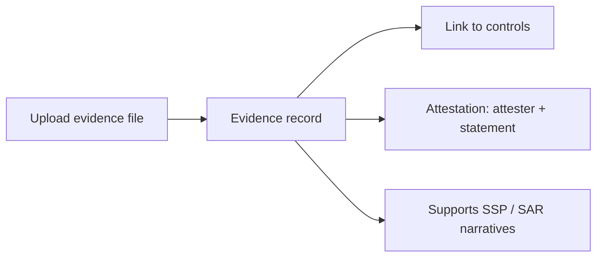

# User Guide: Evidence & Attestations

**Evidence** is the supporting material — screenshots, config exports, scan
output, policy documents — that backs up a control's implementation or
assessment. An **attestation** is a signed statement by a named person vouching
for that evidence. This guide covers uploading and organizing evidence and
attaching attestations to it.

**Who this is for:** control authors, assessors, and anyone gathering proof for
an authorization. Working with evidence requires authentication and a role with
evidence permissions — see [RBAC](RBAC).

---

## Before you start

- **Access:** signed in, with a role that permits managing evidence.
- **Prerequisites:** none, though evidence is most useful when linked to the
  controls it supports.
- **Where to find it:** *Assessment → Evidence* (`/evidences`).

---

## At a glance

---

## Primary use cases

- **Upload and organize evidence** for controls, filterable by type, status,
  boundary, and control.
- **Attest to evidence** — capture who vouches for it, when, and in what role.
- **Support assessments** — link evidence to the controls it substantiates.

---

## How to upload evidence

1. Go to *Assessment → Evidence* (`/evidences`).
2. Click **Upload**.
3. Provide the file and its metadata (type, status, associated authorization
   boundary and control).
4. Save. The evidence appears in the list, which you can filter by **type**,
   **status**, **authorization boundary**, and **associated control**, or search.

## How to review an evidence item

Open an evidence record (`/evidences/:id`) to see a **file preview**, the
**linked controls**, and its **attestation list**. From here you can **Edit** the
metadata or **Delete** the record.

## How to add an attestation

1. Open the evidence record.
2. Start a new attestation (`/evidences/:evidence_id/attestations/new`).
3. Fill in the **attester name**, **date**, **role**, and **attestation
   statement**.
4. Save. The attestation is listed on the evidence record, scoped to that
   evidence.

---

## Tips & best practices

- Set the **associated control** when you upload, so evidence is discoverable
  from the control it supports rather than only by filename.
- Use **status** consistently (e.g. draft vs. final) so filters give a true
  picture of what's ready for assessment.
- Add an **attestation** whenever a human sign-off is expected — an attester,
  date, and statement turn a raw file into defensible proof.
- Keep evidence **scoped to the right boundary** so access follows the same rules
  as the rest of that system's documents.

---

## Troubleshooting

| Symptom | Likely cause | What to do |
|---|---|---|
| Evidence not showing under a control | No associated control set | Edit the evidence and set the associated control |
| Can't add an attestation | Not on an evidence record, or view-only role | Open the evidence first; confirm your role ([RBAC](RBAC)) |
| File won't preview | Unsupported preview type | The file is still stored and downloadable; preview is best-effort |
| Filters hide items you expect | An active filter is applied | Reset the type/status/boundary/control filters |

---

## Related guides

- [User Guides index](User-Guides)
- [Assessment Results (SAR)](User-Guide-Assessment-Results) — evidence supports
  assessment findings.
- [Trust Store](User-Guide-Trust-Store) — reusable authoritative back-matter
  sources.
- [Screens & UI](Screens) — exhaustive element-level reference.
