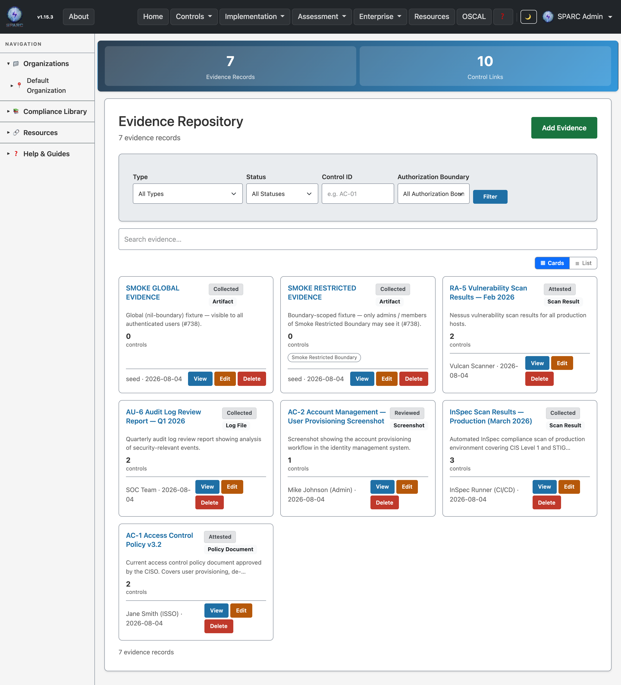
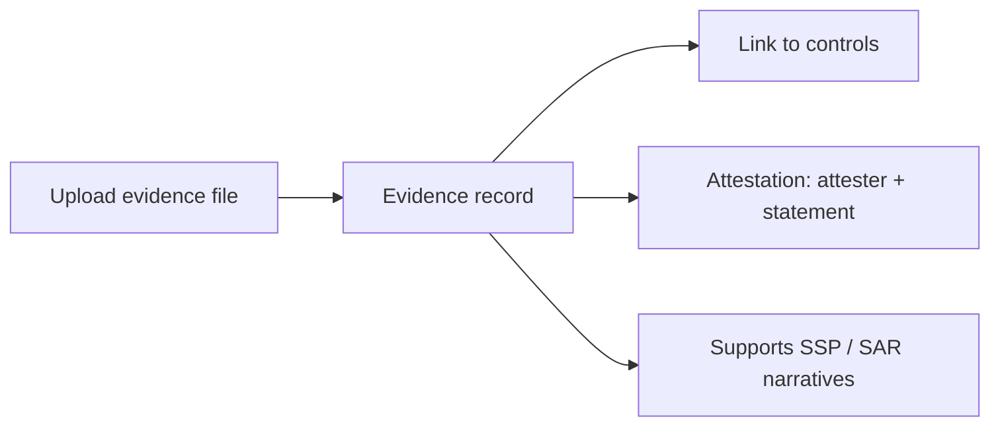

# User Guide: Evidence & Attestations

**Evidence** is the supporting material — screenshots, config exports, scan
output, policy documents — that backs up a control's implementation or
assessment. An **attestation** is a signed statement by a named person vouching
for that evidence. This guide covers uploading and organizing evidence and
attaching attestations to it.

**Who this is for:** control authors, assessors, and anyone gathering proof for
an authorization. Working with evidence requires authentication and a role with
evidence permissions — see [RBAC](RBAC).

---

## Before you start

- **Access:** signed in, with a role that permits managing evidence.
- **Prerequisites:** none, though evidence is most useful when linked to the
  controls it supports.
- **Where to find it:** *Assessment → Evidence* (`/evidences`).

---

*The Evidence index — evidence artifacts and attestations scoped to boundaries and controls.*

## At a glance

```mermaid
flowchart LR
    UP[Upload evidence file] --> EV[Evidence record]
    EV --> LINK[Link to controls]
    EV --> ATT[Attestation: attester + statement]
    EV --> SSP[Supports SSP / SAR narratives]
```

---

## Primary use cases

- **Upload and organize evidence** for controls, filterable by type, status,
  boundary, and control.
- **Attest to evidence** — capture who vouches for it, when, and in what role.
- **Support assessments** — link evidence to the controls it substantiates.

---

## How to upload evidence

1. Go to *Assessment → Evidence* (`/evidences`).
2. Click **Upload**.
3. Provide the file and its metadata (type, status, associated authorization
   boundary and control).
4. Save. The evidence appears in the list, which you can filter by **type**,
   **status**, **authorization boundary**, and **associated control**, or search.

### Knowing whether the upload worked

Evidence is only useful if it is really there, so SPARC always tells you which
of the two happened:

- **It worked.** A green confirmation names the **file**, not just the record —
  filename, size, and the first part of its **SHA-256 checksum**. If you do not
  see the filename in that message, the file did not store, whatever else the
  screen says.
- **It did not work.** A red message explains why and **stays on screen until
  you dismiss it**. The form keeps everything you typed, so you can correct the
  problem and submit again without re-entering the metadata.

A file is required when you create evidence. If you submit without choosing one,
the dropzone says so and the form does not submit. (Editing an existing record
does not require re-uploading — the attached file is kept unless you replace it.)

Some failures happen before the request reaches SPARC at all — a network
security policy rejecting the upload, a file too large for an intermediate
proxy, or a dropped connection. Those are reported too, with the HTTP status, so
a blocked upload never looks like a successful one.

### How Collection Date and Collected By are set

These two fields are **recorded by SPARC**, not entered by you. When you save,
SPARC stamps the collection time in **UTC** and records the signed-in user as
the collector. They are shown on the form read-only.

This is deliberate: collection provenance that the submitter can type is
provenance an assessor cannot rely on (NIST **AU-10**, non-repudiation). It also
means a collection date can never be set in the future, which would be
impossible on its face. If you need to record when an artifact was *originally*
produced — as opposed to when it was collected into SPARC — put that in the
**Description** or **Source** field.

## How to review an evidence item

Open an evidence record (`/evidences/:id`) to see a **file preview**, the
**linked controls**, and its **attestation list**. From here you can **Edit** the
metadata or **Delete** the record.

## How to add an attestation

1. Open the evidence record.
2. Start a new attestation (`/evidences/:evidence_id/attestations/new`).
3. Fill in the **attester name**, **date**, **role**, and **attestation
   statement**.
4. Save. The attestation is listed on the evidence record, scoped to that
   evidence.

---

## Tips & best practices

- Set the **associated control** when you upload, so evidence is discoverable
  from the control it supports rather than only by filename.
- Use **status** consistently (e.g. draft vs. final) so filters give a true
  picture of what's ready for assessment.
- Add an **attestation** whenever a human sign-off is expected — an attester,
  date, and statement turn a raw file into defensible proof.
- Keep evidence **scoped to the right boundary** so access follows the same rules
  as the rest of that system's documents.

---

## Troubleshooting

| Symptom | Likely cause | What to do |
|---|---|---|
| Evidence not showing under a control | No associated control set | Edit the evidence and set the associated control |
| Can't add an attestation | Not on an evidence record, or view-only role | Open the evidence first; confirm your role ([RBAC](RBAC)) |
| File won't preview | Unsupported preview type | The file is still stored and downloadable; preview is best-effort |
| Filters hide items you expect | An active filter is applied | Reset the type/status/boundary/control filters |
| **Upload** does nothing when clicked | No file chosen — a file is required to create evidence | The dropzone shows the reason; choose a file and submit again |
| Red message naming an HTTP status (403, 413) | The request was rejected before it reached SPARC, usually by a network security policy or a proxy size limit | Nothing was saved. Retry; if it persists, send the status code to your administrator |
| Saved, but the message says the file did **not** attach | The record stored without its file | Treat the record as incomplete — use **Edit** to upload the file again before relying on it |
| Collection Date can't be edited | It is recorded automatically on save (AU-10) | Expected. Record an original production date in **Description** or **Source** |

---

## Finding what you need

The evidence list opens as **cards**, with a **☰ List** toggle if you prefer a
table. Your choice is remembered for this screen.

Evidence filters by **type**, **status**, **control ID** and **authorization
boundary**. Search covers the title, description and the original filename, which
is often what you actually remember about an artifact.

See [Browsing a list of documents](User-Guide-Getting-Oriented#browsing-a-list-of-documents) for how cards, lists, search and filters work — they behave the same on every list screen.

---

## Related guides

- [User Guides index](User-Guides)
- [Security Assessment Results (SAR)](User-Guide-Assessment-Results) — evidence supports
  assessment findings.
- [Compliance Library](User-Guide-Compliance-Library) — reusable authoritative back-matter
  sources.
- [Screens & UI](Screens) — exhaustive element-level reference.
