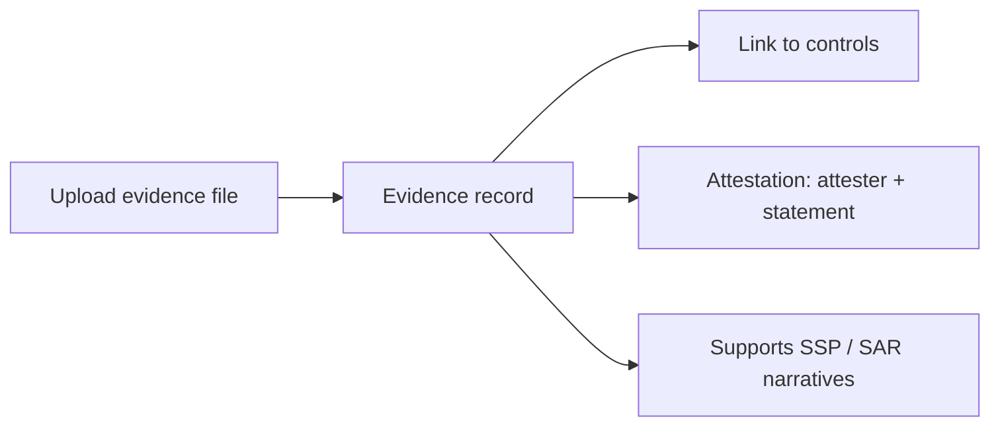

# User Guide: Evidence & Attestations

**Evidence** is the supporting material — screenshots, config exports, scan
output, policy documents — that backs up a control's implementation or
assessment. An **attestation** is a signed statement by a named person vouching
for that evidence. This guide covers uploading and organizing evidence and
attaching attestations to it.

**Who this is for:** control authors, assessors, and anyone gathering proof for
an authorization. Working with evidence requires authentication and a role with
evidence permissions — see [RBAC](RBAC).

---

## Before you start

- **Access:** signed in, with a role that permits managing evidence.
- **Prerequisites:** none, though evidence is most useful when linked to the
  controls it supports.
- **Where to find it:** *Assessment → Evidence* (`/evidences`).

---

*The Evidence index — evidence artifacts and attestations scoped to boundaries and controls.*

## At a glance

```mermaid
flowchart LR
    UP[Upload evidence file] --> EV[Evidence record]
    EV --> LINK[Link to controls]
    EV --> ATT[Attestation: attester + statement]
    EV --> SSP[Supports SSP / SAR narratives]
```

---

## Primary use cases

- **Upload and organize evidence** for controls, filterable by type, status,
  boundary, and control.
- **Record an attestation** — an assertion, in someone's own words, that a
  control is satisfied. This *is* evidence: no file is needed.
- **Support assessments** — link evidence to the controls it substantiates.

---

## How to upload evidence

1. Go to *Assessment → Evidence* (`/evidences`).
2. Click **Upload**.
3. Provide the file and its metadata (type, status, associated authorization
   boundary and control).
4. Save. The evidence appears in the list, which you can filter by **type**,
   **status**, **authorization boundary**, and **associated control**, or search.

**Every evidence record must support at least one control.** Evidence that
supports nothing cannot be assessed and appears under no control, so the form
will not save without one. If you are editing an older record that has no
control linked, you will be asked to add one before the save goes through — that
is deliberate, so the backlog gets worked rather than growing.

**Artefact types must carry their file.** A Screenshot with no screenshot is an
empty claim, so the form refuses it and says which type needs what. The one
exception is an Attestation, below, where the statement is the evidence.

### Recording an attestation instead of uploading a file

Not every control is satisfied by an artefact. A System Owner performing a
periodic access review satisfies the control by *asserting* it — "I have
reviewed the access list and confirm its validity" — and there may be no file to
attach at all.

1. Click **Upload**, and set **Evidence Type** to **Attestation**.
2. The form asks for the assertion instead of insisting on a file: an
   **attester**, the **role** they are attesting under, and the **statement**
   itself.
3. Link at least one control, as with any evidence.
4. Save. You may still attach a supporting file, but nothing requires one.

The attester is chosen from a list of accounts, not typed in, and SPARC checks
that the person actually holds the role they are attesting under **on that
system**. Being able to upload evidence is not the same as having the authority
to sign for it, and for a record whose whole substance is who asserted it, that
difference is the point. If someone you expect is missing from the list, they
hold no attesting role on that boundary — add them to the boundary roster with
one, or grant `evidence.attest` to a role in *Admin → Roles*.

Which roles may attest is **your instance's decision**, not a fixed list. Out of
the box it is the accountable roles — Authorizing Official, Agency AO, System
Owner / ISO, ISSM, ISSO, CISO and Common Control Provider. Assessors are
deliberately excluded: an assessor should not vouch for the evidence they will
later assess. Policy Manager may attest to instance-wide evidence, which is
provider material inherited from a leveraged system and belongs to no single
boundary.

The name recorded on an attestation is a **snapshot** taken when it is signed. If
that person is later renamed or changes role, the attestation keeps saying what
it said at the time — history is not rewritten.

### Knowing whether the upload worked

Evidence is only useful if it is really there, so SPARC always tells you which
of the two happened:

- **It worked.** A green confirmation names the **file**, not just the record —
  filename, size, and the first part of its **SHA-256 checksum**. If you do not
  see the filename in that message, the file did not store, whatever else the
  screen says.
- **It did not work.** A red message explains why and **stays on screen until
  you dismiss it**. The form keeps everything you typed, so you can correct the
  problem and submit again without re-entering the metadata.

A file is required when you create evidence. If you submit without choosing one,
the dropzone says so and the form does not submit. (Editing an existing record
does not require re-uploading — the attached file is kept unless you replace it.)

Some failures happen before the request reaches SPARC at all — a network
security policy rejecting the upload, a file too large for an intermediate
proxy, or a dropped connection. Those are reported too, with the HTTP status, so
a blocked upload never looks like a successful one.

### Linking evidence to controls

The **Controls** field is a search over the controls in your loaded catalogs,
rather than a box you type a bare identifier into. Type an identifier
(`AC-2`, `AC-02` and `ac-2` all find the same control) or part of a title
(`account management`), then pick from the results. Each pick becomes a
removable chip.

This matters because a control identifier can be written three ways, and the
form SPARC shows you on screen is not the form catalogs store internally. Typing
one by hand was easy to get subtly wrong. Picking from the list gives you the
identifier the catalog actually uses.

Two things worth knowing:

- **Enhancements are separate controls.** `AC-2(1)` is not the same link as
  `AC-2`. Pick the one you actually mean; both are selectable.
- **If the system has a baseline** (a profile attached to its authorization
  boundary), the search offers that baseline's controls and says so. Otherwise
  it searches every loaded catalog.

Links created before this search existed may show as **unrecognised** — they
carry an identifier that does not match a control in any loaded catalog. They
are shown rather than hidden so you can re-pick the right control.

### How Collection Date and Collected By are set

These two fields are **recorded by SPARC**, not entered by you. When you save,
SPARC stamps the collection time in **UTC** and records the signed-in user as
the collector. They are shown on the form read-only.

The collector is recorded two ways: the **name** as it read at the moment of
collection, which is what you see and what an assessor reads, and a link to the
**account**, which is what the **Added by** filter uses. The name is never
rewritten afterwards — if someone is later renamed, evidence they collected
still shows the name that was true when they collected it, and still resolves to
their account. Evidence fetched automatically from an authoritative URL, and
evidence submitted through the API with a service-account token, records a
collector the same way.

This is deliberate: collection provenance that the submitter can type is
provenance an assessor cannot rely on (NIST **AU-10**, non-repudiation). It also
means a collection date can never be set in the future, which would be
impossible on its face. If you need to record when an artifact was *originally*
produced — as opposed to when it was collected into SPARC — put that in the
**Description** or **Source** field.

## How to review an evidence item

Open an evidence record (`/evidences/:id`) to see a **file preview**, the
**linked controls**, and its **attestation list**. From here you can **Edit** the
metadata or **Delete** the record.

## How to re-attest existing evidence

Attestations are also how periodic review is recorded. Originating one happens on
the evidence form itself (above) — an attestation is evidence, so it is created
with the record rather than bolted on afterwards. This screen is for the *next*
review of a record that already exists.

1. Open the evidence record.
2. Start a new attestation (`/evidences/:evidence_id/attestations/new`).
3. Choose the **attester** and the **role** they attest under, then give the
   **date** and the **statement**.
4. Save. The earlier attestations are kept — the history of who asserted what,
   and when, is never overwritten, and the **review frequency** drives the
   next-review-due and overdue indicators.

---

## Tips & best practices

- Set the **associated control** when you upload, so evidence is discoverable
  from the control it supports rather than only by filename.
- Use **status** consistently (e.g. draft vs. final) so filters give a true
  picture of what's ready for assessment.
- Add an **attestation** whenever a human sign-off is expected — an attester,
  date, and statement turn a raw file into defensible proof.
- Where there is no artefact at all, record an **Attestation** rather than
  inventing a file to attach. The statement is the evidence, and it is checked
  against the roster in a way a scanned signature is not.
- Keep evidence **scoped to the right boundary** so access follows the same rules
  as the rest of that system's documents.

---

## Troubleshooting

| Symptom | Likely cause | What to do |
|---|---|---|
| Evidence not showing under a control | No associated control set | Edit the evidence and set the associated control |
| Can't add an attestation | Not on an evidence record, or view-only role | Open the evidence first; confirm your role ([RBAC](RBAC)) |
| File won't preview | Unsupported preview type | The file is still stored and downloadable; preview is best-effort |
| Filters hide items you expect | An active filter is applied | Reset the type/status/boundary/control filters |
| **Upload** does nothing when clicked | No file chosen, for a type that needs one | The dropzone shows the reason; choose a file, or switch the type to **Attestation** if the statement *is* the evidence |
| "Link at least one control" | The evidence supports no control | Pick a control in the Controls box. Evidence that supports nothing cannot be assessed |
| "A file is required for *&lt;type&gt;* evidence" | An artefact type with no artefact | Attach the file, or change the type to **Attestation** |
| The person you want isn't in the **Attester** list | They hold no attesting role on that system | Add them to the boundary roster with an attesting role, or grant `evidence.attest` to a role in *Admin → Roles* |
| "…does not hold *&lt;role&gt;* on this boundary" | The attester holds that role somewhere else, not here | Attest under a role they hold here — the message lists them — or correct the roster |
| An older attestation can't be re-saved | It predates the roster check and names nobody verifiable | Choose a real account as the attester. The original record stays readable and its signature is untouched |
| Red message naming an HTTP status (403, 413) | The request was rejected before it reached SPARC, usually by a network security policy or a proxy size limit | Nothing was saved. Retry; if it persists, send the status code to your administrator |
| Saved, but the message says the file did **not** attach | The record stored without its file | Treat the record as incomplete — use **Edit** to upload the file again before relying on it |
| Collection Date can't be edited | It is recorded automatically on save (AU-10) | Expected. Record an original production date in **Description** or **Source** |
| A control you expect isn't in the Controls search | Its catalog isn't loaded, or the boundary's baseline excludes it | Load the catalog, or check the system's baseline |
| A linked control shows as **unrecognised** | It was linked before the search existed and its identifier matches no loaded catalog | Remove the chip and pick the control from the search |

---

## Finding what you need

The evidence list opens as **cards**, with a **☰ List** toggle if you prefer a
table. Your choice is remembered for this screen.

**When you can see more than one system, the list groups itself** — Organization,
then Authorization Boundary, so you read your evidence in the same shape as the
rest of the product. Each group shows how much it holds, and collapsing one is
remembered for next time. If everything you can see belongs to a single system
there is nothing to tell apart, so the grouping does not appear at all and the
screen is exactly as it was.

Grouping changes only how the list is drawn. **It never changes what you can
see** — the same records, arranged. Boundary is also a column in the table view
now, so a row's system is readable without opening it.

Evidence with **no boundary** gets its own group, labelled **Instance-wide**, and
that label is a statement about access: such evidence is visible to every
signed-in user. It is usually provider material inherited from a leveraged
system, which belongs to no single boundary. The same grouping appears on System
Security Plans, Assessment Plans, Assessment Results and POA&Ms — but there a
blank boundary means something different and says so, because those documents
describe one system by definition and a blank one is an unrepaired record rather
than a sharing decision.

Evidence filters by **type**, **status**, **source**, **control ID**,
**authorization boundary**, **added by**, and a **collected between** date range.
Search covers the title, description and the original filename, which is often
what you actually remember about an artifact.

**Added by** lists the accounts that have collected evidence — including any
service account that submits through the API, so you can see everything one
automated pipeline provided. Evidence collected before this filter existed is
matched to its account where the recorded name identifies exactly one; where the
name is shared by two accounts, or matches none, the item is left unattributed
and does not appear under any account. It is still findable by search, type,
status and date.

See [Browsing a list of documents](User-Guide-Getting-Oriented#browsing-a-list-of-documents) for how cards, lists, search and filters work — they behave the same on every list screen.

---

## Related guides

- [User Guides index](User-Guides)
- [Security Assessment Results (SAR)](User-Guide-Assessment-Results) — evidence supports
  assessment findings.
- [Compliance Library](User-Guide-Compliance-Library) — reusable authoritative back-matter
  sources.
- [Screens & UI](Screens) — exhaustive element-level reference.
