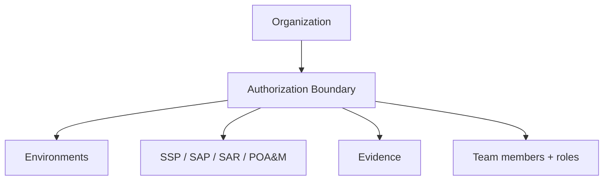

# User Guide: Getting Oriented

A tour of the SPARC interface: how to sign in, read the dashboard, move around
the navigation, and understand how your work is organized. Read this first if
you are new to the application.

**Who this is for:** every user. No special role is required to sign in and view
the dashboard; what you can create or edit depends on your assigned roles — see
[RBAC](RBAC).

---

## Before you start

- **Access:** an account on your SPARC instance. Depending on how the instance
  is configured you may sign in with a local email/password, an SSO provider
  (Okta/OIDC, GitHub, GitLab), or LDAP.
- **Where to find it:** the application URL for your instance. If you are running
  SPARC yourself, follow [Getting Started](Getting-Started) first.

---

## Signing in

1. Open your SPARC instance. If you are not signed in you land on the **Login**
   page (`/login`).
2. Pick the tab for your authentication method — **Local Login**, **OIDC/SSO**,
   or **LDAP** — or use a **GitHub**/**GitLab** button if shown. The tabs that
   appear depend on what the instance has enabled.
3. Enter your credentials and sign in. First-time local accounts created by an
   admin may be prompted to change the password on first login.

The login page also shows an **OSCAL overview** panel explaining the document
model — the same content is always available at *About → OSCAL Overview*
(`/oscal-overview`).

---

## The dashboard

After signing in you land on the **Home** dashboard (`/`), which has three
parts:

1. **Statistics tiles** — a header card with live counts for Catalogs,
   Families, Controls, Authorization Boundaries, Baselines, CDEFs, SSPs, SAPs,
   SARs, POA&Ms, and Evidence. A quick health check of everything in the
   instance.
2. **Aggregate compliance heatmap** — a grid showing implementation status
   across all SSPs, grouped by NIST control family (`AC`, `AU`, `SC`, …). Click
   a family cell to drill down to the controls in that family
   (`/dashboard/family/:family`).
3. **Section navigation grid** — a card per document type with **View** and
   **New** buttons, so you can jump straight into any area or start a new
   document.

---

## Finding your way around

SPARC has two navigation surfaces.

### Top navigation bar

Colour-coded dropdowns group the app by OSCAL layer:

| Menu | Contains | When it shows |
|---|---|---|
| **Home** | The dashboard | Always |
| **Controls** (blue) | Control Catalogs, Baselines, Mappings, Converters | Always |
| **Implementation** (green) | System Security Plans, Component Definitions | Signed in |
| **Assessment** (orange) | Assessment Plans, Assessment Results, Evidence, POA&Ms | Signed in |
| **Authorization Boundaries** | Your boundaries | Signed in |
| **Trust Store** | Authoritative Sources, Review/Promotion Queues, Federation Peers | Signed in, per role |

On the right you'll find a **theme toggle** (light/dark, remembered per browser)
and your **user menu** (avatar/initials) with **Profile**, **Change Password**,
the **Administration** submenu (Instance Admins only), and **Sign Out**.

### Left sidebar

When signed in, the sidebar mirrors how your data is organized: your
**Organizations**, and under each the **Authorization Boundaries** you belong
to, with leaf links straight to that boundary's Baselines, CDEFs, SSP, SAP, SAR,
and POA&Ms. Below that is the **Compliance Library** (Authoritative Sources,
queues, Federation Peers) and external **Resources** links.

---

## How your work is organized

Everything in SPARC lives inside a hierarchy. Understanding it explains why you
see some documents and not others.

- **Organization** — the top-level tenant. Larger instances have several.
- **Authorization Boundary** — the system undergoing authorization (roughly one
  ATO). Documents, environments, and team membership all attach here. This is
  the unit that data access is scoped to (see [Data Isolation](Data-Isolation)).
- **Documents & evidence** — the SSP/SAP/SAR/POA&M and evidence for that
  boundary.

Your **roles** determine what you can do within a boundary and across the
instance. A quick mental model:

- **Instance Admin** — manages users, roles, and instance-wide settings.
- **Boundary roles** — scoped to a single boundary (e.g. author, reviewer,
  approver).

See [RBAC](RBAC) for the full role and permission matrix.

---

## Tips & best practices

- Use the **left sidebar** to stay inside one boundary while you work through its
  documents; use the **top bar** to jump between layers (implementation vs.
  assessment).
- The **dashboard heatmap** is the fastest way to spot weak control families
  across all your SSPs — start remediation there.
- Set the **theme** once; it is remembered per browser via local storage.
- Can't see a menu or document? It's almost always a **role/scope** issue, not a
  bug — check your roles on the relevant boundary in [RBAC](RBAC).

---

## Troubleshooting

| Symptom | Likely cause | What to do |
|---|---|---|
| No login tabs / "no auth configured" message | Instance has no auth method enabled | An admin must enable one (see `ENVIRONMENT_VARIABLES.md` / [Configuration](Configuration)) |
| Implementation/Assessment menus missing | Not signed in | Sign in; those layers require authentication |
| A boundary or document isn't visible | Not a member of that boundary, or lacking the role | Ask an admin to add you / grant the role ([RBAC](RBAC)) |
| Admin menu absent | You are not an Instance Admin | Expected — only Instance Admins see it |

---

## Related guides

- [User Guides index](User-Guides)
- [Authorization Boundaries](User-Guide-Authorization-Boundaries)
- [Administration](User-Guide-Administration)
- [Getting Started](Getting-Started) — install, seed, and first login.
- [Screens & UI](Screens) — exhaustive element-level reference.
