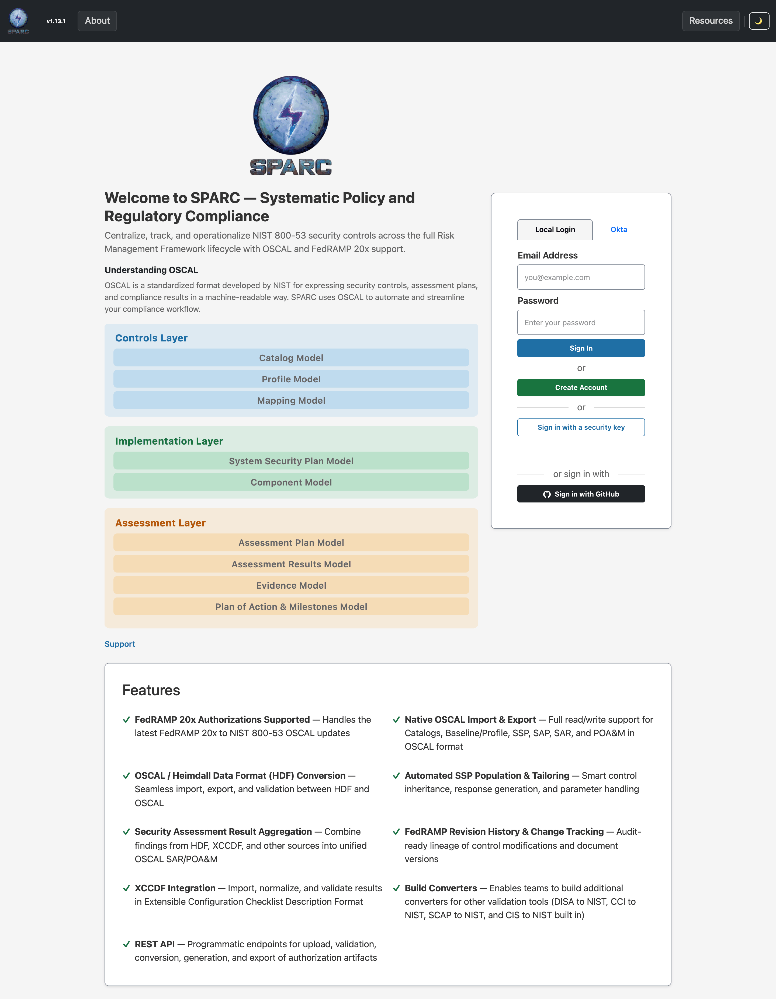
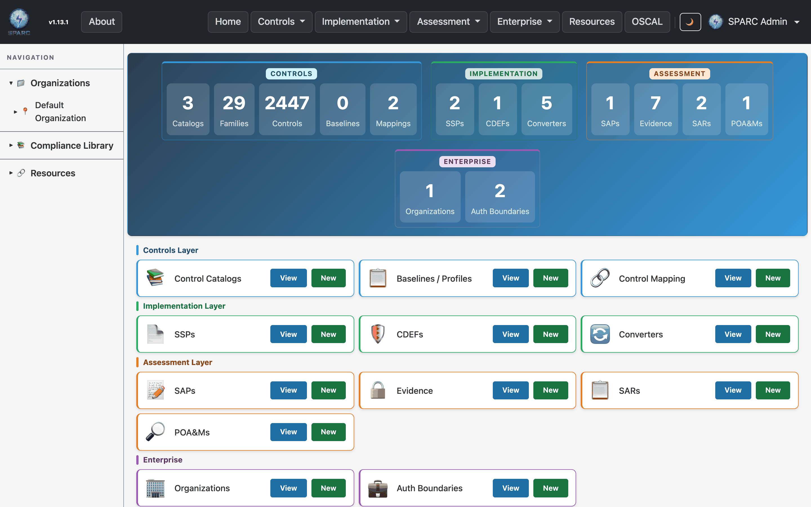
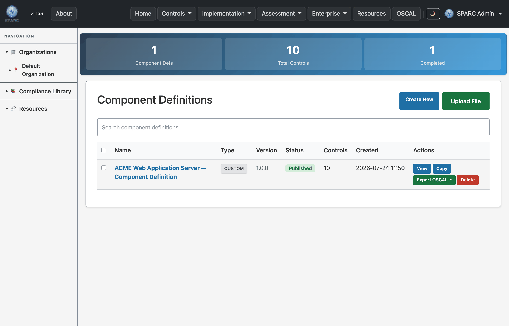
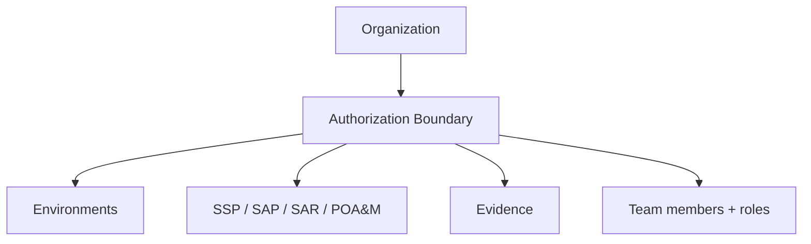

# User Guide: Getting Oriented

A tour of the SPARC interface: how to sign in, read the dashboard, move around
the navigation, and understand how your work is organized. Read this first if
you are new to the application.

**Who this is for:** every user. No special role is required to sign in and view
the dashboard; what you can create or edit depends on your assigned roles — see
[RBAC](RBAC).

---

## Before you start

- **Access:** an account on your SPARC instance. Depending on how the instance
  is configured you may sign in with a local email/password, an SSO provider
  (Okta/OIDC, GitHub, GitLab), or LDAP.
- **Where to find it:** the application URL for your instance. If you are running
  SPARC yourself, follow [Getting Started](Getting-Started) first.

---

## Signing in

*The Login page — the authentication tabs shown depend on what the instance has enabled.*

1. Open your SPARC instance. If you are not signed in you land on the **Login**
   page (`/login`).
2. Pick the tab for your authentication method — **Local Login**, **OIDC/SSO**,
   or **LDAP** — or use a **GitHub**/**GitLab** button if shown. The tabs that
   appear depend on what the instance has enabled.
3. Enter your credentials and sign in. First-time local accounts created by an
   admin may be prompted to change the password on first login.

The login page also shows an **OSCAL overview** panel explaining the document
model — the same content is always available at *About → OSCAL Overview*
(`/oscal-overview`).

---

## The dashboard

*The SPARC dashboard — live counts grouped by layer (Controls, Implementation, Assessment, Enterprise) with quick-action cards.*

After signing in you land on the **Home** dashboard (`/`), which has three
parts:

1. **Statistics tiles** — a header card with live counts for Catalogs,
   Families, Controls, Authorization Boundaries, Baselines, CDEFs, SSPs, SAPs,
   SARs, POA&Ms, and Evidence. A quick health check of everything in the
   instance.
2. **Aggregate compliance heatmap** — a grid showing implementation status
   across all SSPs, grouped by NIST control family (`AC`, `AU`, `SC`, …). Click
   a family cell to drill down to the controls in that family
   (`/dashboard/family/:family`).
3. **Section navigation grid** — a card per document type with **View** and
   **New** buttons, so you can jump straight into any area or start a new
   document.

---

## Finding your way around

SPARC has two navigation surfaces.

### Top navigation bar

Colour-coded dropdowns group the app by OSCAL layer:

| Menu | Contains | When it shows |
|---|---|---|
| **Home** | The dashboard | Always |
| **Controls** (blue) | Control Catalogs, Baselines, Mappings, Converters | Always |
| **Implementation** (green) | System Security Plans, Component Definitions | Signed in |
| **Assessment** (orange) | Assessment Plans, Assessment Results, Evidence, POA&Ms | Signed in |
| **Authorization Boundaries** | Your boundaries | Signed in |
| **Compliance Library** | Authoritative Sources, Review/Promotion Queues, Federation Peers | Signed in, per role |

On the right you'll find a **theme toggle** (light/dark, remembered per browser)
and your **user menu** (avatar/initials) with **Profile**, **Change Password**,
the **Administration** submenu (Instance Admins only), and **Sign Out**.

### Left sidebar

When signed in, the sidebar mirrors how your data is organized: your
**Organizations**, and under each the **Authorization Boundaries** you belong
to, with leaf links straight to that boundary's Baselines, CDEFs, SSP, SAP, SAR,
and POA&Ms. Below that is the **Compliance Library** (Authoritative Sources,
queues, Federation Peers) and external **Resources** links.

---

## Browsing a list of documents

Every list screen in SPARC — SSPs, assessments, POA&Ms, component definitions,
catalogs, evidence, converters, boundaries, the queues — works the same way. Learn
it once and it applies everywhere.

*A collection screen in card view. Search sits at the top, any active filters
appear as removable chips beneath it, and the view toggle is on the right.*

### Cards or a list — your choice, remembered

Each screen opens as **cards** by default. A card shows enough to choose between
items without opening them: what the item is, what state it's in, and how big it
is. Use the **▦ Cards / ☰ List** toggle on the right to switch to a table, which
is easier for scanning a long run of items or comparing a single column.

Your choice is remembered **per screen**, so you can keep SSPs as a list and
component definitions as cards. It sticks for a year, in that browser.

The choice also travels in the address bar. If you send someone a link while
you're in list view, they see the list — the link shows them what you were
looking at, and it does **not** change their own saved preference for that screen.

Every action available in one view is available in the other. Nothing is hidden
by choosing cards.

### Searching

The search box narrows the list as you type. What it matches depends on the
screen and is usually broader than the name: a component definition also matches
on its AWS regions, control IDs, capabilities and automated-check IDs, so
`us-east` or `AC-2` finds things the name alone never would. A converter matches
on the frameworks it translates between; a federation peer on its URL.

Searching never changes your card/list choice, and it keeps any filters you have
already applied.

### Filters

Most list screens offer filters as well as search. What each one offers depends
on the screen:

| Screen | Filters |
|---|---|
| Control catalogs | OSCAL version · revision · source · status |
| Baselines (profiles) | baseline level · OSCAL version · revision · status · source catalog · added by · created between |
| POA&Ms | status · OSCAL version · revision · authorization boundary · added by · created between |
| Evidence | type · status · source · control · authorization boundary · collected between |
| Component definitions | cloud partition · capability · whether they carry automated checks |
| Authoritative sources | scope · rel · media type |

Two things about those lists are worth knowing:

- **The choices come from your data, not a fixed list.** The OSCAL version
  dropdown offers the versions your documents actually use. As you import
  documents written against newer OSCAL releases, they appear on their own.
- **A filter you couldn't use isn't shown.** If every catalog you hold uses the
  same OSCAL version, there is nothing to choose between, so that filter is
  hidden rather than offered as a dropdown with one entry.

Filters and search **narrow together**, they don't replace each other. Searching
`iam` with the GovCloud filter on means "IAM, in GovCloud".

Applying a filter keeps everything else about how you were looking at the list —
your search, your card/list choice and your page size. It does return you to the
first page, because the page you were on describes a different set of results.

Whatever is currently narrowing the list appears as a row of chips above it, with
a count — *"3 filters active"*. Each chip removes just that one filter and leaves
the rest; **Clear all** removes them all but keeps your card/list choice, because
that's how the list is drawn, not which items are in it. The search term appears
as a chip too, so a short list is never unexplained.

When nothing matches, the screen says so — *"No component definitions match the
current filters."* — rather than simply appearing empty.

### Paging

Long collections are paged, with the count shown underneath ("1–24 of 331"). Page
links carry your search, filters and view mode with them, so paging never loses
your place in a filtered set.

---

## How your work is organized

Everything in SPARC lives inside a hierarchy. Understanding it explains why you
see some documents and not others.

```mermaid
flowchart TD
    ORG[Organization] --> AB[Authorization Boundary]
    AB --> ENV[Environments]
    AB --> SSP["SSP / SAP / SAR / POA&M"]
    AB --> EV[Evidence]
    AB --> MEM[Team members + roles]
```

- **Organization** — the top-level tenant. Larger instances have several.
- **Authorization Boundary** — the system undergoing authorization (roughly one
  ATO). Documents, environments, and team membership all attach here. This is
  the unit that data access is scoped to (see [Data Isolation](Data-Isolation)).
- **Documents & evidence** — the SSP/SAP/SAR/POA&M and evidence for that
  boundary.

Your **roles** determine what you can do within a boundary and across the
instance. A quick mental model:

- **Instance Admin** — manages users, roles, and instance-wide settings.
- **Boundary roles** — scoped to a single boundary (e.g. author, reviewer,
  approver).

See [RBAC](RBAC) for the full role and permission matrix.

---

## Tips & best practices

- Use the **left sidebar** to stay inside one boundary while you work through its
  documents; use the **top bar** to jump between layers (implementation vs.
  assessment).
- The **dashboard heatmap** is the fastest way to spot weak control families
  across all your SSPs — start remediation there.
- Set the **theme** once; it is remembered per browser via local storage.
- Can't see a menu or document? It's almost always a **role/scope** issue, not a
  bug — check your roles on the relevant boundary in [RBAC](RBAC).

---

## Troubleshooting

| Symptom | Likely cause | What to do |
|---|---|---|
| No login tabs / "no auth configured" message | Instance has no auth method enabled | An admin must enable one (see `ENVIRONMENT_VARIABLES.md` / [Configuration](Configuration)) |
| Implementation/Assessment menus missing | Not signed in | Sign in; those layers require authentication |
| A boundary or document isn't visible | Not a member of that boundary, or lacking the role | Ask an admin to add you / grant the role ([RBAC](RBAC)) |
| Admin menu absent | You are not an Instance Admin | Expected — only Instance Admins see it |

---

## Related guides

- [User Guides index](User-Guides)
- [Authorization Boundaries](User-Guide-Authorization-Boundaries)
- [Administration](User-Guide-Administration)
- [Getting Started](Getting-Started) — install, seed, and first login.
- [Screens & UI](Screens) — exhaustive element-level reference.
