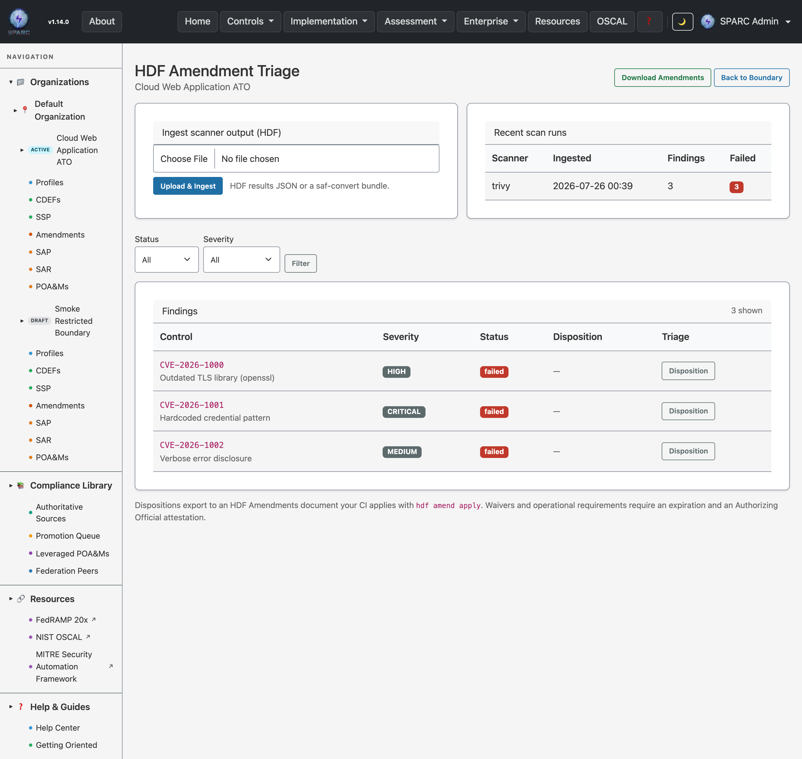

# User Guide: HDF Amendment Triage

Turn raw scanner output into auditable disposition decisions. Upload your
scanners' findings (in HDF — the Heimdall Data Format the SAF CLI produces),
triage each failed control through a guided UI, and export an **HDF Amendments**
document your CI applies with `hdf amend apply` before its security-threshold gate.

**Who this is for:** teams who run security scanners (Trivy, Brakeman, Gitleaks,
Grype, and anything the [SAF CLI](https://saf.mitre.org/) can convert to HDF) and
need a standardized, evidence-linked way to say "this finding is a false positive"
/ "risk accepted" / "tracked as a POA&M" — without hand-editing per-tool ignore
files and losing the audit trail.

**What SPARC is here:** a translation engine and human-in-the-loop UI. Your
scanners, your CI, and your Authorizing Official remain the source of truth. SPARC
records each disposition as a re-derivable translation artefact — nothing is
trapped in SPARC that you can't reconstruct from your own inputs.

---

## Where it lives

Every triage flow is scoped to an **Authorization Boundary** (the system you're
assessing). Reach it three ways:

- The left **sidebar** — under each boundary, **Amendments** sits between **SSP**
  and **SAP**.
- The **Amendments** button on the boundary's page header.
- The **Amendments** button on any POA&M page (jumps to that POA&M's boundary).

Or go straight to `…/authorization_boundaries/<your-boundary>/triage`.

You need the `evidence.read` permission on the boundary to view triage, and
`evidence.write` to ingest scans or set dispositions.



---

## 1. Ingest a scan

1. Produce an HDF results file. Most scanners aren't HDF natively — convert with
   the SAF CLI, e.g. `saf convert trivy2hdf -i trivy.json -o scan.hdf.json`. A
   multi-scan bundle (a JSON array of HDF docs) is accepted too.
2. On the triage page, under **Ingest scanner output (HDF)**, choose the file and
   click **Upload & Ingest**.

SPARC extracts each control result — id, status, severity (from the finding's
`impact` or an explicit severity tag), and the raw HDF slice — and stores it as a
**finding** on the boundary. Re-uploading a fresh scan **updates** the existing
findings (matched by control id) rather than duplicating them, and any
disposition you've already made on that control is preserved.

The **Recent scan runs** panel shows the last few ingests with pass/fail counts.

---

## 2. Triage the findings

The **Findings** table lists every control. Filter by **status** (start with
`failed` — that's your worklist) and **severity**. For each finding, click
**Disposition** to record a decision.

### Override kinds

Pick the override that matches reality. Each links to a supporting record so the
decision carries provenance:

| Kind | Meaning | Links to | Amended status |
|---|---|---|---|
| `falsePositive` | The scanner is wrong / the code path isn't reachable | an **Evidence** record justifying it | Not Applicable |
| `waiver` | Risk formally accepted | an **Attestation** by an *Authorizing Official* (+ expiration) | Not Applicable |
| `poam` | Real, tracked, will be fixed | an existing **POA&M finding** | Failed (tracked) |
| `vendorDependency` | Upstream/vendor issue tracked as a POA&M | an existing **POA&M finding** | Failed (tracked) |
| `inherited` | Provided by an upstream system | the upstream **Authorization Boundary** | Not Applicable |
| `riskAdjustment` | Severity downgraded with rationale | a **Risk Assessment** record | Failed (adjusted) |
| `operationalRequirement` | Can't fix; business need | an **Attestation** by an *Authorizing Official* (+ expiration) | Failed |

To link a supporting record, enter its **type** (e.g. `Evidence`, `PoamFinding`,
`Attestation`, `AuthorizationBoundary`, `RiskAssessment`) and its **id**, add a
**justification**, and — for `waiver` / `operationalRequirement` — an
**expiration** date. Save.

The form updates a hint showing which record type the selected kind requires.

### Rules SPARC enforces

- **Critical findings cannot be waived, downgraded, or marked operational.** A
  CRITICAL must be remediated or tracked as a POA&M. `falsePositive` is still
  allowed on a critical (the scanner can be wrong).
- **Waivers and operational requirements need an Authorizing Official
  attestation and an expiration** — no open-ended risk acceptance.
- One active disposition per finding. Re-dispositioning replaces the prior one.

Clear a disposition any time with **Clear** next to its badge.

---

## 3. Export amendments for your pipeline

Click **Download Amendments** to get an HDF Amendments JSON document containing
one override per current, non-expired disposition. Feed it to your pipeline:

```bash
hdf amend apply --results scan.hdf.json --amendments boundary-amendments.hdf.json -o amended.hdf.json
saf validate threshold -i amended.hdf.json -F threshold.yml
```

`hdf amend apply` sets each control's `effectiveStatus` from your dispositions, so
your threshold gate sees false positives and waivers suppressed and POA&Ms tracked
— exactly as you triaged them.

The export is **deterministic**: the same dispositions always produce the same
document (stable ordering + a content-derived id), so you can safely cache the
artefact in your pipeline. A control that no longer appears in your latest scan
(remediated) automatically drops from the export.

---

## Automating it (API)

Everything above is available over the REST API for CI, scoped per boundary by an
API token:

| Action | Endpoint |
|---|---|
| Ingest a scan | `POST /api/v1/authorization_boundaries/:id/scan_runs` |
| List findings | `GET /api/v1/authorization_boundaries/:id/scanner_findings?status=failed` |
| Set a disposition | `POST /api/v1/scanner_findings/:uuid/disposition` |
| Export amendments | `GET /api/v1/authorization_boundaries/:id/hdf_amendments` |

The export endpoint validates its own output with `hdf amend verify` before
returning, so a schema drift surfaces as an error rather than a bad artefact.

---

## Related

- [Evidence & Attestations](User-Guide-Evidence-and-Attestations) — the records
  that back `falsePositive` and `waiver` dispositions.
- [POA&M](User-Guide-POAM) — the tracker `poam` / `vendorDependency` link to.
- [Authorization Boundaries](User-Guide-Authorization-Boundaries) — the scope for
  all triage.
