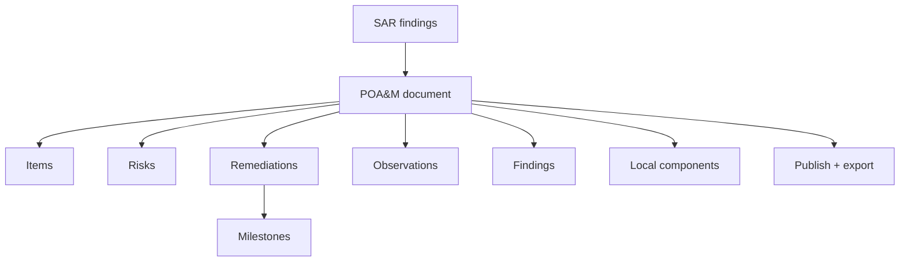

# User Guide: Plan of Action & Milestones (POA&M)

A **POA&M** tracks known weaknesses and how they will be fixed. In OSCAL it is
the `plan-of-action-and-milestones` document, and SPARC models its full set of
child entities — items, risks, remediations (with milestones), observations,
findings, and local components. This guide covers creating a POA&M, managing its
entities, publishing it, and viewing inherited POA&Ms from a leveraged system.

**Who this is for:** ISSOs and remediation owners tracking open findings to
closure. Working with POA&Ms requires authentication and a role with POA&M
permissions — see [RBAC](RBAC).

---

## Before you start

- **Access:** signed in, with a role that permits creating/editing POA&Ms.
- **Prerequisites:** typically a **SAR** whose findings you are tracking — see
  [Assessment Results](User-Guide-Assessment-Results).
- **Where to find it:** *Assessment → POA&Ms* (`/poam_documents`).

---

## At a glance

---

## Primary use cases

- **Track open findings to closure** — one item per weakness, with a scheduled
  completion date and milestones.
- **Model OSCAL risk detail** — risks, remediations, observations, and findings
  as first-class entities.
- **Publish a POA&M** for the authorization package and export it as OSCAL.
- **View inherited POA&Ms** from a leveraged (underlying) system, read-only.

The POA&M is the OSCAL `plan-of-action-and-milestones`; it consumes SAR findings
and is bundled into the ATO package.

---

## How to create a POA&M

1. Go to *Assessment → POA&Ms* (`/poam_documents`).
2. Click **Create New**.
3. Provide the document metadata.
4. Save. The detail page (`/poam_documents/:id`) shows items with a **risk
   distribution heatmap** and a section per child-entity type.

## How to add and manage entities

The POA&M detail page has a section for each entity type, each with a **New**
button that opens a nested form.

- **Item** (`.../poam_items/new`) — the core POA&M line: risk ID, finding source,
  status, impact level, remediation plan, scheduled completion date, milestones.
- **Risk** (`.../poam_risks/new`) — OSCAL `risk`: title, description, statement,
  status, deadline, threat/characterization.
- **Remediation** (`.../poam_remediations/new`) — OSCAL `response`: lifecycle,
  title, description, remarks. **Milestones** are nested under a remediation
  (`.../poam_remediations/:id/poam_milestones/new`) with title, description, and
  target date.
- **Observation** (`.../poam_observations/new`) — title, description, methods,
  collected/expires timestamps.
- **Finding** (`.../poam_findings/new`) — title, description, target/objective
  status, and references to related observations and risks.
- **Local component** (`.../poam_local_components/new`) — a component referenced
  by the POA&M but not defined in a linked SSP (type, title, description,
  status).

Each entity has **New** and **Edit** forms; edit from its row in the relevant
section.

## How to filter and review

On the detail page, use the **risk status** and **impact level** filters and the
**risk heatmap** to focus on the items that matter. Items are paginated.

## How to publish and export

- Use **Publish** (with a **publish-check** first) to mark the POA&M published.
- Export via **OSCAL** (validated / unvalidated), **JSON**, **YAML**, or **XML**
  from the detail page.

## How to view inherited (leveraged) POA&Ms

If your boundary leverages an underlying system, its POA&Ms appear read-only
under **Leveraged POA&M Documents** (`/leveraged_poam_documents`). The index
lists inherited POA&Ms and the detail view shows their items without edit
controls — you don't own them, so you can see but not change them. Record the
leveraged relationship on your boundary first (see
[Authorization Boundaries](User-Guide-Authorization-Boundaries)).

---

## Tips & best practices

- Create **one item per weakness**, each traceable to the SAR finding it came
  from — clean traceability is what reviewers look for.
- Attach **milestones** with real target dates to every remediation; a POA&M item
  without milestones is hard to manage and hard to defend.
- Run the **publish-check** before publishing to catch incomplete items early.
- Use **local components** only for things not already modeled in a linked SSP,
  to avoid duplicate component definitions.

---

## Troubleshooting

| Symptom | Likely cause | What to do |
|---|---|---|
| Publish blocked | Publish-check found incomplete items | Fix the flagged items, then publish |
| A milestone form isn't available | You're not under a remediation | Open the remediation first, then add its milestones |
| Leveraged POA&Ms are empty | No leveraged authorization recorded / populated | Record and **Populate** the leveraged authorization on the boundary |
| OSCAL export fails validation | Missing required item/risk fields | Fill the flagged fields, then use the validated export |
| Can't edit entities | View-only role | Request POA&M write permission ([RBAC](RBAC)) |

---

## Related guides

- [User Guides index](User-Guides)
- [Assessment Results (SAR)](User-Guide-Assessment-Results) — source of findings.
- [Authorization Boundaries](User-Guide-Authorization-Boundaries) — leveraged
  authorizations.
- [Evidence & Attestations](User-Guide-Evidence-and-Attestations)
- [Screens & UI](Screens) — exhaustive element-level reference.
