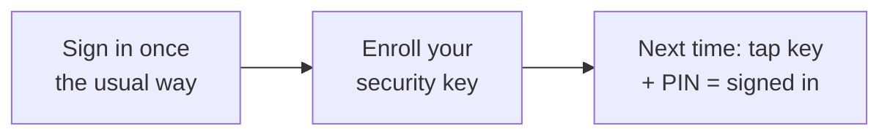

# User Guide: Security Keys & Smart Cards

Sign in to SPARC with a hardware security key (like a YubiKey) or a PIV/CAC
smart card instead of a password. Both use a PIN, so a single tap is strong,
phishing-resistant multi-factor authentication — you prove you *have* the device
and *know* its PIN in one step.

**Who this is for:** any SPARC user whose organization has enabled security-key
or smart-card sign-in. Administrators who reset a locked-out user's keys should
also see [Administration](User-Guide-Administration).

---

## Before you start

- **Access:** any signed-in user can enroll a security key. Your organization
  must have enabled the feature (you'll see a **Security Keys** entry in your
  account menu and a **Sign in with a security key** button on the login page).
- **Prerequisites:** a FIDO2-compatible security key with a PIN set, or a
  PIV/CAC card with a reader and its middleware installed. A supported browser
  (Chrome, Edge, or Firefox; Safari support is limited).
- **Where to find it:** *Account menu → Security Keys*.

---

## At a glance

---

## Primary use cases

- Enroll a security key so you can sign in without a password.
- Sign in with your security key and PIN.
- Sign in with your CAC / PIV smart card.
- Remove a key you no longer use, or register a backup.

---

## How to …

### How to enroll a security key

1. Sign in the way you normally do.
2. Open the **account menu** (top right) and choose **Security Keys**.
3. Under *Add a security key*, optionally type a **Name** (e.g. "Work
   YubiKey") so you can recognize it later.
4. Click **Add security key**.
5. When your browser prompts, **insert/tap your key and enter its PIN**.
6. The key appears in *Your keys*. You're done — you can now sign in with it.

> **Tip:** enroll a **second** key as a backup and keep it somewhere safe. If you
> lose your only key, you'll need an administrator to reset it.

### How to sign in with a security key

1. On the login page, click **Sign in with a security key**.
2. When prompted, **tap your key and enter its PIN**.
3. You're signed in — no password needed.

### How to sign in with your CAC / PIV smart card

1. Insert your smart card into its reader before opening SPARC.
2. On the login page, click **Sign in with your CAC / smart card**.
3. Select your certificate if asked, and **enter your card PIN**.
4. You're signed in.

### How to remove a security key

1. Go to *Account menu → Security Keys*.
2. Next to the key, click **Remove** and confirm.

---

## Tips & best practices

- Always keep at least one **backup** key or an alternate sign-in method.
- Your PIN is entered on the device and is **never sent to or stored by SPARC**.
- A security key only works on the site it was enrolled on — that's what makes
  it phishing-resistant.

---

## Troubleshooting

| Symptom | Likely cause | What to do |
|---|---|---|
| "This browser does not support security keys" | Unsupported/old browser (e.g. Safari) | Use Chrome, Edge, or Firefox |
| Enrollment or sign-in was "cancelled or timed out" | The prompt was dismissed, or took too long | Click the button again and complete the PIN prompt promptly |
| "This security key is already registered" | The key is already enrolled on your account | Use it to sign in, or enroll a different key |
| Lost your only key | — | Ask an administrator to **reset your security keys**, then re-enroll |

---

## Related guides

- [User Guides index](User-Guides)
- [Administration](User-Guide-Administration) — admins reset a user's keys.
- [Authentication and MFA](Authentication-and-MFA) — operator setup and configuration.
