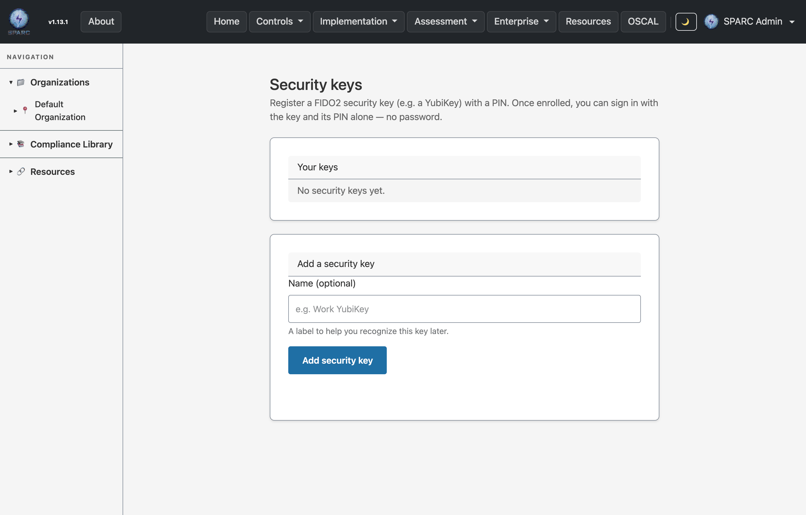
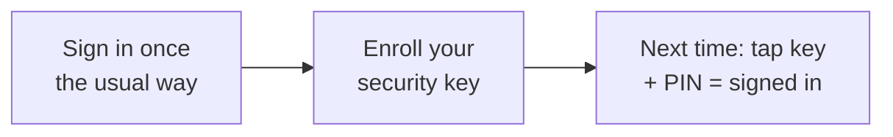

# User Guide: Security Keys & Smart Cards

Sign in to SPARC with a hardware security key (like a YubiKey) or a PIV/CAC
smart card instead of a password. Both use a PIN, so a single tap is strong,
phishing-resistant multi-factor authentication — you prove you *have* the device
and *know* its PIN in one step.

**Who this is for:** any SPARC user whose organization has enabled security-key
or smart-card sign-in. Administrators who reset a locked-out user's keys should
also see [Administration](User-Guide-Administration).

---

## Before you start

- **Access:** any signed-in user can enroll a security key. Your organization
  must have enabled the feature (you'll see a **Security Keys** entry in your
  account menu and a **Sign in with a security key** button on the login page).
- **Prerequisites:** a FIDO2-compatible security key with a PIN set, or a
  PIV/CAC card with a reader and its middleware installed. A supported browser
  (Chrome, Edge, or Firefox; Safari support is limited).
- **Where to find it:** *Account menu → Security Keys*.

---



*The Security Keys screen — register and manage FIDO2 security keys and PIV / CAC smart cards.*

## At a glance


```mermaid
flowchart LR
    A[Sign in once<br/>the usual way] --> B[Enroll your<br/>security key]
    B --> C[Next time: tap key<br/>+ PIN = signed in]
```

---

## Primary use cases

- Enroll a security key so you can sign in without a password.
- Sign in with your security key and PIN.
- Sign in with your CAC / PIV smart card.
- Remove a key you no longer use, or register a backup.

---

## How to …

### How to enroll a security key

1. Sign in the way you normally do.
2. Open the **account menu** (top right) and choose **Security Keys**.
3. Under *Add a security key*, optionally type a **Name** (e.g. "Work
   YubiKey") so you can recognize it later.
4. Click **Add security key**.
5. When your browser prompts, **insert/tap your key and enter its PIN**.
6. The key appears in *Your keys*. You're done — you can now sign in with it.

> **On a Mac (or any device with a built-in authenticator):** the browser's
> dialog offers **Touch ID / this device** *first*. To enroll an external key
> like a **YubiKey**, choose **More options** (Chrome/Edge) or **Other options →
> Security key** (Safari), then insert/tap your key. If you only see a Touch ID
> prompt, look for the small **"More choices"/"Use a different device"** link.

> **Tip:** enroll a **second** key as a backup and keep it somewhere safe. If you
> lose your only key, you'll need an administrator to reset it.

### How to sign in with a security key

1. On the login page, click **Sign in with a security key**.
2. When prompted, **tap your key and enter its PIN**.
3. You're signed in — no password needed.

### How to sign in with your CAC / PIV smart card

1. Insert your smart card into its reader before opening SPARC.
2. On the login page, click **Sign in with your CAC / smart card**.
3. Select your certificate if asked, and **enter your card PIN**.
4. You're signed in.

### How to remove a security key

1. Go to *Account menu → Security Keys*.
2. Next to the key, click **Remove** and confirm.

---

## For administrators: rolling out security keys

These are **operator/deployment settings** (environment variables), not in-app
toggles — set them where your deployment manages configuration (e.g. the ECS
task definition / sparc-iac).

### Make security keys available (opt-in)

```
SPARC_FIDO2_ENABLED=true
```

Users can now enroll from *Account menu → Security Keys* and sign in with a key,
but enrollment is voluntary.

### Require security keys (mandatory enrollment)

To force every applicable user to register a key **on first login** before they
can use anything else — an org-wide hardware-key mandate, no external IdP needed:

```
SPARC_REQUIRE_FIDO2=all      # every human user, any sign-in method
# or
SPARC_REQUIRE_FIDO2=local    # only users who sign in with local email/password
                             # (OIDC / LDAP / PIV users rely on their IdP's MFA)
```

Notes:

- Setting `local` or `all` **also enables FIDO2** — you do not also need
  `SPARC_FIDO2_ENABLED`. (`off` is the default; `true`→`all`, `false`→`off`.)
- A user with no key is redirected to the Security Keys page and cannot reach
  anything else until they enroll.
- **Always exempt:** the break-glass bootstrap admin account
  (`SPARC_ADMIN_EMAIL`, typically shared via a role-checkout/PAM flow) and
  **service accounts** (which authenticate by API token, not a key). Human
  administrators are **not** exempt — they must enroll.
- After an admin resets a user's keys, that user is re-prompted to enroll on next
  login.

### Require a strong login method (OIDC or PIV)

Separately from *enrolling a key*, you can require users to **sign in** only with
a phishing-resistant method — e.g. OIDC (your SSO/IdP) or a PIV/CAC smart card —
and forbid plain local passwords:

```
SPARC_REQUIRE_AUTH_METHODS=oidc,piv
```

- Any signed-in user whose method isn't on the list is sent back to the login
  page to re-authenticate with an accepted one. Empty (default) = no restriction.
- Tokens: `local`, `ldap`, `piv`, `webauthn` (`fido2`), `oidc`, `github`,
  `gitlab`, `sso` (any SSO). Example above = "OIDC or PIV only."
- **Break-glass admin (`SPARC_ADMIN_EMAIL`) and service accounts are exempt** —
  keep `SPARC_ENABLE_LOCAL_LOGIN=true` so the break-glass account still works;
  everyone else is forced onto OIDC/PIV.
- This is enforced in the app, so it works even on a single-listener mTLS gateway
  (no dedicated PIV host needed just to enforce). PIV must still be *available* —
  that requires the mTLS gateway (deployment/sparc-iac side).

This is independent of *mandatory enrollment* above: one forces registering a
key, the other restricts the login method. Pick the model your org needs.

### Restrict PIV/CAC to org-issued certificates (optional)

For smart-card (PIV/CAC) login, the mTLS gateway already validates each cert
against your CA. As **defense-in-depth**, SPARC can additionally require the cert
to come from a known org **issuer** and/or carry a known **certificate-policy
OID** — so a cert from an unexpected issuer can't sign in even if the gateway
trust store is broader than intended:

```
SPARC_PIV_ACCEPTED_ISSUERS=ACME Corp PIV CA      # issuer DN (substring match)
SPARC_PIV_ACCEPTED_POLICY_OIDS=2.16.840.1.101.3.2.1.3.13
```

Both empty (default) = accept any cert the gateway forwarded (no change). When
set, a non-matching cert is rejected and audited. This does **not** decide *which
CA to trust* — that stays at the gateway; it's an extra app-side allowlist.

---

## Tips & best practices

- Always keep at least one **backup** key or an alternate sign-in method.
- Your PIN is entered on the device and is **never sent to or stored by SPARC**.
- A security key only works on the site it was enrolled on — that's what makes
  it phishing-resistant.

---

## Troubleshooting

| Symptom | Likely cause | What to do |
|---|---|---|
| "This browser does not support security keys" | Unsupported/old browser (e.g. Safari) | Use Chrome, Edge, or Firefox |
| The browser prompts for **Touch ID / a passkey**, not my YubiKey | On a Mac the built-in authenticator is offered first | Choose **More options / Use a different device → Security key**, then insert/tap your external key |
| Enrollment or sign-in was "cancelled or timed out" | The prompt was dismissed, or took too long | Click the button again and complete the PIN prompt promptly |
| "This security key is already registered" | The key is already enrolled on your account | Use it to sign in, or enroll a different key |
| Lost your only key | — | Ask an administrator to **reset your security keys**, then re-enroll |

---

## Related guides

- [User Guides index](User-Guides)
- [Administration](User-Guide-Administration) — admins reset a user's keys.
- [Authentication and MFA](Authentication-and-MFA) — operator setup and configuration.
