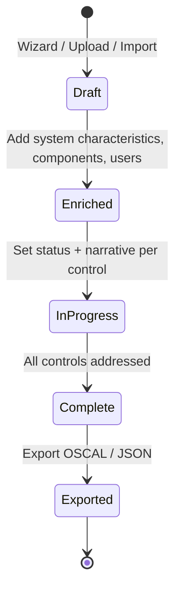

# User Guide: System Security Plans (SSP)

A **System Security Plan** documents how your system implements each control in
its baseline. In SPARC an SSP is the OSCAL `system-security-plan` document: you
create it from a baseline, enrich it with system metadata, record an
implementation status and narrative for every control, and export it as OSCAL.
This guide walks the full lifecycle.

**Who this is for:** ISSOs, control authors, and system owners. Working with SSPs
requires authentication and a role with SSP permissions — see [RBAC](RBAC).

---

## Before you start

- **Access:** signed in, with a role that permits creating/editing SSPs.
- **Prerequisites:** a **baseline** (profile) to build from — see
  [Control Catalogs & Baselines](User-Guide-Control-Catalogs-and-Baselines).
  Optionally a **Component Definition (CDEF)** to seed component narratives.
- **Where to find it:** *Implementation → System Security Plans*
  (`/ssp_documents`).

---

## At a glance

---

## Primary use cases

- **Author a new SSP** from a baseline and document control implementations.
- **Import an existing OSCAL SSP** and continue editing it in SPARC.
- **Enrich an SSP** with the OSCAL-required system metadata (characteristics,
  components, users) needed for a valid export.
- **Produce a submission-ready OSCAL SSP** for the authorization package.

The SSP is the `system-security-plan` in the OSCAL implementation layer; it feeds
the assessment layer (SAP/SAR) and the ATO package.

---

## How to create an SSP with the wizard

1. Go to *Implementation → System Security Plans* (`/ssp_documents`).
2. Click **Create New SSP** to open the wizard (`/ssp_documents/wizard`).
3. **Select a baseline/profile** — this determines the control set.
4. **Select a CDEF** (optional) — to seed component-provided implementations.
5. Enter **system details**: name, version, description.
6. Submit. SPARC generates the SSP with one control entry per baseline control.

## How to import or upload an existing SSP

- From the SSP list, use **Upload File** to submit an existing document. Uploaded
  files are parsed asynchronously — the detail page shows a **processing
  spinner** and refreshes every few seconds until it reaches **completed** (or
  shows a **failure banner** if parsing fails).
- The **Source** badge on the list marks how each SSP was created: **Wizard**,
  **OSCAL Import**, or **File Upload**.

## How to enrich an SSP

Enrichment adds the OSCAL metadata an SSP needs beyond control narratives.

1. On the SSP list or detail page, click **Enrich** (`/ssp_documents/:id/enrich`).
   The detail page shows an **"Enrich SSP"** prompt when a document is still
   **Basic** rather than **Enriched**.
2. Complete the form:
   - **System characteristics** — description, sensitivity level, system status,
     authorization boundary.
   - **Components** — title, type, description for each system component.
   - **System users** — title and role IDs.
   - **Information types.**
3. Save. The detail page now shows the **System Characteristics**,
   **Components**, and **Users** cards, and the OSCAL badge flips to
   **Enriched**.

## How to document control implementations

The SSP detail page (`/ssp_documents/:id`) is where the real work happens.

1. Use the **compliance heatmap** or **status chips** to jump to the controls
   you need — chips filter the control cards by status.
2. Expand a **control card** to see its stated requirement, catalog guidance, and
   any inherited/provider statements.
3. Click **Edit** on the card to open the inline form and set:
   - **Status** (implementation status)
   - **Control application** and **coverage level**
   - **Control type**
   - **Expected completion** date (for planned items)
   - Narrative text areas (implementation statement, etc.)
4. Save the card. The **compliance percentage** and progress bar at the top
   update as you go.

For heads-down editing, open the dedicated **Editor**
(`/ssp_documents/:id/editor`), which updates control fields inline via Turbo
Frames without full page reloads.

## How to export an SSP

On the detail page use **Export OSCAL** (for the OSCAL `system-security-plan`)
or **Download JSON**. Export when the compliance score and control statuses
reflect the current state you want to submit.

---

## Tips & best practices

- **Enrich early.** Several export validations depend on system characteristics,
  components, and users — filling them up front avoids a late scramble.
- Drive completion with the **status chips**: filter to *pending* controls and
  work the list down until the compliance score is where you need it.
- Reuse **CDEFs** for common components (a managed database, a logging stack) so
  the same implementation narrative isn't retyped across systems.
- Watch the **colour of the compliance score**: green ≥ 80%, yellow ≥ 50%, red
  < 50% — a quick signal of how close the SSP is.

---

## Troubleshooting

| Symptom | Likely cause | What to do |
|---|---|---|
| SSP stuck on the processing spinner | Async parse still running, or it failed | Wait for auto-refresh; if a failure banner appears, check the file and re-upload |
| "Enrich SSP" banner won't go away | System metadata not saved | Complete and save the enrichment form |
| OSCAL export fails validation | Missing enrichment or required control fields | Enrich the SSP and fill the flagged control fields, then re-export |
| Compliance score seems stuck | Control edits not saved | Re-open the control card, set the status, and save |
| Can't edit control cards | View-only role | Request SSP write permission ([RBAC](RBAC)) |

---

## Related guides

- [User Guides index](User-Guides)
- [Control Catalogs & Baselines](User-Guide-Control-Catalogs-and-Baselines) —
  source of the SSP's control set.
- [Component Definitions (CDEF)](User-Guide-Component-Definitions)
- [Assessment Plans (SAP)](User-Guide-Assessment-Plans) — the next step.
- [Screens & UI](Screens) — exhaustive element-level reference.
