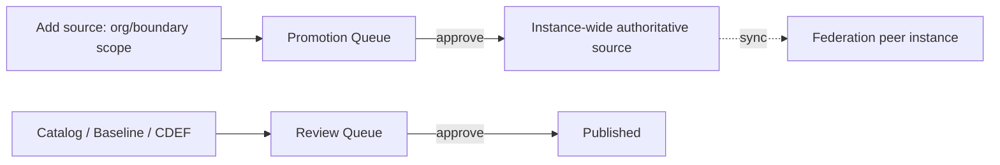

# User Guide: Trust Store

The **trust store** is SPARC's shared library of authoritative back-matter
sources plus the workflows that govern them: a review queue for documents, a
promotion queue for elevating sources to instance-wide scope, and federation
peers for sharing sources across SPARC instances. This guide covers adding
authoritative sources, moving documents and sources through the queues, and
configuring federation. It also explains how OSCAL **back matter** and
**artifacts** work.

**Who this is for:** compliance librarians, reviewers, and approvers. Adding a
source is open to any authenticated user; reviewing, approving promotions, and
managing federation require specific permissions — see [RBAC](RBAC).

---

## Before you start

- **Access:** signed in. Adding an authoritative source needs only
  authentication; the **Review Queue** needs reviewer permission, the
  **Promotion Queue** needs approver permission, and **Federation Peers** needs
  the admin/federation permission.
- **Where to find it:** the **Trust Store** area of the nav and the sidebar's
  **Compliance Library** — Authoritative Sources, Review Queue, Promotion Queue,
  Federation Peers.

---

## At a glance

---

## Primary use cases

- **Build a reusable source library** — add authoritative back-matter resources
  once and link them from many documents instead of re-uploading.
- **Govern documents** — route catalogs, baselines, and CDEFs through review and
  approval.
- **Promote a source** from a single boundary to instance-wide scope.
- **Federate** — exchange authoritative sources with trusted peer SPARC
  instances.

---

## How to add an authoritative source

1. Go to **Authoritative Sources** (`/authoritative_sources`).
2. Click **New** and provide the source details.
3. Save. The source is created at **org/boundary scope** by default; the index
   shows each source with its scope, and the detail view shows the resource and
   where it's used.

Any authenticated user may add a source.

## How to promote a source to instance-wide scope

1. From a source (or the promotion workflow), request promotion.
2. An approver opens the **Promotion Queue** (`/promotion_queue`), which lists
   sources requesting elevation from org/boundary scope to instance-wide
   authoritative scope.
3. The approver clicks **Approve** or **Reject** on the row. Approved sources
   become available instance-wide.

## How to review documents

1. Authors submit a trust-store document (**Control Catalog**, **Baseline /
   Profile**, or **CDEF**) for review.
2. A reviewer opens the **Review Queue** (`/review_queue`), which consolidates
   documents awaiting review.
3. Each row links to the document's **approve/reject** actions. Approve to
   publish, or reject to send it back.

## How to configure federation peers

1. Go to **Federation Peers** (`/federation_peers`) and click **New**.
2. Enter the peer's **name**, **base URL**, and **shared-secret** configuration.
3. Save. From a peer's detail page, use **Sync** to exchange HMAC-signed
   authoritative-source bundles with that peer.

---

## Understanding back matter and artifacts

- **Back-matter resources** are OSCAL attachments (citations, policies, diagrams)
  carried by a document. They are managed **inline on each document's detail
  page** — there is no standalone back-matter screen. You can **link** a
  reusable trust-store source into a document instead of re-uploading the file.
- **Control back-matter links** attach a back-matter resource to an individual
  catalog or profile control from that control's edit view.
- **Artifacts** are the durable download side of back matter: a stable UUID
  (`/artifacts/:uuid`) resolves to a freshly-signed download so links keep
  working even as content or slugs change. There is no artifact browse screen —
  it's a resolver referenced by OSCAL `href` values.

---

## Tips & best practices

- Add a source **once** to the trust store and **link** it everywhere, rather
  than uploading the same file into multiple documents.
- **Promote** only sources that are genuinely instance-wide authoritative — keep
  boundary-specific material at boundary scope.
- Use durable **artifact UUIDs** in OSCAL references so exported documents don't
  break when content is re-versioned.
- Establish **federation peers** deliberately — the sync exchanges signed source
  bundles, so trust the peer before configuring the shared secret.

---

## Troubleshooting

| Symptom | Likely cause | What to do |
|---|---|---|
| Can't approve in a queue | Missing reviewer/approver permission | Request the permission ([RBAC](RBAC)) |
| Promoted source still boundary-scoped | Promotion not yet approved | An approver must approve it in the Promotion Queue |
| Federation sync fails | Base URL or shared secret mismatch | Re-check the peer's URL and shared-secret config |
| A linked source's download 404s | Stale direct link used | Reference the durable artifact UUID, not a raw path |

---

## Related guides

- [User Guides index](User-Guides)
- [Control Catalogs & Baselines](User-Guide-Control-Catalogs-and-Baselines) —
  documents that flow through the review queue.
- [Evidence & Attestations](User-Guide-Evidence-and-Attestations)
- [Data Isolation](Data-Isolation) — how scope governs visibility.
- [Screens & UI](Screens) — exhaustive element-level reference.
