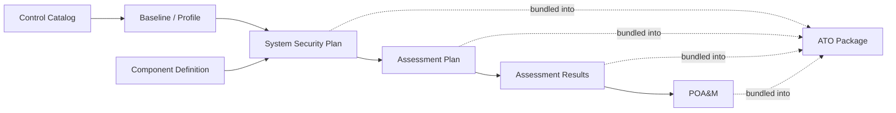

# User Guides

Task-oriented guides for using the SPARC application, one per major area of the
UI. Where the [Screens & UI](Screens) page is an exhaustive element-by-element
reference, these guides answer *"how do I actually get this done?"* — step by
step, with the primary use cases and workflows for each screen.

SPARC helps compliance teams build and maintain the OSCAL documents that make up
a FedRAMP / NIST 800-53 authorization package: the **System Security Plan
(SSP)**, **Assessment Plan (SAP)**, **Assessment Results (SAR)**, and **Plan of
Action & Milestones (POA&M)** — plus the control catalogs, baselines, and
component definitions they build on.

**New here?** Start with [Getting Started](Getting-Started) to stand up and log
in, then [User Guide: Getting Oriented](User-Guide-Getting-Oriented) for a tour
of the interface.

---

## The compliance lifecycle in SPARC

Most work in SPARC follows the Risk Management Framework (RMF) document
lifecycle. Each stage produces an OSCAL document that feeds the next:

1. Load a **control catalog** (e.g. NIST SP 800-53 Rev 5) and tailor a
   **baseline** from it.
2. Document how your system meets each control in an **SSP**, optionally reusing
   **component definitions (CDEF)**.
3. Plan the assessment in a **SAP**, record the outcome in a **SAR**.
4. Track open findings to closure in a **POA&M**.
5. Bundle everything for a boundary into an **ATO package**.

---

## Guides by area

### Orientation & workspace

| Guide | Covers |
|---|---|
| [Getting Oriented](User-Guide-Getting-Oriented) | Dashboard, navigation, the Organization → Boundary → document hierarchy, roles |
| [Authorization Boundaries](User-Guide-Authorization-Boundaries) | Boundaries, environments, team members, leveraged authorizations, ATO packages |

### Controls library

| Guide | Covers |
|---|---|
| [Control Catalogs & Baselines](User-Guide-Control-Catalogs-and-Baselines) | Catalogs, families, controls, baselines/profiles, control mappings |
| [Converters & Imports](User-Guide-Converters-and-Imports) | Rule-to-NIST converters, STIG parsing, import flows |

### OSCAL documents

| Guide | Covers |
|---|---|
| [System Security Plans (SSP)](User-Guide-System-Security-Plans) | Create, enrich, edit control implementations, export |
| [Component Definitions (CDEF)](User-Guide-Component-Definitions) | Reusable component control sets, bulk apply |
| [Assessment Plans (SAP)](User-Guide-Assessment-Plans) | Plan how controls will be assessed |
| [Assessment Results (SAR)](User-Guide-Assessment-Results) | Record pass/fail outcomes, findings |
| [POA&M](User-Guide-POAM) | Track findings, risks, remediations, milestones |
| [Evidence & Attestations](User-Guide-Evidence-and-Attestations) | Upload evidence, attach attestations |

### Trust store & administration

| Guide | Covers |
|---|---|
| [Trust Store](User-Guide-Trust-Store) | Authoritative sources, review & promotion queues, federation |
| [Security Keys & Smart Cards](User-Guide-Security-Keys) | Enroll a FIDO2 key or CAC/PIV; passwordless sign-in |
| [Administration](User-Guide-Administration) | Users, roles/permissions, service accounts, audit log |

---

## Conventions used in these guides

- **Navigation paths** are written as *Menu → Item* (e.g.
  *Implementation → System Security Plans*).
- **Button and field labels** appear in **bold** and match what you see on
  screen.
- Each guide opens with a **Before you start** section listing the role and any
  prerequisite documents you need.
- For the full inventory of every screen, route, and field, see the
  [Screens & UI](Screens) reference.

> **Screenshots** are being added incrementally. Diagrams in these guides render
> directly in the wiki; per-screen captures are tracked as a follow-up.
